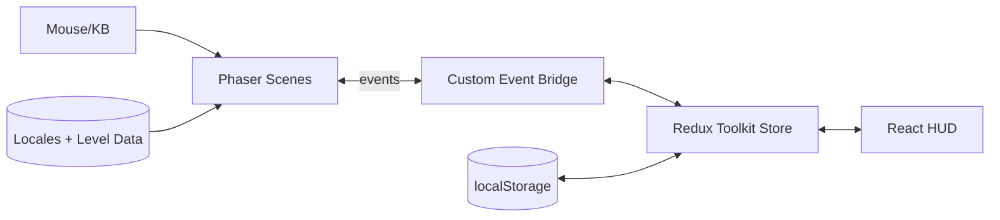

# The Getaway - Architecture Documentation

## Project Structure

The Getaway is structured as a modern React application with TypeScript, using Vite as the build tool and development server. The architecture follows a modular design approach, separating game logic from UI components and state management.

### Project Layout

The project is organized as follows:

- `/memory-bank` - Documentation and design files (outside the actual game code)
- `/the-getaway` - The main game project folder
  - `/src` - Source code for the game
  - Configuration files (package.json, tsconfig.json, etc.)

### Core Technologies

- **TypeScript**: Used throughout the project for type safety and better development experience.
- **React**: Provides the UI layer and component architecture.
- **Vite**: Fast build tool and development server.
- **Phaser**: Game engine for rendering and game mechanics.
- **Redux Toolkit**: State management library for predictable state and separation of concerns.
- **Tailwind CSS**: Utility-first CSS framework for styling.
- **Jest**: Testing framework for unit tests.

## Directory Structure

### `/the-getaway/src`

The main source directory containing all application code.

### `/the-getaway/src/assets`

Contains all static assets for the game including:
- Graphics (character sprites, environment tiles, UI elements)
- Audio (sound effects, music)
- Other media files

### `/the-getaway/src/components`

React components that make up the game's user interface:
- **`GameCanvas.tsx`**: The main component that integrates Phaser with React. It initializes the Phaser game instance and provides the canvas where the game is rendered.
- **`GameController.tsx`**: Bridges Redux state with Phaser events, handling player input, combat flow, click-to-move execution, curfew enforcement, NPC routine scheduling, and now prevents stepping onto NPC tiles while auto-pathing to conversation range when you click an NPC.

### `/the-getaway/src/components/ui`

Dedicated folder for reusable React UI components, separate from core game logic/controllers.

- **`PlayerStatusPanel.tsx`**: Displays player vitals, action points, hostile counts, and curfew state using Redux data.
- **`LogPanel.tsx`**: Displays a scrolling list of game events and messages, reading data from the Redux `logSlice`.
- **`PlayerSummaryPanel.tsx`**: Compact HUD card showing the operative's vitals, currency, and point pools with a CTA that opens the full character screen.
- **`CharacterScreen.tsx`**: Pip-boy style modal that presents the detailed profile (status panel, detailed stats, skill tree). Toggled via the HUD button or the `C` key and reuses existing components inside a scrollable shell; the layout now stacks the profile column (summary + core stats) alongside a systems column where inventory and loadout share the top row and the skill tree stretches beneath them.
- **`PlayerLoadoutPanel.tsx`**: Summarises equipped weapon/armor alongside perk badges inside the character screen.
- **`PlayerInventoryPanel.tsx`**: Full inventory console with filter tabs, encumbrance telemetry, equipment slot grid, hotbar management, and inline equip/repair/use actions that dispatch Redux inventory reducers.
- **Inventory data model**: `Player.inventory` now tracks `hotbar` slots alongside `items`, and `Player.equippedSlots`/`activeWeaponSlot` mirror the expanded slot framework (primary/secondary/melee weapons, body armor, helmet, accessories). `Player.encumbrance` persists the derived weight ratio so reducers and UI can apply penalties without recomputing totals each frame.
- **`MiniMap.tsx`**: Consumes the layered controller state to render cached tiles, animated waypoint paths, entity/objective markers, and the viewport reticle, now framed inside the shared HUD tokens (`hudTokens.ts`). The panel sticks to the noir chrome while keeping drag/zoom, Shift-waypoint previews, keyboard nudging, and high-contrast/auto-rotate toggles intact.
- **`DayNightIndicator.tsx`**: Surfaces the current time of day, phase transitions, and curfew countdown in the HUD.
- **`LevelIndicator.tsx`**: Floats level metadata and active objectives in the upper-left overlay, pulling data from the current `MapArea`.
- **`GeorgeAssistant.tsx`**: React HUD console that anchors top-center, presenting a compact status dock and an expandable chat feed while pulling quest, karma, reputation, and personality data straight from Redux.
- **`DialogueOverlay.tsx`**: Displays branching dialogue with NPCs, presenting options and triggering quest hooks while pausing player input.
- **`OpsBriefingsPanel.tsx`**: Serves as the quest log, surfacing active objectives with progress counters and listing recently closed missions with their payout summaries.

## High Level Overview
> Category: summary  
> ID: high_level_overview

### Design principles

- Phaser scenes own simulation and rendering while React manages HUD overlays that subscribe to Redux selectors.
- Redux Toolkit slices centralise world, player, and quest data so both runtimes consume a single state graph.
- Persistence hydrates from `localStorage` with schema guards and version tags to keep older saves compatible.
- Content remains immutable under `src/content/levels/{level-id}/locales/{en,uk}.ts`, cloned into runtime stores before mutation.

### Technical flow

1. `GameCanvas` boots Phaser scenes, wiring scene lifecycle hooks into Redux dispatchers and DOM CustomEvents.
2. Bridge services in `src/game/services/*` proxy Phaser events to React HUD listeners while React components dispatch Redux actions that Phaser systems observe.
3. Persistence helpers serialise whitelisted slices with version metadata and rehydrate on boot, invoking migrators when the stored version lags.
4. Localisation helpers resolve bilingual content for both HUD strings and scene metadata, ensuring English remains the source of truth with Ukrainian kept in lockstep.



## Level0 Visual Revamp Pipeline
> Category: rendering_systems  
> ID: level0_visual_revamp_pipeline

### Design principles

- Treat Level 0 visuals as a composable pipeline (theme contracts -> world painters -> entity rigs -> scenic props) so art swaps do not require gameplay rewrites.
- Keep gameplay topology authoritative in map data; visual layers may style and dress tiles but must not alter collision semantics or door connectivity.
- Use deterministic composition for district look/prop scatter so QA can reproduce scene layout exactly for a given map seed/content set.

### Technical flow

1. `the-getaway/src/game/visual/contracts.ts` defines shared render contracts (`VisualTheme`, `BuildingVisualProfile`, `EntityVisualProfile`, `VisualQualityPreset`) including district lot/massing fields (`lotPattern`, `massingStyle`, `massingHeight`, `trimHex`, `atmosphereHex`).
2. `the-getaway/src/game/visual/theme/noirVectorTheme.ts` resolves quality budgets and district/entity palettes; `createNoirVectorTheme` and `resolveBuildingVisualProfile` provide deterministic defaults.
3. `the-getaway/src/game/visual/world/DistrictComposer.ts` composes deterministic district grammar (facade/lot/massing selection + seeded color shifts), then `the-getaway/src/game/world/worldMap.ts` injects those profiles into `MapBuildingDefinition.visualProfile`.
4. `the-getaway/src/game/scenes/MainScene.ts` delegates world rendering orchestration to `the-getaway/src/game/scenes/main/modules/WorldRenderModule.ts`, which drives `the-getaway/src/game/visual/world/TilePainter.ts` and `the-getaway/src/game/visual/world/BuildingPainter.ts` while rendering dedicated building-massing layers (`drawBuildingMasses`) plus skyline-composition backdrops.
5. `the-getaway/src/game/visual/world/AtmosphereDirector.ts` resolves deterministic atmosphere profiles (gradient, fog bands, emissive intensity, wet reflection alpha, overlay tint/alpha) from district mix + world time + preset budgets.
6. `the-getaway/src/game/visual/world/OcclusionReadabilityController.ts` applies visual-only readability compensation (building alpha fade + token/label emphasis) when entities overlap heavy massing bounds, restoring prior-frame baselines so boosts remain transient.
7. `the-getaway/src/game/visual/world/PropScatter.ts` generates deterministic prop placements that avoid door tiles/door buffers/protected interactive tiles and applies district-aware clustering for denser composition without blocking routes.
8. `the-getaway/src/game/visual/entities/CharacterRigFactory.ts` supplies silhouette-v2 procedural rigs with role-specific overlays and motion cues integrated into player/NPC/enemy update flows in `MainScene` while preserving nameplates, health bars, and combat indicators.
9. `the-getaway/src/components/GameCanvas.tsx`, `the-getaway/src/game/settings/visualSettings.ts`, and `the-getaway/src/store/settingsSlice.ts` coordinate smooth-vector renderer defaults and quality-preset-aware FX budgets (`performance | balanced | cinematic`), including shared fog/emissive/wet-reflection/occlusion caps consumed by scene render systems.

## MainScene Module Runtime
> Category: scene_architecture  
> ID: main_scene_module_runtime

### Design principles

- Keep `MainScene` focused on orchestration and compatibility, while extracted modules own bounded responsibilities.
- Standardize scene lifecycle hooks (`init`, `onCreate`, `onStateChange`, `onResize`, `onUpdate`, `onShutdown`) so future extraction can proceed incrementally without behavior drift.
- Centralize listener/resource cleanup through a shared disposable primitive to reduce leak risk during scene restarts and hot state changes.

### Technical flow

1. `the-getaway/src/game/scenes/main/SceneModule.ts` defines the lifecycle contract consumed by all scene modules.
2. `the-getaway/src/game/scenes/main/SceneContext.ts` builds module context (`scene`, typed `getState`/`dispatch`, listener bridge helpers, shared disposables).
3. `the-getaway/src/game/runtime/resources/DisposableBag.ts` provides LIFO teardown, idempotent `dispose()`, and immediate execution for post-dispose registrations.
4. `the-getaway/src/game/scenes/main/SceneModuleRegistry.ts` registers modules in deterministic order and fans out create/state/resize/update/shutdown events (reverse shutdown order).
5. `the-getaway/src/game/scenes/MainScene.ts` initializes registry + context once per scene create, forwards lifecycle events to the registry, and keeps public scene APIs stable while delegating extracted behavior.
6. Initial extraction modules live in `the-getaway/src/game/scenes/main/modules/`:
   - `DayNightOverlayModule.ts` (overlay init/resize/update/zoom application)
   - `MinimapBridgeModule.ts` (minimap init/shutdown + viewport updates)
   - `SurveillanceRenderModule.ts` (vision-cone rendering + surveillance camera sprite lifecycle/cleanup)
   - `WorldRenderModule.ts` (backdrop/map redraw cadence, atmosphere profile resolution, occlusion + building massing/label rendering, lighting pipeline)
   - `EntityRenderModule.ts` (player/enemy/NPC token + label updates, combat bars/indicators, player screen-position dispatch)
   - `StateSyncModule.ts` (Redux state-change orchestration for combat transitions, map swaps, entity refresh, and surveillance overlay sync)
   - `ClockModule.ts` (world-time accumulator, dispatch cadence, suspicion-decay tick dispatch, and timed atmosphere redraw signaling)
   - `InputModule.ts` (tile click, path preview, pickup sync listener wiring)
   - `CameraModule.ts` (camera follow/bounds/zoom/resize orchestration)
7. `MainScene.ts` now exposes only compatibility APIs required externally (`focusCameraOnGridPosition`, `worldToGrid`, `worldToGridContinuous`, `emitViewportUpdate`) while module-owned runtime state (camera/entity/world/state-sync/clock) remains inside module instances.
8. Architecture guardrails are enforced by `the-getaway/scripts/check-scene-architecture.mjs` and chained into `yarn lint`:
   - fail if `the-getaway/src/game/scenes/MainScene.ts` exceeds 400 lines,
   - fail if any production file in `the-getaway/src/game/scenes/main/modules/*.ts` contains `as unknown as`,
   - fail if `MainScene` declares mutable public property fields.
9. Contract/runtime behavior is covered by `the-getaway/src/game/scenes/main/__tests__/SceneModuleRegistry.test.ts`, `the-getaway/src/game/scenes/main/__tests__/SceneContext.test.ts`, `the-getaway/src/game/scenes/main/modules/__tests__/ClockModule.test.ts`, `the-getaway/src/game/scenes/main/modules/__tests__/SurveillanceRenderModule.test.ts`, `the-getaway/src/game/scenes/main/modules/__tests__/WorldRenderModule.test.ts`, `the-getaway/src/game/scenes/main/modules/__tests__/EntityRenderModule.test.ts`, `the-getaway/src/game/scenes/main/modules/__tests__/StateSyncModule.test.ts`, and `the-getaway/src/game/runtime/resources/__tests__/DisposableBag.test.ts`.

## Narrative Resource Hierarchy
> Category: content_pipeline  
> ID: narrative_resource_hierarchy

### Design principles

- Standardise narrative data around stable resource keys (`levels.*`, `missions.*`, `quests.*`, `npcs.*`) so structural definitions stay immutable and language-agnostic.
- Keep localisation bundles separate from structural content, letting writers update copy without touching TypeScript modules.
- Validate cross-references (level ↔ mission ↔ quest ↔ NPC) automatically so regressions surface during CI/testing instead of in gameplay.

### Technical flow

1. `the-getaway/src/game/narrative/structureTypes.ts` introduces canonical interfaces plus locale bundle contracts for levels, missions, quests, and NPC registrations.
2. Structural definitions live under `src/content/levels/*/levelDefinition.ts`, `src/content/missions/**/missionDefinition.ts`, and `src/content/quests/**/questDefinition.ts`, with registries in `src/content/levels/index.ts`, `src/content/missions/index.ts`, and `src/content/quests/index.ts`.
3. Localised strings consolidate into `src/content/locales/{locale}/{levels,missions,quests,npcs}.ts`, aggregated via `the-getaway/src/content/locales/index.ts`.
4. Runtime loaders (`src/content/missions.ts`, `src/content/levels/level0/index.ts`, and `src/content/quests/builders.ts`) merge structural data with locale bundles to emit `MissionLevelDefinition` and `Quest` instances for Redux slices.
5. `the-getaway/src/game/narrative/validateContent.ts` walks the hierarchy, confirming every reference resolves and every resource key has locale coverage; a Jest spec (`src/__tests__/narrativeValidation.test.ts`) keeps the check wired into the suite.

### Pattern: ResourceKeyLifecycle

- Authors add or modify structural content via the definition modules, wire resource keys into locale bundles, and register associated NPCs in `src/content/npcs/index.ts`.
- Validation runs as part of the test suite, blocking commits that forget locale copy or miswire cross-resource keys.
- UI and Redux consumers never read raw locale files; instead they call the derived builders so future content (additional locales or metadata) continues to flow through the same pipeline.

## Narrative Scene Generation
> Category: world_generation  
> ID: narrative_scene_generation

### Design principles

- Keep `(subject, relation, object)` triples as the single interface between narrative prompts and spatial generation, allowing either heuristic extraction or manual authoring to feed the same tooling.
- Resolve placement requests through existing grid utilities (`isPositionWalkable`, `findNearestWalkablePosition`) so generated props honour collision layers and cover metadata.
- Feed telemetry (collisions, missing assets) back into scene metadata so the CLI and future dashboards can surface author-facing diagnostics.

### Technical flow

1. `the-getaway/src/game/narrative/tripleExtraction.ts` tokenises mission copy, matches supported relations (`near`, `inside`, `left_of`, etc.), and emits ordered `SceneMoment` bundles; manual fallback bundles run through the same validators.
2. `the-getaway/src/game/world/generation/relationRules.ts` translates relations into placement strategies (directional offsets, adjacency searches, interior resolution) while guarding against occupied or non-walkable tiles.
3. `the-getaway/src/game/world/generation/worldGenerationPipeline.ts` instantiates a `MapArea`, seeds manual placements, resolves anchors, applies computed props, and annotates tiles (cover vs blocking) before recording any pipeline issues.
4. `the-getaway/scripts/generate-scene-from-story.ts` orchestrates extraction + generation, writing validated JSON under `src/content/levels/{level}/missions/{mission}/generatedScenes` and reporting validation errors in the CLI output.
5. `the-getaway/src/content/scenes/generatedScenes.ts` indexes emitted scene definitions so mission records (e.g., `level0RecoverCacheMission`) can reference `generatedSceneKeys` without manual filesystem lookups.

## Environment Story Triggers
> Category: narrative_systems  
> ID: environment_story_triggers

### Design principles

- Keep environment reactivity declarative: world-facing flags live under `world.environment.flags` and drive all swaps through a trigger registry rather than ad-hoc conditionals.
- Favour data tables over inline copy so rumors, signage, and notes remain tone-consistent with [[03 Lore/Plot Bible]] and can scale through content-only additions.
- Ensure triggers are idempotent and observable—every swap records the source ID and timestamp so reducers, HUD, and QA tooling can diff the current ambient state.
- Throttle weather shifts to once per recorded time-of-day so ambient logs surface meaningful beats instead of oscillating between severity presets.

### Technical flow

1. `the-getaway/src/game/interfaces/environment.ts` defines flag enums (`gangHeat`, `curfewLevel`, `supplyScarcity`, `blackoutTier`) plus serialized snapshots for rumors, signage, weather, and spawned notes.
2. `the-getaway/src/store/worldSlice.ts` seeds the environment state, exposes reducers (`setEnvironmentFlags`, `applyEnvironmentSignage`, `applyEnvironmentRumorSet`, `registerEnvironmentalNote`, `setNpcAmbientProfile`), and maps existing systems to the new flags (curfew to `curfewLevel`, alert level to `gangHeat`/`supplyScarcity`, reinforcements to blackout tiers).
3. `the-getaway/src/content/environment/` holds trigger tables (`rumors.ts`, `notes.ts`, `signage.ts`, `weather.ts`) with one-liner metadata so writers can add swaps without touching logic.
4. `the-getaway/src/game/world/triggers/triggerRegistry.ts` maintains registered triggers with cooldown/once semantics; `the-getaway/src/game/world/triggers/defaultTriggers.ts` now derives weather via a single daily updater that records the active `TimeOfDay`, preferring gang-heat overrides until curfew level 3 and logging at most one shift per phase, while keeping the remaining rumor, signage, and note triggers unchanged. A test-only reset helper exposes clean registration for specs.
5. `the-getaway/src/components/GameController.tsx` initialises the registry and ticks triggers each animation frame, feeding the Redux dispatch/getState pair so triggers stay in sync with the active scene.
6. `the-getaway/src/store/selectors/worldSelectors.ts` surfaces memoised selectors for flags, signage variants, rumor sets, weather snapshots (including last `TimeOfDay`), and spawned notes for HUD consumers.
7. `the-getaway/src/game/world/environment/environmentMatrix.ts` codifies the hazard-to-system matrix: `resolveEnvironmentalFactors` folds zone hazards and environment flags into canonical factors, while `combineSystemImpacts` emits aggregated behaviour/faction/travel weights. `the-getaway/src/store/selectors/worldSelectors.ts` exposes `selectEnvironmentSystemImpacts`, driving `the-getaway/src/components/GameController.tsx` (NPC routine pacing + reinforcement delays) and `the-getaway/src/components/ui/DayNightIndicator.tsx` (travel advisory overlay).
8. `the-getaway/src/game/world/triggers/__tests__/defaultTriggers.test.ts` drives the reducers through the registry, asserting rumor rotations, signage swaps, note spawns, and the daily weather gate when flags or time phases shift.

## Weapon Mod System
> Category: equipment_systems  
> ID: weapon_mod_system

### Design principles

- Keep attachments data-driven: weapons expose type/slots/accuracy/magazine metadata; mods declare slot, compatible weapon types, and effects so attachment logic stays declarative.
- Centralise effect math so combat reads a single aggregated modifier bundle (hit, damage, crit, armor-pierce, silenced, magazine capacity) instead of scattered conditionals.
- Gate crafting behind proximity-aware workbench status (safehouse, scavenger market with fee if standing < Friendly, industrial workshop) plus Engineering skill and resource costs; keep UI selection local to the inventory and allow drag/drop when possible.

### Technical flow

1. `the-getaway/src/game/interfaces/types.ts` extends weapons with `weaponType`, `modSlots`, `attachedMods`, `accuracy`, `magazineSize`, `currentMagazine`, and typed mod IDs/slots; instantiated items now retain `definitionId` so crafting can tally stackable resources.
2. `the-getaway/src/content/items/weaponMods.ts` defines mod payloads (slots, compat, effects, workbench + Engineering requirements) with item prototypes and resource items in `the-getaway/src/content/items/index.ts`.
3. `the-getaway/src/game/systems/weaponMods.ts` aggregates attachment effects and validates compatibility; `the-getaway/src/game/combat/combatSystem.ts` folds the aggregated effects into hit chance, damage, crit, armor-pierce, silenced handling, and magazine tracking.
4. Inventory reducers (`the-getaway/src/store/playerSlice.ts`) attach/detach mods, clamp magazine capacity to modded limits, deep-clone attachments on move, and craft mods via `craftWeaponMod` (Engineering gate + workbench status + optional market fee + resource spend → mod instantiation).
5. World gating: `the-getaway/src/store/worldSlice.ts` tracks `workbenchStatus` (proximity + location type/fee) and is refreshed each tick by `the-getaway/src/components/GameController.tsx`.
6. UI: `the-getaway/src/components/ui/PlayerInventoryPanel.tsx` hosts the “Modify” overlay (right-click entry, drag/drop slot selection, stat preview) and a workbench crafting overlay listing recipes, requirements, and resources; crafting dispatches `craftWeaponMod` with any required fee.

## Command Shell Layout
> Category: ui_shell  
> ID: command_shell_layout

### Design principles

- Maintain the three-column command shell while letting each sidebar collapse without removing it from the flex context so the world view can immediately claim the freed space.
- Anchor interactive toggles to the sidebar rails instead of the overall stage to keep them flush with panel edges and out of the top-right HUD stack.
- Surface live sidebar measurements through CSS custom properties so auxiliary overlays can reference actual widths when positioning future elements.

### Technical flow

1. `the-getaway/src/App.tsx` wraps the left and right panels in rail containers that own the `flex-basis` sizing (`min(26rem, 24vw)`), easing between their expanded width and `0px` via a cubic-bezier transition, and expose `--sidebar-width` / `--sidebar-last-width` variables sourced from `ResizeObserver` readings.
2. Collapsing a panel drives the rail basis to `0px` while the panel stays mounted with `visibility: hidden`, `pointer-events: none`, and `max-width: 0px`, ensuring ResizeObserver retains the last visible width for smooth reopening.
3. Toggle buttons now live inside each rail, positioned with `calc(100% - 1.1rem)` (left) and `-1.1rem` (right) offsets plus a clamped vertical anchor (`clamp(6rem, 50%, calc(100% - 6rem))`) so they never overlap the menu, level, or day/night overlays; the stage exports `--left-sidebar-width` / `--right-sidebar-width` and their `--*-last-width` counterparts for downstream layout logic.
4. `the-getaway/src/components/GameCanvas.tsx` subscribes to the center column via `ResizeObserver`, debounces updates (~40 ms), caches the last applied canvas size, and only calls `game.scale.resize` when dimensions change so the Phaser world stretches instantly during rail transitions without black-frame flicker.
5. Combat transitions trigger a snapshot/ref restore loop in `the-getaway/src/App.tsx`, collapsing both sidebars on battle start to prioritise the playfield and restoring the pre-combat layout once `world.inCombat` drops back to false.

## George Assistant Overlay
> Category: hud_ai  
> ID: george_assistant_overlay

### Design principles

- Keep George docked to the left Pip-Boy rail so guidance lives alongside other command UI without occluding the playfield.
- Source hints and tone entirely from Redux selectors and content tables, ensuring HUD logic stays declarative and dialogue copy remains data-driven for localisation.
- Respect player agency with a collapsible conversation shell, keyboard shortcut, and cooldown-gated interjections so the assistant never spams the log or steals focus during combat.

### Technical flow

1. `the-getaway/src/components/ui/GeorgeAssistant.tsx` subscribes to `selectObjectiveQueue`, `selectMissionProgress`, `selectNextPrimaryObjective`, `selectPlayerKarma`, `selectPlayerFactionReputation`, and `selectPlayerPersonalityProfile`, renders the center-aligned console dock with CSS tokens, and binds the global `G` shortcut alongside pointer interaction.
2. `the-getaway/src/App.tsx` positions the level card and the George console within the same HUD layer while keeping the console centered along the top edge.
3. `the-getaway/src/game/systems/georgeAssistant.ts` consolidates intelligence by formatting primary/secondary hints, karma summaries, and conversation payloads, pulling tone-specific templates from `the-getaway/src/content/assistants/george.ts`.
4. Interjection hooks cache quest completion sets, faction deltas, mission-complete signals (`missionAccomplished`), and hostile-state transitions; when thresholds are crossed the assistant queues a guideline-tagged line, throttled by `INTERJECTION_COOLDOWN_MS` so alerts surface once and then cool off.
5. `the-getaway/src/store/selectors/worldSelectors.ts` delivers a memoised `selectAmbientWorldSnapshot` bundling environment flags, rumor/signage/weather snapshots, and zone hazard metadata; `the-getaway/src/game/systems/georgeAssistant.ts` diff-checks successive snapshots via `GeorgeAmbientTracker`, enforcing per-category cooldowns before returning structured ambient events.
6. `the-getaway/src/components/ui/GeorgeAssistant.tsx` merges mission guidance, ambient events, and interjections into a single notification stream, highlights the dock when unseen entries queue up, and promotes the freshest line into the collapsed ticker so world changes surface even with the console closed while the Level Indicator remains lightweight.
7. `the-getaway/src/components/ui/GeorgeAssistant.tsx` now embeds the global event log (`LogPanel`) inside the same console column, eliminating the detached overlay and keeping chatter/history visible without the extra toggle.
8. The Ask George input switched to a controlled prompt field with a send affordance; each submit appends the player’s line to the feed and immediately emits a placeholder banter response (via `pickBanterLine`/ambient strings) so UX stays responsive until the upstream AI hook is wired.
9. Feed throughput now routes through a throttled queue that clamps every line to 140 glyphs and dispatches one bubble per second, while log ingestion categorises entries into battle/dialogue/stealth/broadcast lanes so HUD styling stays meaningful when combat, stealth, and banter updates intermingle.

### Pattern: ObjectiveSync

- George assistant treats the Level Objectives selector set as source of truth, mirroring cross-out state and surfacing the highest-priority incomplete objective as the default guidance line.
- Mission-complete dispatches route through the same event contract as the Level Objectives panel, allowing George to deliver celebration copy only after the HUD updates.

## Noir Hud Style System
> Category: ui_theming  
> ID: noir_hud_style_system

### Design principles

- Keep every HUD surface on the same gunmetal + neon palette by sourcing colours exclusively from shared CSS variables instead of local hex values.
- Treat typography and spacing as part of the design language: headings use the display stack while body text stays on the readable sans family.
- Support cinematic lighting shifts (day/night/curfew) with data-attribute driven overrides so React and Phaser layers stay in sync.

### Technical flow

1. `the-getaway/src/styles/hud-theme.css` defines palette, typography, spacing, and sizing tokens with `@theme static` and registers reusable component styles (e.g. `.hud-panel`). The file exports neon cyan/magenta highlights, gunmetal surfaces, focus shadows, and dimension tokens such as `--size-hud-ribbon-height` and `--size-hud-sidebar-width`.
2. `the-getaway/src/styles/hudTokens.ts` mirrors the CSS variables inside TypeScript, exposing helpers for 8-pt spacing, radii, typography, icon sizing (24×24 wrappers / 20×20 live areas), and the 2px stroke weight so UI components can stay on the same rhythm even when they rely on inline styles.
3. Theme overrides live behind `data-theme` (`day`, `dark`, `night`) and `data-curfew` / `data-alert` attributes, enabling day/night shifts and curfew accent swaps without touching component code. HUD consumers read the same CSS variables regardless of framework layer.
4. `the-getaway/src/index.css` imports the theme, applies the noir gradients to the body background, and resets anchors/buttons to use shared variables so global chrome reflects the unified styling out of the box.
5. Tailwind consumes these tokens via variable-backed utilities (`rounded-hud`, `shadow-hud`, `h-[hud-ribbon]`, etc.) allowing React components to mix utility classes with bespoke CSS while keeping the palette declarative.
6. Implementation teams must run a full surface sweep when touching HUD styling: replace ad-hoc colours, shadows, and font stacks with the shared tokens to avoid regressing the noir identity. Any new HUD component should default to `.hud-panel` or document why it diverges.

`the-getaway/tailwind.config.js`
`the-getaway/src/styles/hud-theme.css`
`the-getaway/src/styles/hud-components.css`
`the-getaway/src/index.css`

- Before shipping HUD changes, run `yarn build` or Tailwind CLI to confirm the trimmed colour palette and variable-backed utilities compile without pulling in the default spectrum.
- Designers requested a holistic styling pass; when implementing this roadmap step ensure linked panels (minimap, George console, mission overlays, modals) are audited for outdated tokens and refit as needed.
- GameMenu, CommandShell ribbon, OpsBriefingsPanel, and PlayerSummaryPanel now rely on `hud-components.css` primitives; George Assistant, Level Indicator, and auxiliary HUD overlays still need migration to the shared token classes.
- The MiniMap column now consumes `mini-map-panel` styles + the TS token helpers; extend `hudTokens.ts` instead of sprinkling ad-hoc paddings or icon sizes whenever the HUD needs new spacing or icon primitives.
- `MiniMap.tsx` trims its render bounds to the outer wall rectangle exposed by `MiniMapRenderState.tiles`, translating and scaling that crop so the interior fills the HUD lane while pointer math remains in world coordinates; HUD QA now relies on separate tooling for grid/icon validation, so the runtime overlay has been removed entirely to keep the panel clean.
- `the-getaway/src/components/ui/GameMenu.tsx` now stages a landing CTA view with a dedicated Settings button and swaps to a compact secondary panel via local `activeView` state, keeping Start/Resume isolated while routing locale/surveillance/lighting controls and the unified AutoBattle mode selector (Manual/Balanced/Aggressive/Defensive) through the condensed layout.
- Shared HUD icon primitives live in `the-getaway/src/components/ui/icons`; components such as `LogPanel` import `CombatIcon`,`DialogueIcon`, etc. so iconography stays consistent and local emoji fallbacks are no longer needed.

## Level Objectives Panel
> Category: hud_systems  
> ID: level_objectives_panel

### Design principles

- Keep the level card and objectives list anchored to the top-center HUD rail so mission metadata is always visible without crowding the playfield.
- Drive all content from structured selectors (`selectMissionProgress`, `selectPrimaryObjectives`, `selectSideObjectives`) so the React panel remains declarative and mirrors Redux truth without local bookkeeping.
- Treat mission completion as a formal state transition that can be observed by cinematics, reward flows, and save-game checkpoints rather than ad-hoc UI toggles.

### Technical flow

1. `the-getaway/src/components/ui/LevelIndicator.tsx` renders the level badge plus two ordered lists: primary objectives and optional side quests. Each entry receives `isComplete` from selector output and toggles a `objective-item--complete` class that applies the cross-out/checkbox styling.
2. `the-getaway/src/store/selectors/missionSelectors.ts` resolves mission progress by combining objective definitions with quest completion state, exposing memoised primary/side arrays, `allPrimaryComplete`, and helper selectors for HUD/assistant consumers.
3. `the-getaway/src/store/missionSlice.ts` stores the manifest, tracks `pendingAdvance`, and flips `missionAccomplished()` when selectors report that all primary objectives are complete.
4. `the-getaway/src/game/systems/missionProgression.ts` exports DOM event helpers used by HUD components to broadcast mission completion and level advance requests to Phaser scenes and the assistant.
5. Confirmation flows call `advanceToNextLevel()` which increments `currentLevel`, hydrates the next level's objective bundles, and resets the panel lists while leaving incomplete side quests in the log until dismissed.
6. `the-getaway/src/components/system/MissionProgressionManager.tsx` watches mission selectors, dispatches `missionAccomplished` once per completion, and emits `MISSION_ACCOMPLISHED` DOM events for HUD consumers.
7. `the-getaway/src/components/ui/MissionCompletionOverlay.tsx` shows the Mission Accomplished modal, allows deferral, presents a mission-ready toast, and fires `LEVEL_ADVANCE_REQUESTED` via `emitLevelAdvanceRequestedEvent` when the player opts to continue.

### Pattern: ObjectiveCrossOut

- Cross-out effect leverages a `::after` pseudo-element with a 200 ms width transition so objectives animate cleanly when their quests resolve.
- Checkbox state is purely cosmetic; assistive text announces "Completed" via `aria-live` for screen-reader parity.

### Pattern: MissionAdvancementContract

- Redux action contract: `missionAccomplished` → middleware `missionProgressionListener` → `LEVEL_ADVANCE_REQUESTED` custom event for Phaser scenes → `advanceToNextLevel` reducer.
- The contract ensures George assistant, minimap, and save systems can subscribe to a single signal instead of duplicating mission-complete checks.
- George listens for the same `LEVEL_ADVANCE_REQUESTED` emit to stage "Mission Accomplished" callouts only after the confirmation modal resolves, keeping guidance synchronized with HUD state.
- `MISSION_ACCOMPLISHED` DOM events fan out when primary objectives resolve, letting HUD systems celebrate immediately while the toast/overlay keeps player control.

## Hud Layout Guidelines
> Category: hud_systems  
> ID: hud_layout_guidelines

### Design principles

- Each HUD panel owns a single system; when George, the Level Indicator, or another overlay already presents data, panels reference that source rather than duplicating copy.
- Overlays default to zero toggles and restrained chrome—introduce controls only when direct interaction is required so the console stays legible at a glance.
- Presentation layers never recompute mechanics (travel risk, suspicion, stamina); they consume selectors/services that already encapsulate logic.
- Layouts respond via CSS breakpoints or data attributes to offer compact/expanded treatments instead of branching markup trees.
- Accessibility is baseline: ensure concise `aria-label`s or `role="status"` convey implied text and reserve tooltips for modal/popup contexts only.

### Pattern: HudPanelChecklist

- Pre-flight every panel by checking duplication, interaction count, and source-of-truth alignment, then log architectural/design impacts here and in [[01 MVP/Game Design]] when mechanics shift.
- Panels share the console visual language—gunmetal base, cyan edge lines, layered scanlines/particle sweeps—to maintain the painterly noir HUD identity.

### Pattern: HudLayoutStateMachine

- `the-getaway/src/store/hudLayoutSlice.ts` stores an optional QA override for layout presets (`exploration | stealth | combat`). The state stays independent of other slices so reset/locale changes do not clobber QA selections.
- `the-getaway/src/store/selectors/hudLayoutSelectors.ts` derives the active preset by combining the override with `world.inCombat`, `world.engagementMode`, zone heat, and surveillance detection telemetry. Combat always wins, stealth engages when the player intentionally toggles stealth or pressure rises above 45%, otherwise the console falls back to exploration.
- `the-getaway/src/App.tsx` injects `data-hud-layout` attributes on the stage + bottom dock and swaps entire HUD lanes (George, Ops Briefings) based on the preset while highlighting the remaining panels via `data-hud-emphasis`.
- `the-getaway/src/styles/hud-bottom-dock.css` reads those attributes to reflow the dock grid (4 columns in exploration, 3 during stealth, 2 in combat) and to accentuate whichever panels are marked as emphasized.
- QA can force any preset through the Game Menu (`HUD Layout Override` select) which dispatches `setHudLayoutOverride` so automated tests or manual sessions can lock layouts without faking combat.

## Command Dock Layout
> Category: hud_systems  
> ID: command_dock_layout

### Design principles

- Collapse the HUD into a single bottom ribbon split into four compact bands (map, status, comms, objectives) so George stays beside the core HUD cluster while the playfield remains clear and the Quests lane anchors the right edge.
- Keep the comms lane (George/events toggle) immediately before the Quests lane so the assistant can reference objective context without forcing eye travel across the entire ribbon; overlays continue to slide from their originating lane to avoid stacking conflicts.
- Clamp the ribbon’s height to the Player Summary lane—`PlayerSummaryPanel` defines the ceiling and all other bands stretch to match so the dock never exceeds the HUD footprint.
- Inline views show only current objectives and recent signals; archive states (completed objectives, event history) live in lightweight trays that slide from the same anchor to avoid screen-covering panels.
- George’s feed is always visible: the chat scrollback captures the last few messages without requiring a toggle or ticker, and the freshest guidance is rendered as the latest chat bubble.
- George’s assistant messaging must live exclusively in that chat feed—no inline highlight strings or truncated copy outside the log—so UX updates should never reintroduce marquee or header text.
- Developer instrumentation remains adjacent to the mission rail—the debug inspector parks beneath the Level indicator and stays collapsed by default so production HUD users never see it.
- Debug tooling only mounts when `settings.testMode` is true so the inspector toggle and overlays are completely absent in non-developer sessions.

### Technical flow

1. `the-getaway/src/App.tsx` composes the unified ribbon, measures the Player Summary lane to enforce dock height, manages objective/event overlays, and forwards renderer metadata into the HUD shell.
2. `the-getaway/src/components/ui/GeorgeAssistant.tsx` streams the assistant feed inline, trims the log to the latest entries, and promotes the freshest line into the ribbon headline without a marquee.
3. `the-getaway/src/components/ui/OpsBriefingsPanel.tsx` supports a compact inline variant for active objectives and a full variant for completed archives, sharing selector logic across both.
4. `the-getaway/src/components/ui/LogPanel.tsx` renders the expanded event history tray, while `the-getaway/src/components/debug/GameDebugInspector.tsx` houses renderer and suspicion diagnostics under the mission rail.
5. `the-getaway/src/components/GameCanvas.tsx` emits renderer info through an optional callback so HUD overlays never depend on the in-canvas debug badge.

## Storylet Framework
> Category: narrative_systems  
> ID: storylet_framework

### Design principles

- Keep story-driven vignettes fully data-driven so designers can add new plays by extending a registry and localization files without touching reducers.
- Evaluate eligibility with a pure engine that inspects state snapshots (actors, triggers, cooldowns) to keep Redux mutations isolated to a single slice.
- Surface resolved storylets through a queue abstractions so UI layers can render comic/dialogue panels asynchronously while side effects (logs, faction deltas, personality shifts) apply immediately.

### Technical flow

1. `the-getaway/src/game/quests/storylets/storyletTypes.ts` defines the canonical structures for plays, roles, triggers, branches, outcomes, and runtime bookkeeping used across the system.
2. `the-getaway/src/game/quests/storylets/storyletRegistry.ts` enumerates act-aligned plays (ambush, rest, omen) with cooldown windows, role definitions, and branch metadata that reference localized keys.
3. `the-getaway/src/game/quests/storylets/storyletEngine.ts` assembles an actor pool (player, contacts, nearby NPCs), scores eligible plays against the incoming trigger, casts roles, resolves branch conditions, and returns a `StoryletResolution`.
4. `the-getaway/src/content/storylets/index.ts` plus locale files (`en.ts`, `uk.ts`) supply titles, synopses, narrative text, and log copy keyed to each outcome/variant.
5. `the-getaway/src/store/storyletSlice.ts` hosts the runtime slice/thunk: it snapshots state, calls the engine, applies outcome effects (log messages, faction deltas, personality adjustments, health changes), and enqueues resolved storylets for UI consumption.
6. `the-getaway/src/components/system/MissionProgressionManager.tsx` fires a mission-completion trigger, while `the-getaway/src/components/GameController.tsx` raises campfire-rest and curfew-ambush triggers so the system reacts to exploration and combat beats.

### Pattern: StoryletTriggering

- Trigger payloads carry semantic tags (`resistance`, `rest`, `corpsec`, `injury`) so the engine can filter plays and match variance without peeking into Redux internals.
- Cooldowns are enforced both globally and per-location via `storylets.entries` and `lastSeenByLocation`, preventing repeat vignettes from spamming the player while still allowing act progression to surface fresh content.
- Queue entries persist localization keys alongside rendered text, letting future UI layers rehydrate narrative panels in the current locale while maintaining audit trails for what fired when.

## Level Up Flow
> Category: progression_ui  
> ID: level_up_flow

##### Level-Up Flow Orchestration

### Design principles

- Surface level advancement as a guided, multi-step funnel so players can review rewards, select perks, and allocate points without leaving the flow.
- Avoid dead-ends: if no perks remain or none are currently eligible, allow the player to continue while preserving outstanding selections for later.
- Keep Redux as the single source of truth for pending perk selections, attribute/skill points, and level-up events while the UI orchestrates presentation.

### Technical flow

1. `src/App.tsx` listens for `pendingLevelUpEvents`. When a `LevelUpModal` is dismissed it inspects `player.data` to decide whether to open the perk selector or point allocation panel first, skipping the character screen entirely during the guided sequence.
2. `src/components/ui/LevelUpModal.tsx` presents the promotion banner with reward cards (skill points, attribute points, perk picks, and recovery) plus next-step guidance before the flow begins.
3. `src/components/ui/PerkSelectionPanel.tsx` now distinguishes between “have pending picks” and “have eligible picks”, allowing players to continue if every perk is already owned or temporarily locked while still showing requirement callouts.
4. `src/components/ui/LevelUpPointAllocationPanel.tsx` handles attribute and skill point spending with enforced completion before returning control. When the panel closes, `App` re-checks Redux; if perk picks remain and new perks are now eligible, the selection panel reopens.
5. A new reducer, `src/store/playerSlice.ts` → `clearPendingPerkSelections`, zeroes out pending perk tokens only when no unowned perks remain, preventing players from getting stuck at high levels.
6. Each level grants one manual SPECIAL point (tracked in `player.attributePoints`), surfaced through `src/components/ui/LevelUpPointAllocationPanel.tsx` so players choose their own boosts without automatic allocation.

## Minimap Controller
> Category: ui_systems  
> ID: minimap_controller

### Mini-Map Controller & Rendering Stack

### Design principles

- Derive all minimap state once per frame from Redux selectors and camera viewport, then fan out through a pure render pipeline.
- Cache tiles/overlays/entities separately so zooming, panning, or entity updates only redraw the necessary layers.
- Keep UI presentation declarative: React renders canvases from `MiniMapRenderState`, while `MiniMapController` owns transforms and dirty-flag logic.

### Technical flow

1. `src/game/controllers/MiniMapController.ts` ingests the active `MapArea`, viewport, and path preview to produce a `MiniMapRenderState` with tile/entity/objective signatures and `dirtyLayers` flags.
2. `src/game/services/miniMapService.ts` subscribes to Redux, throttles broadcasts with `requestAnimationFrame`, and dispatches `MINIMAP_STATE_EVENT` snapshots plus zoom updates.
3. `src/components/ui/MiniMap.tsx` stacks five canvases (tiles, overlays, entities, path, viewport). Each canvas only redraws when its matching dirty flag flips, keeping zoom/drag interactions responsive.
4. Shift-drag emits `MINIMAP_PATH_PREVIEW_EVENT`; `GameController.tsx` resolves the path via `findPath`, dispatching `PATH_PREVIEW_EVENT` so both Phaser and the minimap display the queued route.
5. Legend clicks post `MINIMAP_OBJECTIVE_FOCUS_EVENT`, which `miniMapService` proxies to `MainScene.focusCameraOnGridPosition`, keeping map navigation consistent with core camera controls.

### Pattern: Layered Rendering

- Tiles render into a dedicated canvas using cached gradients; overlays add curfew tint + neon border; entities/objectives draw glowing shapes; paths animate via a dashed canvas; viewport reticle sits topmost.
- High-contrast mode swaps tile palette, while auto-rotate rotates the canvas stack around the center and the pointer math in `MiniMap.tsx` compensates so drag targets remain accurate.
- Keyboard arrow keys nudge the camera by emitting viewport focus events, matching accessibility expectations and enabling keyboard-only navigation.

### Pattern: Event Contract

- `MINIMAP_STATE_EVENT` → React HUD updates (tiles/entities/path/viewport).
- `MINIMAP_ZOOM_EVENT` → syncs slider + button states on the HUD.
- `MINIMAP_PATH_PREVIEW_EVENT` → GameController pathfinding for Shift-drag waypoints.
- `MINIMAP_OBJECTIVE_FOCUS_EVENT` → camera snap-to-objective for legend shortcuts.

## Surveillance Network
> Category: gameplay_systems  
> ID: surveillance_network

### Design principles

- Author surveillance configuration outside runtime logic so curfew coverage can scale with new zones.
- Keep camera alert state in Redux to synchronize Phaser rendering, HUD, and minimap overlays.
- Treat observation cones as optional guidance: players explicitly toggle them so the base render stays uncluttered.

### Technical flow

1. `src/content/cameraConfigs.ts` declares static, motion, and drone camera blueprints per zone; `cameraTypes.ts` converts them into runtime state with sweep metadata.
2. `surveillanceSlice` stores zone cameras, HUD metrics, overlay toggles, and curfew banner visibility so React components can subscribe to a single source of truth.
3. `GameController` loads zone surveillance on area transitions, throttles crouch movement, and drives `updateSurveillance` every frame while binding `Tab`/`C` hotkeys through `setOverlayEnabled` and `setCrouching`.
4. `game/systems/surveillance/cameraSystem.ts` advances sweeps/patrols, applies stealth + crouch modifiers, locks camera orientation on the player while they remain inside the active cone with line-of-sight and immediately releases the lock (accelerating decay) once the target escapes, raises network alerts, schedules reinforcements, and snapshots HUD values for the slice.
5. `MainScene` listens to store changes and instantiates `CameraSprite` containers that animate LEDs and cones, respecting the overlay flag on each update.
6. React HUD layers stack the day/night wafer above the minimal camera wafer (`CameraDetectionHUD.tsx`) in the top-right rail, surfacing the SPY ACTIVITY/suspicious/alarmed intent label, styled exposure bar, and network underline while the Game Menu hosts the overlay toggle (Tab shortcut still mapped in `GameController`) and `CurfewWarning.tsx` handles curfew activations as `MiniMap.tsx` renders camera glyphs with alert-state colors.

`the-getaway/src/game/systems/surveillance/cameraSystem.ts`
`the-getaway/src/game/objects/CameraSprite.ts`
`the-getaway/src/store/surveillanceSlice.ts`
`the-getaway/src/components/GameController.tsx`
`the-getaway/src/components/ui/CameraDetectionHUD.tsx`
`the-getaway/src/components/ui/CurfewWarning.tsx`
`the-getaway/src/components/ui/MiniMap.tsx`

## Engagement Modes
> Category: hud_and_state  
> ID: engagement_modes

### Design principles

- Maintain a single source of truth for the player's engagement state so HUD, gameplay systems, and AI react consistently.
- Keep stealth toggles deterministic: player intent drives entry/exit while combat, dialogue, or alarms can forcibly override with a cool-down.
- Surface system state through lightweight selectors so UI layers stay declarative and memo-friendly.

### Technical flow

1. `worldSlice.engagementMode` tracks `'none' | 'stealth' | 'combat' | 'dialog'`, mirroring combat/quest reducers while allowing `GameController` to set stealth manually.
2. `playerSlice` now persists `movementProfile`, `stealthModeEnabled`, and `stealthCooldownExpiresAt`; helper reducers (`setMovementProfile`, `setStealthState`) keep runtime systems decoupled from React specifics.
3. `selectStealthAvailability` in `store/selectors/engagementSelectors.ts` exposes eligibility/cooldown metadata that both HUD and controllers consume.
4. `GameController` handles toggle input (`X`), enforces cooldowns, auto-drops stealth during combat/dialogue, and applies noise-based alert bumps to nearby guards when the player moves loudly.
5. `StealthIndicator.tsx` reads engagement + surveillance telemetry, rendering the Hidden/Exposed/Compromised/Standby wafer with localisation-aware copy and state-driven styling.
6. Surveillance and suspicion pipelines use `player.movementProfile` + `stealthModeEnabled` (replacing crouch) to scale camera range, detection gain, disguise multipliers, and witness posture modifiers.

`the-getaway/src/store/worldSlice.ts`
`the-getaway/src/store/playerSlice.ts`
`the-getaway/src/store/selectors/engagementSelectors.ts`
`the-getaway/src/components/GameController.tsx`
`the-getaway/src/components/ui/StealthIndicator.tsx`
`the-getaway/src/game/systems/surveillance/cameraSystem.ts`
`the-getaway/src/game/systems/suspicion/observationBuilders.ts`

## Witness Memory Heat
> Category: gameplay_systems  
> ID: witness_memory_heat

### Design principles

- MVP status: disabled; gated by `settings.reputationSystemsEnabled` so witness/heat updates and HUD telemetry remain off until Post-MVP.
- Model suspicion as decaying eyewitness memory so stealth pressure emerges from elapsed time and behaviour rather than scripted cooldowns.
- Keep per-witness data local to observers while exposing aggregated heat via memoised selectors that HUD, AI, and content systems can share.
- Synchronise decay with world time controls (pause, cutscenes, dialogue) to avoid double ticks or skipped updates during freezes.

### Technical flow

 1. `the-getaway/src/game/systems/suspicion/witnessMemory.ts` defines the `WitnessMemory` model plus `decayWitnessMemory`, `reinforceWitnessMemory`, and pruning helpers parameterised by half-life and certainty floor.
 2. `the-getaway/src/game/systems/suspicion/observationBuilders.ts` assembles guard and camera observations, applying distance, lighting, disguise, and posture dampeners before forwarding structured payloads.
 3. `the-getaway/src/store/suspicionSlice.ts` stores zone memories, derives heat tiers via the aggregation helpers, exposes selectors, and handles suppression/decay while pausing when dialogues freeze the world.
 4. `the-getaway/src/components/GameController.tsx`, `the-getaway/src/game/combat/perceptionManager.ts`, `the-getaway/src/game/systems/surveillance/cameraSystem.ts`, and `the-getaway/src/game/scenes/MainScene.ts` emit observations and schedule decay ticks directly from guard vision, surveillance loops, and world time pulses.
 5. `the-getaway/src/components/debug/SuspicionInspector.tsx` renders a dev-only overlay listing current heat and leading witnesses; `the-getaway/src/components/ui/GeorgeAssistant.tsx` can reference the same selectors when exposing suspicion telemetry diegetically.

### Pattern: WitnessDecayScheduler

- `GameController` advances suspicion ticks alongside world time pulses, skipping decay when `time.isFrozen` (menus, dialogue) and clamping certainty within [0,1].
- Memories below the configured floor (default 0.05) are pruned immediately; suppressed memories remain stored but excluded from aggregation until reactivated.
- Save/load serialises witness snapshots `{ witnessId, recognitionChannel, certainty, lastSeenAt, halfLife, reported, suppressed }` with schema version guards.

### Pattern: HeatTierThresholds

- Zone heat tiers map to enumerated guard states (`calm`, `tracking`, `crackdown`) so AI, HUD, and quests share a single source of truth instead of hard-coded floats.
- Aggregation sums the top-K certainty scores (default 5) multiplied by proximity and report multipliers, preventing dozens of faint memories from dwarfing primary witnesses.
- Designers override half-life and tier thresholds per district via `src/content/suspicion/heatProfiles.ts` to support paranoid corporate sectors versus sleepy outskirts without code edits.

## Localized Reputation Network
> Category: gameplay_systems  
> ID: localized_reputation_network

### Design principles

- MVP status: disabled; gated by `settings.reputationSystemsEnabled` so reputation/gossip propagation is paused until Post-MVP.
- Scope notoriety updates to the smallest meaningful audience first (witness → faction → neighborhood) so systemic reactions stay believable and performant.
- Keep event sensing, witness evaluation, interpretation, propagation, and reaction decoupled through message contracts to minimize feedback loops between UI, AI, and data layers.
- Budget rumor spread and decay inside the system itself so designers tweak pacing without touching consuming systems.

### Technical flow

1. `the-getaway/src/game/systems/reputation/events.ts` exposes `emitReputationEvent` which game actions call with trait tags, intensity, and location metadata. Events fan out through an in-memory queue managed by `reputationSystem`.
2. `the-getaway/src/game/systems/reputation/witnessService.ts` samples NPCs from the active `MapCell`, computes `visibilityScore = los * distanceFalloff * lighting * disguise * noise`, and yields `WitnessCandidate` objects. Candidates below threshold τ are flagged as rumor-only observers.
3. `the-getaway/src/game/systems/reputation/interpretation.ts` merges candidate data with faction value tables and personal bias traits to generate `WitnessRecord` entries containing trait deltas, confidence, and perceived alignment. Records persist to `the-getaway/src/store/reputationSlice.ts` for auditing.
4. `the-getaway/src/store/reputationSlice.ts` maintains layered `ReputationProfile` maps keyed by witness ID, faction ID, and `cellId`. Reducers apply weighted deltas, schedule decay ticks, and expose selectors for scoped lookups (e.g., `selectCellReputation(cellId, trait)`).
5. `the-getaway/src/game/systems/reputation/propagationService.ts` advances bounded gossip edges once per heartbeat using NPC social graphs pulled from `npcDirectory`. Each edge stores strength, latency, and remaining gossip energy to cap daily rumor spread.
6. Consumers pull scoped data through selectors: `DialogueController` adjusts available lines, `PricingService` modifies price multipliers, `GuardAIController` escalates alertness, and `QuestGatingService` unlocks/locks missions based on the relevant audience’s perception.
7. Developer tooling lives in `the-getaway/src/debug/reputationInspector.tsx` and `the-getaway/src/debug/reputationHeatmapLayer.tsx`, rendering overlays that visualize trait intensity by cell and witness breakdowns for tuning.

### Pattern: RumorPropagationBudget

- Each NPC carries a `gossipEnergy` counter replenished daily; propagation edges consume energy per hop, enforcing slow spread without bespoke timers in consumers.
- Latency offsets ensure rumors resolve after a delay rather than instantly applying deltas, enabling designers to stage delayed reactions.
- Intensity gates allow catastrophic events to bypass normal caps by flagging `allowCrossCell` when thresholds exceed configured bounds.

### Pattern: ScopedReputationLookup

- Selector priority order: direct witness override → social graph aggregate → faction aggregate → cell aggregate → fallback to global faction standing (Step 29).
- Each selector returns both score and confidence so UI and AI can present uncertain reactions (“I heard…” vs “I saw…”).
- Hooks expose subscription APIs for React HUD (discount banners, dialogue hints) without leaking Redux internals into Phaser systems.

## Autobattle System
> Category: combat_systems  
> ID: autobattle_system

### Design principles

- Treat AutoBattle as an assist layer, not a replacement—manual input must pre-empt automation instantly without desyncing turn order or AP bookkeeping.
- Reuse existing combat primitives (`ReactionQueue`, `combatSystem` actions, selectors) so automated turns travel through the same reducers and telemetry that manual play already exercises.
- Keep heuristics deterministic per profile seed to support replay/debug parity while allowing designers to tweak weight tables without code changes.

### Technical flow

1. `the-getaway/src/store/settingsSlice.ts` stores `autoBattleEnabled` and `autoBattleProfile`, persisting via the existing localStorage hydrator. Reducers expose `setAutoBattleEnabled`/`setAutoBattleProfile`; selectors feed both the HUD toggle and planner configuration.
2. `the-getaway/src/game/combat/automation/autoBattleProfiles.ts` defines the Aggressive, Balanced, and Defensive weight tables—covering attack bias, AP reserve thresholds, panic triggers, and consumable aggression—that parameterise the planner.
3. `the-getaway/src/game/combat/automation/autoBattlePlanner.ts` evaluates the combat snapshot, scoring candidate attacks and reposition moves via expected damage, cover gain, distance deltas, and reserve penalties. It returns the highest-score action or a safe hold position fallback when no positive play exists.
4. `the-getaway/src/game/combat/automation/AutoBattleController.ts` runs inside `GameController`, invoking the planner when the player turn is active. It dispatches `movePlayer`, `executeAttack`, and `switchTurn` actions directly, records telemetry (`recordAutoBattleDecision`), and logs via `logSlice`, while honouring fail-safes (dialogue prompts, depleted AP, manual overrides).
5. `the-getaway/src/store/autoBattleSlice.ts` tracks runtime status (`idle`/`running`/`paused`), pause reasons, and the last planner decision so the HUD and debug overlays reflect automation state in real time.
6. `the-getaway/src/components/ui/CombatControlWidget.tsx` renders the compact combat overlay that merges the turn indicator, AP readout, foe counter, and AutoBattle toggle. It mirrors the `Shift+A` hotkey while leaving behaviour profile management in the Game Menu.
7. `the-getaway/src/components/GameController.tsx` wires controller updates, hotkeys, and manual input detection—calling `notifyManualOverride` on the automation controller—to guarantee automation releases instantly when the player acts, dialogue opens, or objectives interrupt the turn.

### `/the-getaway/src/content`

Authorial data that defines the playable world, separated from runtime systems so levels can be versioned and reviewed independently.

- **`levels/level0`**: The foundation sandbox (Level 0) that aggregates quests, dialogues, NPC/item blueprints, building footprints, and cover positions. Each file exports immutable baselines that slices/scenes clone before mutating, giving us clean governance for future levels.
- **`levels/level0/locales`**: Locale-specific payloads (`en.ts`, `uk.ts`) containing the fully translated dialogue, quest metadata, blueprint names, and world objectives. The locale loader deep-clones the requested locale every time so runtime mutations never touch the authoring source.
- **`ui/index.ts`**: Centralised HUD copy (menu strings, quest log headings, etc.) with per-locale lookup tables consumed by React components.
- **`skills.ts`**: Declares branch/skill metadata (increments, effect blurbs, stub flags) used by the skill tree UI and runtime systems to keep XP progression data-driven.
- **`levels/index.ts`** (future): Intended as the registry once additional districts come online, enabling per-level loading without touching game logic.

### `/the-getaway/src/game`

Contains all game logic, separated into modules:

#### `/the-getaway/src/game/combat`

Handles the turn-based combat system:

- **`combatSystem.ts`**: Core combat mechanics including:
  - Damage calculations with hit chance modifiers
  - Distance and range calculations for targeting
  - Action Point (AP) costs for different actions
  - Cover mechanics that reduce hit chances
  - Turn management for player and enemies
  - Functions for checking valid moves and attacks

- **`enemyAI.ts`**: Artificial intelligence for enemies:
  - Decision-making for optimal enemy actions
  - Tactical behaviors like seeking cover when damaged
  - Movement algorithms for approaching the player
  - Combat strategies for different enemy types
  - Utility functions for evaluating positions and threats

#### `/the-getaway/src/game/world`

Manages the game world and environment:

- **`grid.ts`**: Grid-based world system:
  - Creating and managing the game map grid
  - Detecting walkable tiles and obstacles
  - Adding and removing walls and cover
  - Utility functions for converting between grid coordinates and pixel positions
  - Boundary checking and position validation

- **`dayNightCycle.ts`**: Day-night cycle implementation:
  - Time of day tracking (morning, day, evening, night)
  - Light level calculations for rendering
  - Visual effects through color overlays
  - Curfew mechanics for gameplay restrictions
  - Time progression based on real elapsed time
- **`pathfinding.ts`**: Deterministic A* pathfinder with diagonal support, occupied-tile avoidance, and stable tie-break ordering used by both player click-to-move and NPC routines.
- **`worldMap.ts`**: Generates large districts, interior connections, and seeds NPCs, enemies, and items with routines and dialogue IDs.

## World Map Grid Pattern
> Category: world_generation  
> ID: world_map_grid_pattern

##### World Map Grid Pattern

### Pattern: Manhattan Grid System

The world map uses a **Manhattan-style grid system** inspired by urban planning principles:

**Core Pattern:**
- Wide vertical avenues and horizontal streets create a regular city block grid
- Buildings occupy rectangular footprints within blocks, separated by navigable streets
- Door tiles exist in street space (outside building footprints) to create clear separation between structure and navigation
- Each building connects bidirectionally to a procedurally generated interior space
- Walkable surface metadata (`surfaceKind`, `surfaceAxis`) now tags roads, intersections, sidewalks, and lots so render layers can style navigation space consistently without changing gameplay rules

### Design principles

**Key Design Principles:**
- **Geometric Clarity**: All buildings are axis-aligned rectangles; no irregular shapes or overlapping footprints
- **Single-Parcel Blocks**: Each of the 16 Downtown blocks maps to one named parcel to keep overlays and doorways uncluttered
- **Street-Door Separation**: Doors must be positioned in street tiles adjacent to buildings, never on the building edge itself
- **Unique Positioning**: No two buildings share the same door coordinate
- **Parcel Signage**: Rooftop marquees were removed to keep skylines readable; exterior labeling now relies on environmental cues and quest UI copy
- **Spawn Sanitization**: Blueprint positions snap to the nearest walkable street tile during world generation so nothing spawns atop a roofline

### Pattern: Elevation Profiles & Facades

- `getTileElevation` and `getElevationProfile` convert tile metadata into height offsets so walls extrude into full prisms while cover uses half-height braces.
- `renderElevationPrism` draws right/front faces with tuned shadows, then caps the roof plane; `renderWallDetails` layers neon bands and ledges, and `renderCoverDetails` adds lips plus bracing lines for tactical readability.
- Door tiles stay flat at ground level but `drawDoorTile` projects a doorway panel onto the extruded facade using the same interpolation helpers, keeping entries visually aligned with building volumes.
- `drawBuildingLabels` now only clears previously spawned containers; marquee-style signage was retired to declutter the outdoor view.

### Pattern: Character Tokens & Labels

- `IsoObjectFactory.createCharacterToken` builds reusable player/NPC/enemy silhouette rigs (halo, grounded base, compact torso/head stack, beacon cap) with configurable palettes and role-specific scaling.
- `positionCharacterToken` and `createCharacterNameLabel` coordinate container depth and neon nameplates so tokens stay legible from any camera offset.
- Character overlays (health bars, combat indicators, name labels) update alongside tokens, preserving 2.5-D depth sorting while surfacing combat data.

### Pattern: District Dressing

- Building definitions carry `district`, `signageStyle`, `propDensity`, and `encounterProfile` hints (see `level0/locales/*`).
- `worldMap.applyDistrictDecorations` clones street tiles and promotes slum doors into scrap cover clusters while downtown doors gain planter-style cover to shape chokepoints.
- `IsoObjectFactory` now exposes `createBarricade`, `createStreetLight`, and `createBillboard` so scene code can spawn bespoke dressing without duplicating geometry math.
- `MainScene.renderStaticProps` reads district metadata to place props/highlights; `signageStyle` remains in content for future styling hooks but no longer drives neon marquees.
- Item blueprints receive explicit street coordinates; `MainScene` highlights both loot and interactive NPC tiles for readability.

### Technical flow

**Technical Flow:**
1. `worldMap.ts` defines avenue/street boundaries via `isAvenue()` and `isStreet()` functions
2. Building definitions in `locale files` specify footprint bounds, door position, and interior dimensions
3. `applyDistrictDecorations()` promotes door-adjacent tiles into district-specific cover and queues item spawn seeds before interiors are linked
4. `applyBuildingConnections()` converts footprint tiles to walls, then explicitly marks door tiles as walkable
5. `MainScene` renders building name labels using building definitions passed from `BootScene`
6. Bidirectional connections enable seamless indoor/outdoor transitions

## Skill-Tree-System
> Category: progression  
> ID: skill-tree-system

## Skill Tree System

### Design principles

- Keep branch metadata declarative so designers can extend trees without touching reducers or combat formulas.
- Share the same math helpers between UI previews and runtime logic to avoid divergence.
- Preserve tag behaviour (+10 increments, symmetric refunds) wherever skill points are spent.
- Route dialogue/world gating through a single helper so XP investments have visible payoffs beyond combat.

### Pattern: Skill Data Definitions

- `src/content/skills.ts` defines Combat/Tech/Survival/Social branches with increments, descriptions, and stub markers for future specialisations.
- `src/game/interfaces/types.ts` introduces `SkillId`, `SkillBranchId`, `Player.skillTraining`, and `Weapon.skillType`, wiring the skill tree into player state and equipment definitions.
- `src/game/interfaces/player.ts` seeds zeroed training values while `playerSlice.createFreshPlayer` deep clones them so per-run changes never mutate defaults.

### Pattern: Allocation Flow

- `src/store/playerSlice.ts` exposes `allocateSkillPointToSkill` / `refundSkillPointFromSkill`, using `getSkillDefinition` to determine increments and max caps; tagged skills simply swap to the +10 increment.
- `src/components/ui/SkillTreePanel.tsx` renders the tabbed UI, dispatches those actions, and pulls effect previews from `src/game/systems/skillTree.ts` while announcing updates via `aria-live` for screen readers.
- `src/components/ui/CharacterScreen.tsx` wraps the panel in a modal overlay (���� toggled by the HUD button or `C`) so detailed allocation lives off the main HUD while reusing `PlayerStatusPanel` and `PlayerStatsPanel` within the same layout.
- Regression tests in `src/__tests__/playerSlice.test.ts` and `src/__tests__/SkillTreePanel.test.tsx` lock down spend/refund behaviour and UI wiring.

### Pattern: Runtime Integrations

- `src/game/combat/combatSystem.ts` now resolves a weapon's `skillType`, folds skill bonuses into hit chance, melee damage, and energy crit chance, and recognises `Weapon.skillType` on starting gear.
- `src/game/systems/skillTree.ts` centralises hit/damage/crit/radius math so combat and UI stay synchronised.
- `src/game/quests/dialogueSystem.ts` honours `skillCheck.domain === 'skill'`, checking `player.skillTraining` for thresholds like `[Hacking 50]` while still applying charisma dialogue bonuses for attribute checks.
- `src/components/ui/DialogueOverlay.tsx` delegates locking to `checkSkillRequirement` and resolves skill names through `getSkillDefinition` so the HUD mirrors backend gating.
- `src/game/world/grid.ts` enforces optional `MapTile.skillRequirement`, preventing players from entering locked tiles until their training crosses the defined threshold.

## Faction Reputation System
> Category: progression  
> ID: faction_reputation_system

## Faction Reputation System

### Design principles

- MVP status: disabled; gated by `settings.reputationSystemsEnabled`, hiding HUD panels and gating logic until Post-MVP.
- Keep faction definitions declarative so content updates never require reducer rewrites.
- Treat rival penalties and allied hostilities as systemic rules living in one helper so Redux, UI, and content stay in sync.
- Surface every reputation change through a dedicated event queue so HUD, toast, and accessibility layers consume a single source of truth.

### Pattern: Faction Definitions & Math

- `the-getaway/src/game/systems/factions.ts` enumerates Resistance/CorpSec/Scavengers metadata, standing thresholds, and defaults, and exports helpers to clamp values, derive standings, and localise standing labels.
- Rival logic lives in `applyFactionDelta`, applying the 50% cross-faction penalty and forcing the opposing faction to at least Hostile (-70) when a side reaches Allied (≥60).
- `resolveReputationAction` maps roadmap actions (sabotage, reporting crimes, trading, etc.) to faction deltas so quests and events can request adjustments without hardcoding numbers.

### Pattern: State Management & Events

- `the-getaway/src/store/playerSlice.ts` introduces `pendingFactionEvents` plus reducers `adjustFactionReputation`, `setFactionReputation`, and `consumeFactionReputationEvents`; each update records deltas, rival impacts, and standing changes with timestamps for downstream consumers.
- Background seeding now clones default faction standings from the metadata and clamps background adjustments via `clampFactionReputation`.
- Selectors in `the-getaway/src/store/selectors/factionSelectors.ts` expose structured standing summaries (value, localised standing, effects, next thresholds) so UI components stay presentation-only.

### Pattern: UI & Feedback Loop

- `the-getaway/src/components/ui/FactionReputationPanel.tsx` renders the character-screen panel with colour-coded bars, standing badges, and effect summaries, pulling copy from `UIStrings.factionPanel` and selector data.
- `the-getaway/src/components/system/FactionReputationManager.tsx` watches the pending event queue, pushes log lines, and raises toast notifications with rival notes and standing shifts before clearing the queue.
- `the-getaway/src/App.tsx` mounts both the mission manager and the new faction manager so HUD feedback persists regardless of scene.

### Pattern: Gameplay Gating

- `the-getaway/src/game/quests/dialogueSystem.ts` now honours `DialogueOption.factionRequirement`, blocking dialogue paths unless reputation or standing thresholds are met.
- `the-getaway/src/game/interfaces/types.ts` extends `DialogueOption`, `MapArea`, and `Player` definitions with faction-aware metadata and requirements.
- `the-getaway/src/components/GameController.tsx` evaluates `MapArea.factionRequirement` before changing scenes, logging `factionAccessDenied` when the player lacks the required standing or raw reputation.
- `the-getaway/src/content/system/index.ts` supplies the new localisation strings so denial messages and toast summaries respect the active locale.

#### `/the-getaway/src/game/quests`

Quest and dialogue systems:

- **`questSystem.ts`**: Quest management functionality:
  - Creating quests with objectives and rewards
  - Tracking quest status and progress
  - Updating objectives and checking completion
  - Distributing rewards upon quest completion
  - Managing active and completed quest lists

- **`dialogueSystem.ts`**: Conversation and interaction system:
  - Dialogue tree structure with nodes and options
  - Skill check integration for conditional dialogue paths
  - Quest-related dialogue options for starting/completing quests
  - Dialogue navigation and branching conversations
  - Helper functions for creating common dialogue patterns

## Dialogue Tone Pipeline
> Category: narrative_systems  
> ID: dialogue_tone_pipeline

### Design principles

- Procedural dialogue lines stay anchored to the plot bible influences (dry wit, surreal melancholy) and remain locale agnostic by sampling from data-driven templates.
- Persona, author, and scene vectors blend deterministically so regenerated lines are reproducible during tests or localisation review; fallback copy remains intact if tone configs are missing or explicitly opt out.
- Motif counters live per persona to prevent repeating signature imagery in adjacent lines while decaying across conversations so motifs can resurface over longer arcs.
- Role template resolution keeps systemic NPC chatter grounded in live world state (hazards, curfew levels, faction reputations) while sharing the same tone pipeline as handcrafted scenes.

### Technical flow

1. `the-getaway/src/content/dialogueTone/index.ts` composes the tone library by merging author fingerprints, persona baselines, scene hints, micro-templates, and synonym palettes. Entries encode trait weighting, motif tags (`motif.streetlight`, `motif.compass`, `motif.rain_hum`, `motif.glowsticks`), and optional lexicon overrides.
2. `the-getaway/src/game/narrative/dialogueTone/dialogueToneMixer.ts` blends author/persona/scene vectors with normalised weights, clamps conflicts (e.g., fragment preference on templates that forbid fragments), selects compatible templates, and samples palettes via seeded RNG so identical `(dialogueId, nodeId, seedKey)` inputs yield identical prose.
3. `the-getaway/src/game/narrative/dialogueTone/dialogueToneManager.ts` wraps the mixer with caching and persona-scoped motif tracking. It merges dialogue-level defaults with node overrides, resolves seed keys, and memoises results so repeated React renders do not mutate motif state or reshuffle generated text.
4. `the-getaway/src/game/narrative/dialogueTone/templateResolver.ts` loads role template families from `the-getaway/src/content/dialogueTemplates/roles/`, evaluates gating (faction standing, curfew level, blackout tier, hazard keywords, perk ownership), seeds a deterministic RNG, resolves tokens, and returns tone overrides plus resolved text for `[roleTemplate:role.key]` references.
5. `the-getaway/src/components/ui/DialogueOverlay.tsx` detects role template markers, builds a `RoleDialogueContext` from Redux (player perks, faction reputation, world hazards/time of day), calls the resolver, merges tone overrides onto the node, and forwards the enriched request to the tone manager before rendering the generated line or role-specific fallback.
6. Locale bundles such as `the-getaway/src/content/levels/level0/locales/en.ts` opt in node-by-node. Archivist Naila now routes intro/mission/complete beats through the mixer, blending the Vonnegut-Brautigan author fingerprint with the Amara persona while retaining translated fallback text.

#### `/the-getaway/src/game/inventory`

Inventory and item management:

- **`inventorySystem.ts`**: Inventory functionality:
  - Weight-based inventory limitation system
  - Item management (adding, removing, using)
  - Item creation for different types (weapons, armor, consumables)
  - Item effects on player stats and attributes
  - Inventory organization and sorting capabilities

#### `/the-getaway/src/game/interfaces`

Character attributes and core game interfaces:

- **`types.ts`**: Core type definitions:
  - Base Entity interface for all game entities
  - Player, Enemy, and NPC interfaces
  - Item, Weapon, Armor, and Consumable type definitions
  - Quest and objective structures
  - Dialogue system interfaces
  - Map and tile definitions
  - Game state interface for state management

- **`player.ts`**: Player-specific functionality:
  - Default player configuration with balanced attributes
  - Functions for modifying player state
  - Health and action point management
  - Experience and leveling system
  - Character skill manipulation

#### `/the-getaway/src/game/scenes`

Contains Phaser Scene classes.

- **`BootScene.ts`**: A preliminary Phaser scene that runs first. Its primary role is to read the initial game state (map, player position) from the Redux store and then start the `MainScene`, passing the necessary data via the scene's `init` method. This ensures `MainScene` has the data it needs before its `create` method runs.
- **`MainScene.ts`**: The main Phaser scene rendering the world in an isometric projection (tiles, enemies, player, cover highlights, overlays). It subscribes to Redux (`worldSlice`, `playerSlice`, `logSlice`), reacts to state changes, and emits pointer events that power click-to-move path previews.

### `/the-getaway/src/store`

Redux state management:

- **`index.ts`**: Main Redux store configuration:
  - Combines all reducers into a single store
  - Exports typed hooks for accessing state
  - Configures middleware and devtools

- **`playerSlice.ts`**: Player state management:
  - Player position, health, and attributes
  - Inventory management
  - Experience and leveling actions
  - Action point manipulation for combat
- **`settingsSlice.ts`**: Stores user-configurable preferences (currently language locale) and exposes a `setLocale` reducer used by the menu UI.

- **`worldSlice.ts`**: World state management:
  - Current map area and time tracking
  - Combat state handling
  - Entity management (enemies, NPCs, items)
  - Environmental state like day/night cycle
  - Seeds Level 0 with a night phase timestamp so curfew and surveillance behaviours are observable immediately on boot
  - Rebuilds map areas and door connections when the locale switches, keeping `mapConnections` in Redux so React components can resolve door transitions without touching the content layer directly.

- **`questsSlice.ts`**: Quest and dialogue state:
  - Active and completed quests
  - Quest objectives and progress
  - Active dialogue state for UI rendering
  - Seeds Redux state by cloning Level 0 resources from `/content/levels/level0`, keeping authoring data immutable
  - Seeds Redux state by cloning Level 0 resources from `/content/levels/level0` and re-clones whenever the locale changes, keeping authoring data immutable
  - Persistent `lastBriefing` pointer kept for audit trails even though quest intel now lives in the HUD log

- **`logSlice.ts`**: Manages a list of log messages for display in the UI. Provides an `addLogMessage` action to push new messages (e.g., combat events, warnings) onto the log stack.

### `/the-getaway/src/styles`

CSS and styling resources:
- Tailwind CSS configuration
- Custom CSS styles
- Theme definitions

## Key Components

### GameCanvas Component

`GameCanvas.tsx` is the bridge between React and Phaser. It:
1. Creates a container div for the Phaser canvas
2. Initializes a Phaser game instance when the component mounts
3. Configures Phaser with appropriate settings
4. Handles cleanup on component unmount
5. Provides an interface for React components to interact with the Phaser game

### SkillTreePanel Component

`SkillTreePanel.tsx` exposes the progression UI for character skills:
1. Renders Combat, Tech, Survival, and Social branches with an accessible tablist (arrow keys rotate branches, tab cycles controls).
2. Surfaces available skill points, tag indicators, and branch blurbs sourced from `src/content/skills.ts`.
3. Provides increment/decrement controls that dispatch `allocateSkillPointToSkill` and `refundSkillPointFromSkill`, honoring tag bonuses (+10 per spend) vs. standard (+5) increments.
4. Announces value changes via an `aria-live` region so screen readers receive updates like “Small Guns increased to 45, hit chance bonus now +22.5%”.
5. Mirrors combat formulas by calling `src/game/systems/skillTree.ts` to show real-time effect summaries (hit chance, crit bonus, melee damage, explosive radius).

### Redux Store

The Redux store serves as the central state management system, with:
- Separate slices for different game aspects
- Actions and reducers for state updates
- Selectors for efficient state access
- Local storage persistence (`store/index.ts`) so the command hub menu can resume prior sessions.
- `worldSlice` coordinates map directories, time-of-day/curfew state, NPC/enemy collections, and exposes helpers (`updateNPC`, `updateEnemy`, `setMapArea`) used by controllers and scenes.

## Data Flow
> Category: state_management  
> ID: data_flow

## Data Flow

### Pattern: Unidirectional Data Flow

1. User interactions (keyboard, mouse) are captured by React or directly by Phaser
2. Game logic in the `/src/game` modules processes these inputs
3. State changes are dispatched to the Redux store
4. UI components react to state changes and update accordingly
5. The game rendering is handled by Phaser through the `GameCanvas` component

## Implementation Patterns
> Category: code_standards  
> ID: implementation_patterns

## Implementation Patterns

### Pattern: Immutability

### Immutability

All state updates are performed immutably using object spreads and function returns rather than direct mutation. This enables:
- Predictable state management
- Easy undo/redo functionality in the future
- Better performance through reference equality checks

Example from `combat/combatSystem.ts`:
```typescript
// Execute a move
export const executeMove = (
  entity: Player | Enemy,
  targetPosition: Position
): Player | Enemy => {
  // Update position and AP without mutation
  return {
    ...entity,
    position: targetPosition,
    actionPoints: entity.actionPoints - DEFAULT_MOVEMENT_COST
  };
};
```

### Pattern: Type Safety

### Type Safety

Strong typing is used throughout the codebase to prevent runtime errors and provide better developer experience:
- All function parameters and return types are explicitly typed
- Unions and intersections are used to model complex relationships
- Generic types are employed where appropriate for reusability

### Pattern: Pure Functions

### Pure Functions

Most game logic is implemented as pure functions that:
- Take inputs and return outputs without side effects
- Don't rely on external state outside their parameters
- Are easy to test in isolation
- Can be composed to create more complex behaviors

### Pattern: React Component Structure

### React Component Structure

React components follow a consistent pattern:
- Functional components with hooks
- Props are explicitly typed
- Side effects are managed with useEffect
- Component responsibilities are clearly defined and focused

## Player Stats Profile
> Category: character_progression  
> ID: player_stats_profile

### Pattern: S.P.E.C.I.A.L Attribute Profile

The player attribute system follows a Fallout-inspired S.P.E.C.I.A.L spread that flows from immutable definitions into UI rendering.

### Design principles

- Keep stat metadata (abbreviations, min/max ranges, focus tags) centralised in `src/game/interfaces/playerStats.ts` so that gameplay systems and UI share a single source of truth.
- Represent stat values inside Redux as plain numbers on the `skills` object (`playerSlice.ts`) to keep persistence lightweight while helper utilities compute presentation data on demand.
- Treat locale-sensitive strings (labels, descriptions, focus badges) as content data in `src/content/ui/index.ts`; UI components never bake in raw text.

### Technical flow

1. `buildPlayerStatProfile()` converts the Redux `skills` payload into range-clamped entries with normalised percentages.
2. `PlayerStatsPanel.tsx` derives labels/descriptions from the locale bundle, renders stat cards with progress bars, and surfaces focus tags for quick readability.
3. Card gradients are keyed off stat focus values, giving the HUD a consistent neon aesthetic while keeping styling data-driven.

`src/game/interfaces/playerStats.ts`
`src/components/ui/PlayerStatsPanel.tsx`
`src/content/ui/index.ts`

## Character Creation Flow
> Category: character_progression  
> ID: character_creation_flow

### Pattern: Three-Step Character Creation Wizard

The onboarding flow lives entirely in `src/components/ui/CharacterCreationScreen.tsx` and stages player setup before any Redux mutations occur.

### Design principles

- Keep identity, attribute, and background selections in local React state until the user confirms, preventing half-built payloads from leaking into persistence.
- Drive mechanical previews (derived stats, tooltips, warnings) off shared helpers like `src/game/systems/statCalculations.ts` so UI mirrors combat/dialogue math.
- Source authorial metadata from `src/content/backgrounds.ts` to keep narrative blurbs, perks, and loadouts editable without touching component logic.

### Technical flow

1. Step 1 captures `name` + `visualPreset`; the wizard exposes randomize/cancel affordances and validates length + allowed glyphs.
2. Step 2 manages SPECIAL values in local state, enforces the point-buy budget, and streams live derived stats via `calculateDerivedStats`.
3. Step 3 renders background cards generated from `BACKGROUNDS`, tagging each with `data-testid` for deterministic tests and ARIA labels for accessibility.
4. On confirmation the component emits `CharacterCreationData` with name, preset, attributes, and `backgroundId` to `src/App.tsx`.
5. `App` dispatches `initializeCharacter` in `src/store/playerSlice.ts`, which clamps attributes, applies derived stats, seeds faction reputation, grants perks, and equips loadout items using inventory factories.

`src/components/ui/CharacterCreationScreen.tsx`
`src/content/backgrounds.ts`
`src/store/playerSlice.ts`
`src/__tests__/backgroundInitialization.test.ts`

## Testing Strategy

The testing approach includes:
- Unit tests for core game mechanics
- Component tests for UI elements
- Comprehensive type testing to ensure interface compatibility
- Test mocks for external dependencies

Example test in `__tests__/types.test.ts`:
```typescript
test('calculateHitChance should return lower value when behind cover', () => {
  const attacker = { x: 0, y: 0 };
  const target = { x: 1, y: 1 };
  
  const normalHitChance = calculateHitChance(attacker, target, false);
  const coverHitChance = calculateHitChance(attacker, target, true);
  
  expect(coverHitChance).toBeLessThan(normalHitChance);
});
```

## Future Considerations

- **Scalability**: The folder structure is designed to support expansion to Fallout 2 scale
- **Modularity**: Components and game logic are separated to allow for easier maintenance
- **Testing**: Jest configuration is in place to support testing as the codebase grows
- **Asset Management**: Structure accommodates the addition of many assets as they're created
- **Performance Optimization**: The current architecture allows for future optimizations like:
  - Memoization of expensive calculations
  - Selective rendering of game elements
  - Chunking of large game maps

## Integration Points

### React <-> Phaser Integration

The integration between React and Phaser is managed through the GameCanvas component, which:
- Initializes Phaser in a React-managed div
- Provides lifecycle management for the Phaser instance
- Will handle communication between Redux state and Phaser's internal state

### Redux <-> Game Logic Integration

Game logic functions are pure and don't directly interact with Redux. Instead:
- Redux actions call game logic functions with current state
- Functions return new state that is then stored in Redux
- React components subscribe to relevant parts of the Redux state
- This separation allows for easier testing and maintenance

This architecture provides a solid foundation for implementing the features outlined in the implementation plan while maintaining code organization and scalability.

## Game Engine Integration

The game engine integration connects Phaser with React and Redux to handle game rendering and state management.

### Components

#### GameCanvas Component (`src/components/GameCanvas.tsx`)

This component serves as the primary connection between React and Phaser:

- Initializes and renders the Phaser game within a dedicated `div` container.
- Uses `BootScene` as the initial scene to ensure proper data loading before `MainScene` starts.
- Manages the Phaser game instance lifecycle (creation/destruction).
- Can include UI overlays (like player position) positioned absolutely over the canvas.

#### GameController Component (`src/components/GameController.tsx`)

The GameController acts as the central hub for handling user input and orchestrating game flow, especially combat turns:

- Listens for keyboard events (movement, attack, end turn).
- Dispatches Redux actions based on input (e.g., `movePlayer`, `executeAttack`, `switchTurn`).
- Validates player actions against game rules (walkable tiles, AP cost).
- Manages the enemy turn sequence using `useEffect` hooks, state variables (`currentEnemyTurnIndex`, `isProcessingEnemyAction`), and `setTimeout` for delays.
- Calls enemy AI (`determineEnemyMove`) and dispatches resulting enemy actions.
- Dispatches messages to the `logSlice` for display in the `LogPanel`.
- Displays a minimal turn indicator UI.
- Treats NPC coordinates as hard blockers, queues conversation approach paths on tile clicks, and records the most recent dialogue node for Ops Briefings.

### Game Engine

#### MainScene Class (`src/game/scenes/MainScene.ts`)

This is the central Phaser scene that renders the game world:

- Subscribes to the Redux store to reflect state changes
- Renders the grid-based map with different tile types
- Handles player sprite positioning and movement
- Manages rendering updates when game state changes
- Implements proper cleanup on scene shutdown

### State Management

The Redux store serves as the single source of truth for game state:

- Player state (position, health, inventory) is managed in `playerSlice.ts`
- World state (map, entities, time) is managed in `worldSlice.ts`
- Game actions are dispatched through Redux actions
- Phaser subscribes to state changes and updates visuals accordingly

### Data Flow

1. User input captured by `GameController`.
2. `GameController` validates input and dispatches Redux actions (`playerSlice`, `worldSlice`, `logSlice`).
3. Redux reducers update the store state.
4. `MainScene` (subscribed to `worldSlice`, `playerSlice`) detects changes and updates Phaser visuals (player/enemy position, health text).
5. React UI components (`PlayerStatusPanel`, `LogPanel`, subscribed to `playerSlice`, `logSlice`) detect changes and re-render.

This architecture creates a clean separation of concerns:
- Game logic and state are managed in Redux
- Rendering and graphics are handled by Phaser
- UI components are built with React
- Communication between layers is handled through Redux state

This approach provides several benefits:
- Game state can be easily saved/loaded
- Time travel debugging is possible with Redux DevTools
- Components can be tested independently
- Game logic is decoupled from rendering details

## Grid-Based Movement System

The grid-based movement system is a core component of the game, providing the foundation for player navigation, combat positioning, and interaction with the environment.

### Key Components

#### Grid System (`/src/game/world/grid.ts`)

This file defines the core grid functionality:

- **Grid Creation**: Functions to create empty grids, basic map areas, and test maps with obstacles
  - `createEmptyGrid`: Creates a 2D array of MapTile objects with default properties
  - `createBasicMapArea`: Generates a map area with walls around the edges
  - `createTestMapArea`: Creates a more complex map with internal walls and cover for testing

- **Position Validation**:
  - `isPositionInBounds`: Checks if a position is within the map boundaries
  - `isPositionWalkable`: Determines if a position can be moved to (not a wall or out of bounds)
  - `getAdjacentWalkablePositions`: Returns all valid positions that can be reached in one step

- **Map Manipulation**:
  - `addWalls`: Adds walls to specific positions in a map area
  - `addCover`: Adds cover elements that provide tactical advantages during combat

- **Coordinate Conversion**:
  - `gridToPixel`: Converts grid coordinates to pixel positions for rendering
  - `pixelToGrid`: Converts pixel coordinates to grid positions for input handling

#### Movement Controller (`/src/components/GameController.tsx`)

Manages player input and movement:

- Captures keyboard input (arrow keys and WASD)
- Validates movement against the grid before updating position
- Handles action point costs for movement during combat
- Provides visual feedback when movement is blocked
- Prevents movement during combat if it's not the player's turn

#### Visual Rendering (`/src/game/scenes/MainScene.ts`)

Renders the grid and player:

- Draws the grid with visual elements for different tile types
- Updates player sprite position based on grid coordinates
- Uses distinctive visual indicators for walls, cover, and floor tiles
- Subscribes to Redux state changes to refresh rendering when needed

### Movement Workflow

1. **Input**: Player presses movement key (arrow or WASD)
2. **Validation**: GameController checks if the new position is walkable
3. **State Update**: If valid, Redux action updates player position
4. **Rendering**: MainScene responds to state change and updates visual position
5. **Feedback**: If invalid, feedback message appears to indicate blocked movement

### Map Structure

Maps use a 2D array of MapTile objects with properties:
- **type**: The tile type (FLOOR, WALL, COVER, etc.)
- **position**: Grid coordinates
- **isWalkable**: Whether the player can move onto this tile
- **provideCover**: Whether the tile offers combat advantages

### Integration with Redux

The grid system integrates with Redux through:
- **worldSlice**: Stores the current map area and handles map state changes
- **playerSlice**: Manages player position and movement-related actions
- **Subscription**: MainScene subscribes to state changes to update rendering

### Testing

The movement system is thoroughly tested with unit tests that verify:
- Grid creation with correct dimensions
- Wall and cover placement
- Pathfinding and adjacency calculation
- Position validation and boundary checking

This grid-based system provides a foundation for future enhancements like combat, NPC movement, and more complex environments.

## Combat System

The combat system is a turn-based framework that manages interactions between the player and enemies, providing a tactical experience with elements like action points, attack mechanics, and enemy AI.

### Key Components

#### Combat Mechanics (`/src/game/combat/combatSystem.ts`)

This module provides the core combat functionality:

- **Action Point System**: Both player and enemies have action points (AP) that limit actions per turn
  - Movement costs 1 AP per tile
  - Attacks cost 2 AP and deal configurable damage
  - When an entity runs out of AP, their turn ends

- **Attack Mechanics**:
  - `executeAttack`: Handles attack logic including hit chance calculation and damage application
  - `calculateHitChance`: Determines probability of hitting based on distance and cover
  - Damage system that reduces target health while respecting constraints like minimum health (0)

- **Movement During Combat**:
  - `canMoveToPosition`: Validates if an entity can move to a position based on adjacency and obstacles
  - `executeMove`: Updates entity position and deducts the appropriate AP cost

- **Turn Management**:
  - `initializeCombat`: Prepares entities for combat by resetting action points
  - `endCombatTurn`: Switches turn between player and enemies, refreshing AP for the next active entity

#### Enemy AI (`/src/game/combat/enemyAI.ts`)

The AI module now orchestrates a finite-state controller that layers weighted randomness with utility nudges:

- **State Machine Backbone**:
  - `determineEnemyMove` instantiates a guard archetype config from `src/content/ai/guardArchetypes.ts`, restores any serialized AI snapshot (`aiState`, `aiCooldowns`, `aiPersonalitySeed`), and drives a `createNpcFsmController` instance from `src/game/ai/fsm/controller.ts`.
  - `NpcFsmController` evaluates base transition weights plus utility modifiers (line of sight, distance, suppression, health thresholds) defined in the archetype record, samples a next state with deterministic RNG seeded by the enemy id, and records telemetry (`weights`, `utilities`, `previousState`) into `enemy.aiTelemetry`.
  - Guard archetypes expose authored tuning knobs (`baseWeights`, `utilityModifiers`, cooldown windows) so design can differentiate sentinel/enforcer/watchman behaviours without touching AI plumbing.

- **Action Hooks & Guard Rails**:
  - Each FSM state maps to a handler inside `enemyAI.ts` (`attack`, `chase`, `search`, `inspect_noise`, `flee`, `panic`, `patrol`, `idle`). Handlers forward to the existing tactical helpers and return the mutated enemy/player pair.
  - Post-evaluation safeguards ensure legacy behaviours remain predictable: when line-of-sight exists but the selected state is `idle`/`inspect_noise`, the AI re-evaluates forced attacks/chases; wounded guards coerce a cover-seeking fallback; out-of-sight idling degrades into exploratory movement.
  - Telemetry persists on the `Enemy` entity (`aiProfileId`, `aiState`, `aiLastTransitionAt`, `aiCooldowns`, `aiTelemetry`) so overlays and debugging panels can visualise transitions.

- **Tactical Helpers**:
  - `moveTowardPlayer`, `seekCover`, and `findNearestCover` remain the deterministic tactical primitives the FSM delegates to.
  - Extra fallbacks (`performSearch`, cover coercion) reuse these helpers so new states stay composable.

- **Position Evaluation**:
  - `getAdjacentPositions`: Identifies all possible move options
  - Distance calculations to determine optimal positioning

### Integration with Redux

The combat system integrates with Redux through:

- **World State**:
  - `inCombat` flag indicates when combat is active
  - `isPlayerTurn` tracks whose turn it is
  - `createEnemy` and `spawnEnemy` functions create enemy entities

- **Player State**:
  - Tracks health, action points, and position
  - `updateActionPoints` and `updateHealth` actions modify player state during combat

### Visual Representation

The combat is visualized through:

- **MainScene**:
  - Renders enemies as red squares with health indicators
  - Displays player and enemy positions on the grid
  - Shows combat status and current turn

- **Game Controller**:
  - Handles player input for combat (spacebar to attack)
  - Provides feedback for combat actions
  - Shows information about the current combat state

### Combat Flow

1. **Initiation**: Combat begins when the player moves adjacent to an enemy or attacks using spacebar
2. **Player Turn**: Player spends AP on movement and attacks until AP is depleted or turn is ended
3. **Enemy Turn**: Each enemy uses AI to make decisions and spend their AP
4. **Turn Cycling**: Turns alternate until combat ends (all enemies defeated or player disengages)

### Test Coverage

The combat system is thoroughly tested with:

- Unit tests for attack mechanics and hit calculation
- Tests for movement validation during combat
- Verification of turn management and AP system
- Tests for enemy AI decision-making logic

This combat architecture provides a foundation for tactical gameplay and can be extended with additional features like different weapon types, special abilities, and more complex enemy behaviors.

## Stamina System
> Category: resource_management  
> ID: stamina_system

## Stamina System

### Design principles

- Keep action points focused on tactical turns; use stamina strictly for exploration pressure
- Derive stamina capacity from Endurance so the attribute has visible moment-to-moment impact
- Surface fatigue state prominently in UI so players know when to rest or change pace
- Centralize stamina constants/helpers in a shared module to avoid magic numbers across slices and components

### Pattern: Core Stamina Resource (MVP - Step 24.5)

### State Management
- Extend `Player` interface in `src/game/interfaces/types.ts` with `stamina`, `maxStamina`, and `isExhausted` fields.
- Redux logic in `src/store/playerSlice.ts`:
  - Helper utilities `ensureStaminaFields()` and `updateStaminaCapacity()` keep values clamped and ratios preserved.
  - Reducers `consumeStamina(amount)`, `regenerateStamina(amount?)`, and `updateMaxStamina()` manage the resource without tying it to combat turns.
  - `addExperience` and `levelUp` now restore stamina to full when a level is gained.
  - `spendAttributePoint('endurance')` and other attribute mutations recalculate stamina capacity alongside HP/AP.
- Shared constants live in `src/game/systems/stamina.ts` (`STAMINA_COSTS`, `STAMINA_REGEN_OUT_OF_COMBAT`, thresholds, helpers).

### Overworld Integration
- `src/components/GameController.tsx` introduces `attemptMovementStamina()`:
  - Shift+movement triggers a sprint cost (`STAMINA_COSTS.sprintTile`).
  - Encumbrance at ≥80% capacity adds a 1-point drain per tile.
  - Combat ignores stamina entirely—movement and attacks remain AP-driven.
  - When costs are zero (walking, light load) the controller calls `regenerateStamina()` for passive recovery.
  - If the player lacks stamina or is exhausted, the controller logs localized warnings and blocks the sprint.
- Additional interactions (lockpicking, climbing) will hook into the same reducers in future steps.

### Derived Stats
- `src/game/systems/statCalculations.ts` exports `maxStamina` as part of `DerivedStats`, computed as `50 + endurance * 5`.
- All attribute updates reuse this calculation so stamina capacity stays in sync with Endurance changes.

### UI Components
- `src/components/ui/PlayerSummaryPanel.tsx` shows a green stamina bar with a "Fatigued" badge when `isExhausted` is true.
- `src/components/ui/PlayerStatsPanel.tsx` lists "Max Stamina" alongside other derived metrics.
- `src/components/ui/LevelUpPointAllocationPanel.tsx` highlights stamina gains when boosting Endurance (`Max Stamina: {player.maxStamina} (+5 per point)`).

### Pattern: Advanced Stamina Features (POST-MVP - Step 26.4)

### Time-of-Day Integration
- `src/store/worldSlice.ts`:
  - Subscribe to `timeOfDay` changes (morning/day/evening/night)
  - Dispatch `applyTimeOfDayStaminaModifier()` on time transitions
  - Night (10PM-6AM): Multiply stamina costs by 1.25, reduce regen by 2
  - Curfew zones: Additional -3 stamina drain per turn

### Circadian Fatigue
- Extend `Player` state:
  ```typescript
  interface Player {
    // ... existing fields
    hoursAwake: number;
    fatigueLevel: number; // 0-100, calculated from hoursAwake
  }
  ```
- `src/store/playerSlice.ts`:
  - `incrementFatigue(hoursElapsed)`: Increase `hoursAwake`, recalculate `fatigueLevel`
  - After 8 hours: `maxStamina *= (1 - (hoursAwake - 8) * 0.1)`
  - `resetFatigue()`: Set `hoursAwake = 0`, restore `maxStamina` to base

### Environmental Effects
- `src/game/world/grid.ts`:
  - Extend `MapTile` interface with `staminaDrain?: number` and `staminaCostMultiplier?: number`
  - Industrial tiles: `staminaDrain: 2` (passive drain per turn)
  - Rough terrain tiles: `staminaCostMultiplier: 2` (double movement cost)
- `src/store/worldSlice.ts`:
  - Track active weather events (heat wave, toxic fog) with stamina modifiers
  - Apply global stamina cost multipliers during active events

### Rest & Recovery
- `src/game/world/rest.ts`:
  ```typescript
  export interface RestOption {
    id: 'quickRest' | 'fullSleep' | 'catnap';
    duration: number; // in-game hours
    staminaRestore: number; // percentage or absolute
    resetsFatigue: boolean;
    encounterRisk?: number; // 0-100, for sleeping bag
  }

  export function executeRest(option: RestOption, location: 'safehouse' | 'wilderness'): RestResult;
  ```
- `src/components/ui/RestMenuPanel.tsx`:
  - Display rest options with time cost and stamina preview
  - Show warning if using Sleeping Bag (encounter risk)
  - Update world time and trigger fatigue reset on completion

### Advanced Perks
- `src/content/perks.ts`:
  - Conditioning (reduces all stamina costs by skill level * 0.5%)
  - Second Wind (auto-restore 40 stamina when < 10, once per combat)
  - Battle Trance (ignore costs for 3 turns, then crash)
  - Iron Lungs (+25% stamina regen)
- Runtime checks in combat system and perk activation handlers

### Technical flow

**MVP Flow (Step 24.5):**
1. Player presses movement key or clicks a path.
2. `GameController` determines sprint state (Shift) and encumbrance drain, then calls `consumeStamina` when costs exist.
3. If stamina is insufficient or the player is exhausted, the move is cancelled and a warning is logged.
4. Successful moves dispatch `movePlayer` and, when costs are zero, `regenerateStamina` to model passive recovery.
5. Level ups recalc stamina capacity and restore the bar to full.

**Advanced Flow (Step 26.4):** *(planned)*
1. Time-of-day or environmental events adjust cost multipliers before movement.
2. Rest menu interactions call `regenerateStamina` with large values and reset exhaustion flags.
3. Perks (Conditioning, Second Wind, Iron Lungs) modify costs or regen rates via shared helpers.

`src/game/systems/stamina.ts`
`src/store/playerSlice.ts`
`src/game/systems/statCalculations.ts`
`src/components/ui/PlayerSummaryPanel.tsx`
`src/components/ui/CircadianFatigueTracker.tsx`
`src/game/world/rest.ts`

## Grid Rendering System

The grid rendering system is a core visual component that displays the game map, which serves as the foundation for player movement, enemy positioning, and tactical gameplay.

### Grid Rendering Techniques

The grid rendering system in `MainScene.ts` uses several techniques to create a clean, consistent visual representation:

#### Pixel-Perfect Rendering

- **Whole Pixel Alignment**: Uses `Math.floor()` for all pixel coordinates to avoid sub-pixel rendering issues that could cause inconsistent border thickness.
- **Grid Cell Drawing**: Each cell is drawn with precise dimensions, with inset filling that leaves exactly 1px for borders.
- **Consistent Border Approach**: Rather than relying on gaps between cells or overlapping borders, explicitly draws uniform 1px borders around each cell.

#### Visual Styling

- **Alternating Floor Patterns**: Floor tiles use a checkerboard pattern (alternating between `0x333333` and `0x3a3a3a`) for improved visual clarity.
- **Color Coding**: Different tile types (wall, floor, cover, door) have distinct colors for easy identification.
- **Visual Indicators**: Uses symbols like X marks for walls and circles for cover positions to enhance readability.
- **Background Fill**: Sets a consistent dark background (`0x1a1a1a`) that serves as the grid line color.

#### Render Process

The rendering follows a two-step process:
1. **Background Fill**: Fills the entire map area with the background color.
2. **Cell Drawing**: For each cell:
   - Determines the appropriate color based on tile type
   - Draws the cell with a 1px offset from all sides
   - Explicitly draws 1px border lines with consistent styling

### Responsive Handling

The grid system handles screen resizing through several mechanisms:

#### Camera System

- **Dynamic Zoom**: Calculates optimal zoom level based on available screen space and map dimensions.
- **Padding**: Maintains a small padding (5% of available space) to ensure edge cells remain visible.
- **Centered View**: Positions the camera to center the map in the available space.

#### Resize Management

- **Event Handling**: Listens for resize events from the Phaser scale manager.
- **Simplified Handling**: Uses direct camera and rendering updates rather than complex debouncing to prevent visual artifacts.
- **Consistent Updates**: Ensures the grid rendering is refreshed properly after resize.

#### Phaser Configuration

- **Scaling Mode**: Uses `Phaser.Scale.FIT` for consistent dimensions during resizing.
- **Pixel Art Optimization**: Enables `pixelArt: true` and `roundPixels: true` to maintain crisp grid lines at different zoom levels.

This rendering approach ensures the game grid maintains consistent visual quality across different screen sizes and resizing operations, providing a solid foundation for the tactical grid-based gameplay.

## Isometric Rendering
> Category: graphics  
> ID: isometric_rendering

## Isometric 2.5-D Graphics Guidelines

### Pattern: 2:1 Isometric Projection

### Grid & Projection Fundamentals
- Maintain a strict 2:1 isometric projection: every tile (e.g., 64×32 px) must be twice as wide as it is tall so that the diamond grid rendered by `MainScene.renderTile` stays aligned.
- Pixel art diagonals should follow a "two-step" pattern (two pixels across, one pixel down). Perfect 30° lines often look jagged; the two-step approach gives smoother edges while respecting the projection.
- All map tiles, props, UI overlays, and collision footprints should honour this ratio to keep depth sorting predictable across the entire scene.

### Design principles

### Shading & Lighting
- Shade objects with three tonal values: light on the top plane, mid-tone on the light-facing side, and dark on the shadow side. This sells the illusion of a single baked light source (we currently imply light from the upper-left).
- When painting texture overlays (metal grain, fabric weave, decals), keep them on a separate layer and multiply blend them over the base shading so the underlying gradient remains visible.
- Ensure every imported or custom-rendered sprite bakes in the same light direction and contrast so mixed asset packs still feel cohesive.

### Layering & Depth Perception
- Depth ordering flows through `DepthManager` (`src/game/utils/depth.ts`). Register dynamic objects via `syncDepthPoint` so `computeDepth` + `DepthBias` constants decide stacking. Avoid calling `setDepth` manually—full bias bands live in [[03 Lore/Art Direction]].
- Reserve overlay and diagnostic layers by using the exported `DepthLayers` constants (path previews, day/night tint, debug wedges) so systemic effects never fight entity ordering.
- Reinforce depth by slightly scaling down props placed "farther back" (higher y) and reducing their saturation/brightness while increasing contrast on foreground items.
- Use subtle atmospheric effects—soft tints, fog sprites, or gradient overlays—to imply distance without adding real 3-D geometry.
- Camera-wide post FX (bloom, vignette, noir grading) are driven by `bindCameraToVisualSettings` in `src/game/settings/visualSettings.ts`; update that module to tweak defaults instead of configuring individual scenes.

### Variation & Texture Use
- Generate variety by scaling, rotating 90°/180°, or skewing base primitives. Combine multiple material palettes (wood, stone, metal) on the same primitive to avoid repetitive visuals.
- Introduce micro-details (cracks, chipped corners, moss streaks, grime passes) so repeated tiles still feel organic.

### Building Complex Objects from Primitives
- Reuse the primitives already in `MainScene`: diamonds, prisms, ellipses, and accent polygons. Functions such as `renderTile` and `drawDoorTile` illustrate how to layer frames, panels, glows, and handles—treat them as blueprints for crates, consoles, or machinery.
- Create helper functions (e.g., `drawCrate`, `drawBarrel`) that call a shared shading routine and use `adjustColor` to compute highlight/shadow variants automatically.

### Pattern: Isometric Utilities & Factory

## Reusable Isometric Utilities & Object Factory

### Coordinate & Metric Helpers
- Extract `getIsoMetrics`, `calculatePixelPosition`, and `getDiamondPoints` from `MainScene.ts` into `src/game/utils/iso.ts`. Export them as `getIsoMetrics()`, `toPixel(gridX, gridY)`, and `getDiamondPoints(centerX, centerY, width, height)` so any scene or factory can place assets accurately on the diamond grid.
- Import these helpers wherever you spawn props, draw UI outlines, or calculate interaction hotspots to guarantee alignment without duplicating math.

### Colour Manipulation
- Move `adjustColor` into the same utility module. Document the convention: positive factors lighten towards white while negative factors darken towards black. Centralising the helper ensures shading stays consistent across tiles, props, and UI highlights.

### Object Factory Pattern
- Implement an `IsoObjectFactory` (class or module) exposing methods like `createFloor(x, y, type)`, `createWall(x, y, palette)`, `createCrate(x, y)`, or `createTree(x, y)`.
- Each factory method should:
  - Convert grid coordinates to pixels with `toPixel`.
  - Generate base geometry via `getDiamondPoints` (or ellipses/polygons for round objects).
  - Apply shading by calling `adjustColor` and a shared drop-shadow/highlight routine.
  - Return a `Phaser.GameObjects.Graphics` or `Container` ready to add to a scene, leaving Redux state untouched.
- Keep factory functions stateless and testable; they should only build visuals, not mutate gameplay state.

### Pattern: AtlasLightingPipeline

### Atlas + Light2D Integration
- Runtime assets now ship as texture atlases under `public/atlases/`. `BootScene.preload` calls `this.load.atlas('props', 'atlases/props.png', 'atlases/props.json')` and loads matching normal maps (e.g., `lamp_slim_a_n`) from `public/normals/`.
- `IsoObjectFactory.createSpriteProp` instantiates atlas frames as `Phaser.GameObjects.Image` instances, records their grid coordinates, applies depth through `DepthManager`, and, when a normal map key is passed, switches the image to the `Light2D` pipeline and binds the normal map via `setNormalTexture`.
- Lighting is feature-gated through `visualSettings.lightsEnabled`. `MainScene` subscribes to `subscribeToVisualSettings`, enabling `this.lights.enable().setAmbientColor(0x16202a)` when toggled on and tearing down point lights when disabled or on shutdown.
- A demo prop (`lamp_slim_a`) renders inside the Level 0 **Waterfront Commons** interior; when lights are enabled a `PointLight` is positioned nearby so the indoor scene showcases normal-map orientation and depth sorting without disturbing exterior overlays.
- When the renderer falls back to Canvas the toggle auto-disables (Redux + visual settings) and sprites stay on the default pipeline, preventing black-screen failures on unsupported GPUs.
- Future props or tiles should follow the same path: add PNG + JSON frames to the atlas, load corresponding normal textures if runtime lighting is required, then spawn them through the factory so depth and lighting stay centralised.

## Paranoia System
> Category: player_systems  
> ID: paranoia_system

### Design principles

- Track psychological pressure in a dedicated slice so tactical systems, directors, and HUD components can observe paranoia without mutating the core player reducer.
- Keep weights and tier thresholds data-driven (`src/content/paranoia/paranoiaConfig.ts`) to allow live tuning per district and difficulty pass.
- Reuse existing world signals (camera runtime, guard alerts, heat aggregation, hazard matrix) inside the controller loop to avoid bespoke event buses.
- Surface paranoia in the HUD/George UI and provide debug overlays so balancing sessions have immediate feedback on spikes, relief, and attribute multipliers.

### Technical flow

1. `the-getaway/src/store/paranoiaSlice.ts` defines `ParanoiaState` (value, tier, respite windows, decay boosts, cooldown ledger) and exposes reducers for tick decay, stimuli deltas, relief application, and snapshot logging. The slice is registered and migrated alongside player/suspicion state in `the-getaway/src/store/index.ts`.
2. `the-getaway/src/content/paranoia/paranoiaConfig.ts` holds tier thresholds, baseline decay, per-source weights, respite caps, and relief constants shared by UI copy, consumables, George actions, and the Street-Tension director.
3. `the-getaway/src/game/systems/paranoia/stimuli.ts` evaluates per-frame stimuli (camera proximity/cone/alarm spikes, guard LOS/pursuit, regional heat, hazards, curfew/night drift, HP panic) and returns gain/loss breakdowns with SPECIAL multipliers and luck-based spike mitigation.
4. `the-getaway/src/components/GameController.tsx` owns a paranoia runtime ref, calls `evaluateParanoiaStimuli` each RAF tick, dispatches `tickParanoia` (passive decay) and `applyParanoiaStimuli` (net deltas), adjusts guard perception via `resolveParanoiaDetectionMultiplier`, and listens for CalmTabs/Nicotine consumption to trigger relief and decay boosts.
5. `the-getaway/src/components/ui/PlayerSummaryPanel.tsx` swaps the stamina bar for a paranoia meter (tier-coloured `AnimatedStatBar`) while still surfacing the fatigue badge when the player enters exhaustion.
6. `the-getaway/src/components/ui/GeorgeAssistant.tsx` adds a cooldown-gated “Reassure” action that applies paranoia relief and a short respite window, with copy localised in the new `georgeStrings.reassure` block.
7. `the-getaway/src/components/debug/ParanoiaInspector.tsx` renders dev-only telemetry for current value, tier, and the latest gain/loss/spike breakdown.
8. `the-getaway/src/content/items/index.ts` introduces CalmTabs and Nicotine packs tagged with `paranoia:*`, letting the controller detect consumption without new Redux plumbing.
9. `the-getaway/src/store/__tests__/paranoiaSlice.test.ts` locks in regression coverage for decay, respite capping, and relief cooldown behaviour.

## Recommended Libraries & Tools
- **phaser3-plugin-isometric** – Adds isometric projection helpers, isoSprites with x/y/z coordinates, and simple 3-D physics when you need vertical stacking or z-based collisions.
- **Isomer (npm)** – Lightweight canvas engine providing `Shape`, `Point`, and `Color` classes for programmatically drawing prisms; great for rapid prototyping or generating reference art.
- **obelisk.js** – Outputs pixel-perfect cubes, pyramids, and slopes using a strict 1:2 pixel ratio; ideal for voxel-style props that match our grid.
- **@elchininet/isometric** – Supplies `IsometricCanvas` (Canvas/SVG) and primitive shapes (rectangles, circles) for UI diagrams or supplemental toolchains.
- **MagicaVoxel / Blender** – Model complex props or characters, render them from a 2:1 angle, and export sprite sheets with baked lighting for high-fidelity assets.

## Asset Sources & Object Banks
- **Kenney.nl (Free, CC0)** – Multiple modular isometric packs (miniature bases, buildings, roads, farms) suitable for rapid iteration and recolouring.
- **OpenGameArt – 1,049 Isometric Floor Tiles (Free, CC0)** – Extensive 2:1 tile collection covering water, autotiles, interiors, and decorative patterns.
- **GDevelop Isometric Interiors Pack (Free, CC0)** – 122 interior props (furniture, decor) already aligned with our projection.
- **Isometric Library by Monogon (Paid)** – ~47 high-quality sprites (architecture, props, characters) for premium scene dressing.
- **PVGames Packs (Paid)** – Large 2.5-D tilesets (Nature, Medieval, Interiors) with hundreds of modular pieces and matching characters; licences allow commercial projects with attribution.

Record licence and attribution requirements for every imported pack in `/src/assets/README.md` (or a dedicated manifesto) before distribution.

## Inventory Durability System
> Category: inventory  
> ID: inventory_durability_system

##### Inventory Durability & Encumbrance System

### Design principles

- Centralise mutating logic inside Redux reducers so React components stay declarative.
- Keep encumbrance as a derived signal: recompute from inventory weight rather than persisting redundant values.
- Surface durability changes through combat events so HUD logging and reducers react without tight coupling.

### Technical flow

1. `src/store/playerSlice.ts` adds `equipItem`, `unequipItem`, `repairItem`, `splitStack`, and `assignHotbarSlot` reducers. Each validates payloads, clones nested structures, and finishes by calling `refreshInventoryMetrics`.
2. `refreshInventoryMetrics` recalculates carried weight, normalises the five-slot hotbar, and feeds those numbers to `src/game/inventory/encumbrance.ts`, which maps weight ratios to encumbrance levels, AP multipliers, and optional warning copy.
3. `src/game/combat/combatSystem.ts` now multiplies weapon/armor effectiveness by durability modifiers, decays durability after every attack, and emits structured combat events (`weaponDamaged`, `armorBroken`, etc.).
4. `src/components/GameController.tsx` watches encumbrance warnings and combat events, logging them through `logSlice` and halting queued movement when the player is immobile.
5. `src/store/playerSlice.ts` also exposes `useInventoryItem`, consuming stackable consumables, updating health/AP/stat effects, normalising hotbar slots when items vanish, and rerunning `refreshInventoryMetrics` so UI panels stay in sync.
6. Weapon/armor trait tags live in `src/game/systems/equipmentTags.ts`; two-handed locking and trait-aware combat adjustments (armor-piercing, hollow-point, silenced, energy) are enforced by `src/store/playerSlice.ts` and `src/game/combat/combatSystem.ts` to keep behaviour declarative.

`src/store/playerSlice.ts`
`src/game/inventory/encumbrance.ts`
`src/game/combat/combatSystem.ts`
`src/components/GameController.tsx`
`src/components/ui/PlayerInventoryPanel.tsx`

## Inventory Item Catalog
> Category: inventory  
> ID: inventory_item_catalog

##### Item Catalog & Save Sanitization

### Design principles

- Centralise item blueprints so UI/content stay in sync with mechanics.
- Instantiate fresh item instances for runtime state; never pass catalog prototypes directly into reducers.
- Normalise legacy save payloads on load so durability, equip slots, and stack metadata conform to the latest expectations.

### Technical flow

1. `src/content/items/index.ts` defines weapon/armor/consumable prototypes and exports `instantiateItem` to clone them with fresh UUIDs, overriding durability or stack counts when needed.
2. Background loadouts now rely on catalog identifiers; `src/content/backgrounds.ts` stores `type="catalog"` entries so starting gear benefits from shared definitions (including the baseline repair kit consumable).
3. `src/store/playerSlice.ts` introduces `sanitizeItemForPlayer` + `deepClone` utilities invoked from `setPlayerData` and `refreshInventoryMetrics` to backfill equip slots, clamp durability, and enforce stack metadata when hydrating persisted state.
4. `repairItemInternal` synchronises `equipped` and `equippedSlots` after durability updates so perk/stack consumers read the same instance; repair consumables now resolve targets via `selectRepairTarget` and fold into the existing reducer pipeline.
5. For localStorage migrations, `scripts/migrate-save-durability.mjs` rewrites JSON blobs, ensuring hotbars reach capacity, equip slots populate correctly, and weight/encumbrance fields recompute before deserialisation.

`src/content/items/index.ts`
`src/content/backgrounds.ts`
`src/store/playerSlice.ts`
`scripts/migrate-save-durability.mjs`

## Integration with Current Architecture
- **State & Rendering Separation** – Keep isometric drawing confined to Phaser scenes (`MainScene` and any descendant scenes). Game logic, AI, and progress live in Redux slices; scenes should only read from selectors and render the resulting state.
- **Extensibility** – Organise new asset categories under `/src/assets` (e.g., `iso_tiles`, `iso_props`, `iso_characters`). Version-control derivatives separately and document licence obligations alongside the assets.
- **Localization** – Any user-facing asset name or description must be added to the locale files (e.g., `/src/content/levels/level0/locales/en.ts`, `/uk.ts`).
- **Testing** – Add unit tests for the shared utilities (`iso.ts`) and `IsoObjectFactory`. Create integration tests (Jest + Phaser headless) to verify depth ordering and hitbox accuracy when new factories are introduced.
- **Documentation** – Update this architecture guide and inline JSDoc whenever new primitives or factories land so future contributors understand expected shading, depth, and alignment conventions.

## Phaser Setup & Performance Considerations

Phaser configuration lives alongside our scenes; keep these settings scoped to `BootScene`, `MainScene`, or any future scene entry points so React/Redux layers stay renderer-agnostic.

### Renderer Selection
- Set `type: Phaser.AUTO` in the game configuration so Phaser prefers WebGL when available and falls back to Canvas on devices without GPU support.
- Favor WebGL for large sprite counts, shader-driven effects, and high-resolution scenes because it leverages GPU parallelism; Canvas uses CPU rasterization and can feel snappier on low-end or older hardware.

### Core Optimization Practices
- Pool frequently spawned objects (bullets, enemies, particles) instead of creating/destroying them each frame.
- Cache references to textures, animations, and lookup results so tight loops avoid repeated scene or registry queries.
- Update and render only visible entities—deactivate off-screen sprites and remove dormant objects from update loops.
- Texture-pack and compress art, then lazy-load bundles as scenes demand them to conserve memory.
- When targeting low-resolution art, render to a smaller internal canvas and scale via CSS, and batch draw calls (especially under WebGL) to reduce state changes.

### Canvas-Specific Guidance
- Use offscreen canvases for expensive blits, round draw coordinates to whole numbers to dodge sub-pixel blurring, and layer static/ dynamic content across multiple canvases when Canvas is active.
- Disable transparency with `{ alpha: false }` when compositing over an opaque background so browsers can optimize canvas buffers.

### GPU Usage & Future APIs
- WebGL remains the portable standard for GPU acceleration, enabling shader pipelines and large sprite batches today.
- WebGPU offers deeper GPU access but lacks universal browser support; continue shipping WebGL defaults with graceful Canvas fallbacks.

### Renderer Flexibility
- Expose a settings toggle or automated hardware probe that can swap between WebGL and Canvas at runtime.
- Abstract drawing helpers so gameplay logic never depends on the active renderer, keeping Redux reducers and React components oblivious to rendering details.

### Architectural Integration
- Confine renderer configuration and performance tricks to Phaser scenes and their supporting utilities—never bleed these concerns into Redux slices, thunks, or React components.
- Add inline documentation within Phaser config files to explain chosen settings, helping future contributors maintain consistent performance practices.
