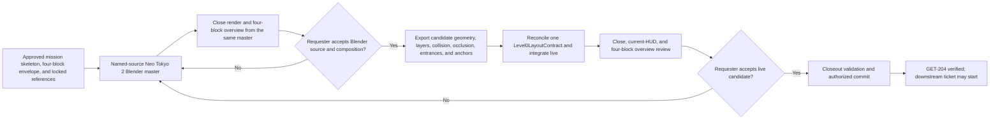

# Architecture

This document defines **how** the approved Tokyo escape specification is implemented. It is target architecture, not a claim that the current protected worktree already conforms.

Authority flows from current requester directives through [[01 MVP/12 Game Design Decision Register]] and the canonical system specifications into this document. Architecture may clarify ownership and data flow; it may not change player behavior. Any conflict returns to the specification and review queue before code changes continue.

## 1. Architectural principles

1. **Specification before runtime.** No gameplay recovery or reimplementation begins until the documentation gate in `AGENTS.md` is satisfied.
2. **One authority per state.** Redux owns persistent/domain state, Phaser owns frame-local presentation and simulation objects, React owns DOM presentation and player input for overlays, and content manifests own authored data.
3. **Mission semantics and accepted geometry have separate authority.** The mission skeleton owns required places, route purposes, stable semantic IDs, and player behavior. The requester-accepted four-block Blender master owns detailed visible geometry. `Level0LayoutContract` is the one reconciled runtime record for walkability, footprints, entrances, occlusion, and gameplay anchors; neither a rejected greybox nor an unaccepted render may silently redefine the other authority.
4. **Truthful perception.** Surveillance rendering and detection consume the same resolved geometry and occlusion data.
5. **Explicit effects.** Dialogue, interactions, terminals, and mission transitions commit typed effects; no component mutates unrelated domains opportunistically.
6. **Deterministic recovery.** Autosave and `OperationAttemptBaseline` are distinct persisted records. `restartAttempt` restores the complete departure baseline rather than reversing later events.
7. **Knowledge is state.** Facts and discovery control what the dossier, minimap, George, dialogue, and objectives may reveal.
8. **Pause is ownership, not a boolean.** Every pause surface acquires a reason; simulation resumes only when all reasons release.
9. **Human evidence outranks technical proxies.** Validators and tests protect contracts. Live human-control behavior and inspected frames prove the game.
10. **Retired code has no design authority.** Existing Ghost/Wire/Force, A*, combat, AutoBattle, storylet, reputation, and inventory code may be archived, removed, or selectively salvaged only after recovery; its presence cannot justify behavior.
11. **Provisional means reversible.** An unresolved `OPEN-*` recommendation may be encoded only through an authored constant, content record, manifest, or isolated presentation seam that is named in progress evidence and can be replaced without rewriting unrelated systems.

## 2. Runtime boundaries

### React application shell

React owns:

- main menu and New Game entry;
- character creation;
- four-lane HUD DOM;
- dialogue, Character screen, dossier, feed, terminal, debrief, failure, Restart Attempt, completion, and Game Design Bible overlays;
- localization rendering;
- accessible focus, keyboard routing, and modal ownership;
- creation/destruction of the Phaser canvas boundary.

React does not calculate camera detection, move actors, choose routes, or directly mutate Phaser objects.

### Redux domain store

Redux owns serializable run state:

- identity and build;
- Health and Paranoia;
- world clock and pause reasons;
- mission/objective/fact/outcome ledgers;
- discovered map knowledge;
- surveillance network state and last-known position;
- contact/dialogue state;
- safehouse, autosave metadata, and `OperationAttemptBaseline` metadata;
- settings and localization.

Reducers accept typed domain events and remain deterministic. Selectors produce read models for React, Phaser synchronization, save serialization, George prompts, and diagnostics.

### Phaser runtime

Phaser owns frame-local world behavior:

- projected environment and dynamic actor rendering;
- direct movement intent and collision sliding;
- camera follow, pan, zoom, and observation framing;
- interaction hit testing against layout semantics;
- camera sweep, shared visibility geometry, drone movement, and authored NPC schedules;
- depth/occlusion presentation;
- runtime audio positioning and live visual feedback.

Phaser reports domain events to Redux. It does not persist authoritative mission outcomes in display objects.

### Authored content layer

Typed content modules/manifests own:

- Level 0 layout contract;
- mission/objective definitions;
- facts and checks;
- dialogue graphs and localized content;
- schedules;
- hiding/blending contexts;
- terminals and surveillance devices;
- George prompts;
- the curated finalized-only bilingual Game Design Bible catalog, its stable topic IDs, and non-rendered source/decision traceability metadata;
- audio cue registry;
- art and actor manifests;
- acceptance fixtures and deterministic diagnostics.

### Production tooling

Tooling owns:

- Neo Tokyo source inventory and license metadata;
- Blender master-scene recipe and deterministic export;
- semantic mask/anchor extraction;
- art, actor, layout, localization, and content validation;
- fixed-viewport capture;
- AI playtest regression evidence.

Tool output never marks a player-experience gate accepted automatically.

### Active Level 0 runtime seam

The shipping application entry mounts the canonical Level 0 runtime island through `src/App.tsx` and `src/components/level0/Level0RuntimeShell.tsx`. The island deliberately does not mount the retired `GameController`, `BootScene`, `MainScene`, A* input modules, tactical-combat managers, or whole-root prototype hydration. Those modules remain recoverable source until their owning tickets salvage or remove them, but they are not part of ordinary New Game.

Current ownership is explicit:

- `src/content/levels/level0/layoutContract.ts` is the authored runtime topology;
- `src/game/level0/layout/` owns validation and the reversible 64×32 projection adapter;
- `src/game/level0/movement/directMovement.ts` owns direct intent, local collision sampling, and axis sliding;
- `src/game/level0/interaction/interactionResolver.ts` owns knowledge, independently derived world-ownership, range, occlusion, and authoritative availability results; automatic discovery filters unknown or wrong-domain anchors instead of revealing their existence through an error;
- `src/game/level0/art/` owns the T4 named-source city contract, live derivative selection, registered camera/LOD rules, provenance, and validation plus the parked T5 treatment contracts. The normal route now renders the T4 four-block city; `visualGate=get204-1` changes only deterministic camera/player start. T5 preserves T4 recipe/semantic identities and remains unable to replace the city until its own accepted export is runtime-ready;
- `src/game/level0/runtime/` owns authored-ID map knowledge, the clock, safehouse effects, exact schema and spatial validation, transient-pause normalization, autosave, the immutable `OperationAttemptBaseline`, and the `restartAttempt` action;
- `src/game/level0/rpg/` owns creation validation, the authored check catalog and pure resolver, committed attempt/resource/XP/allocation ledgers, provisional tuning tables, fatal resource transitions, and safehouse/debrief progression rules;
- `src/store/level0RuntimeSlice.ts` is the isolated serializable domain lane;
- `src/game/level0/scene/Level0Scene.ts` owns live city-layer composition, explicit diagnostic fallback, separate actor transforms/occlusion, camera, and input. City treatment/LOD selection is derived from camera state; protagonist position must never replace one architectural plate with another or mutate geometry presentation;
- `src/game/level0/playtest/level0AgentBridge.ts` derives diagnostics from the same store/layout and may dispatch only normal runtime events;
- `src/content/gameBible/` owns the finalized English/Ukrainian reference catalog, shared language-neutral rules, search extraction, relations, topic coverage, and non-rendered traceability; `src/components/level0/Level0GameBible.tsx` owns its accessible presentation and cannot dispatch game-domain effects;
- `art/iso-assets/contracts/level0-layout-contract.json` is the deterministic Blender-facing export of the same contract.

The retired `the-getaway-state` schema remains disabled. Level 0 schema/runtime content version 3 uses independent autosave and `OperationAttemptBaseline` keys plus exact nested envelopes, so legacy or stale development saves cannot hydrate or overwrite the canonical run. Validation reconstructs and checks normalized callsign/build budgets, every committed check from its recorded Paranoia/facts/contexts, the ordered resource before/after chain, threshold announcements, one-shot XP milestones, pending levels, allocation history, camera-group attempt history, grounding usage, Cold Iron evidence state, processed clock boundaries, and final build totals. It also rejects non-walkable player/last-known positions, non-unit facing, mismatched generation/seed/layout identity, inconsistent clock boundaries, and cause-specific failure data that does not match the authoritative ledgers. `OperationAttemptBaseline` additionally requires the authored departure anchor and carries the complete RPG, surveillance, recovery, and schedule state. Transient overlay pause owners are never serialized; hydration derives only durable failure/completion ownership. Departure persists the baseline before the departed autosave, rejects stale-session or divergent-state conflicts, and recreates Phaser at the committed departure transform. Player transforms are checkpointed only after change at a bounded cadence rather than stored every render frame. Exact layout dimensions, start zoom, movement speed, safehouse policy, check requirements, XP, and unresolved surveillance/art values remain provisional while their `OPEN-*` decisions are unresolved.

## 3. Application lifecycle

The target lifecycle is:

```text
BOOT
  → MAIN_MENU
  → L0_CHARACTER_CREATION
  → L0_SAFEHOUSE_INTRO
  → L0_LIRA_BRIEFING
  → L0_PREPARATION
  → L0_OPERATION_DEPARTED
  → L0_INFILTRATION
  → L0_MEDKITS_SECURED
  → L0_ESCAPE
  → L0_LIRA_RETURN
  → L0_TRANSIT_VALIDATION
  → L0_DEBRIEF
  → L0_COMPLETE
  → CONTINUE_EXPLORING | END_DEMO
```

Scene loading is an application side effect between valid character confirmation and `L0_SAFEHOUSE_INTRO`, not a second mission state. Any authored run failure enters `L0_FAILED` with one exact `failure.*` cause and exposes Restart Attempt. `failure.save_incompatible` prevents Level 0 hydration and offers New Game. Miami is continuation data only; no Level 1 scene is loaded.

Starting or restarting a run must:

1. stop and dispose the previous Phaser scene/runtime;
2. clear frame-local event handlers, timers, audio, and pause ownership;
3. initialize or hydrate only the current save schema;
4. load the correct layout/art/schedule state;
5. create the protagonist from `PlayerIdentity` and `PlayerBuild`;
6. center the camera and broadcast current viewport knowledge before input;
7. expose the correct React surface with no stale overlay or focus owner.

## 4. State ownership map

| Domain | Authority | Runtime mirror | Persisted | Notes |
|---|---|---|---|---|
| Identity/build/progression | Redux | Actor/portrait selection | Yes | No fixed Operative/package state. |
| Health/Paranoia | Redux | HUD and transient feedback | Yes | Changes only through authored effects. |
| Mission/objectives/facts/outcomes | Redux | Markers, prompts, debrief | Yes | Stable keys and provenance. |
| World time/schedules | Redux clock | Phaser schedule evaluation | Yes | Frame deltas emit clock progress only while unpaused. |
| Pause ownership | Redux | Phaser active/frozen gate | Yes for save-safe states | Additive reason set. |
| Surveillance state | Redux | Phaser detection/search presentation | Yes | Geometry remains content/runtime derived. |
| Actor transforms | Phaser during play | Redux checkpoint records only | Baseline/autosave | Avoid per-frame Redux position churn. |
| Discovery/minimap knowledge | Redux | Minimap/world emphasis | Yes | Unknown content cannot leak. |
| Dialogue state | Redux/content graph | React overlay | Yes | Effects commit atomically. |
| Safehouse/autosave/Restart Attempt | Persistence service + Redux metadata | React actions | Yes | `OperationAttemptBaseline` is a separate record restored only by `restartAttempt`. |
| Camera/viewport | Phaser | React minimap scroller read model | No | Reinitialized deterministically. |
| Audio instances | Phaser/audio service | None | No | Derived from current domain events/state. |

## 5. Public typed contracts

The names below are required public concepts. Exact module locations may change during recovery, but the semantic fields and ownership must remain explicit and typed.

### Level0LayoutContract

```ts
type Level0SurfaceKind =
  | 'road'
  | 'sidewalk'
  | 'crossing'
  | 'alley'
  | 'plaza'
  | 'interior-boundary'
  | 'blocked';

type Level0AnchorKind =
  | 'safehouse'
  | 'contact'
  | 'entrance'
  | 'terminal'
  | 'camera'
  | 'drone-launch'
  | 'hiding'
  | 'blending'
  | 'objective'
  | 'interaction'
  | 'audio';

type Level0TraversalLoopId =
  | 'loop.public-contact'
  | 'loop.logistics-service'
  | 'loop.outer-escape';

interface Level0TraversalLoopDisplayName {
  loopId: Level0TraversalLoopId;
  localizedDisplayNameKey: string;
}

interface Level0LayoutContract {
  id: string;
  schemaVersion: number;
  projection: { tileWidth: 64; tileHeight: 32; orientation: 'isometric-2:1' };
  bounds: WorldPolygon;
  zones: Level0Zone[];
  traversalLoops: Level0TraversalLoop[];
  traversalLoopDisplayNames: Level0TraversalLoopDisplayName[];
  surfaces: Level0SurfaceRegion[];
  buildingFootprints: Level0BuildingFootprint[];
  entrances: Level0Entrance[];
  droneRegions: Level0DroneRegion[];
  anchors: Level0Anchor[];
  occluders: WorldPolygon[];
  semanticMaskIds: string[];
  artLayerIds: string[];
}
```

The contract is authored from approved rules plus explicitly recorded provisional layout data. Both Blender export and Phaser runtime consume it. The three stable loop IDs resolve through localization to **Transit Road**, **Market Ring**, and **Outer Space** without renaming internal IDs. Exact dimensions and anchors remain non-final while their review items are open and must stay replaceable through this contract.

### Player identity and build

```ts
interface PlayerIdentity {
  callsign: string;
  appearancePresetId: string;
}

type AttributeKey = 'physical' | 'mental' | 'social' | 'technical';
type SkillKey =
  | 'stealth'
  | 'evasion'
  | 'awareness'
  | 'composure'
  | 'insight'
  | 'influence'
  | 'systems'
  | 'opsec';

interface PlayerBuild {
  attributes: Record<AttributeKey, number>;
  skills: Record<SkillKey, number>;
  level: number;
  xp: number;
  unspentSkillPoints: number;
  unspentAttributePoints: number;
}
```

Creation budgets/caps and progression rules come from [[01 MVP/92 Character & Progression]]. Validation occurs both before confirmation and during save hydration.

### Deterministic checks

```ts
interface AuthoredModifier {
  id: string;
  amount: number;
  requiredContextId: string;
  localizedReasonKey: string;
}

interface CheckRequirement {
  id: string;
  attribute: AttributeKey;
  skill: SkillKey;
  requiredTotal: number;
  factRules: CheckFactRule[];
  situationalModifiers: AuthoredModifier[];
  successEffectIds: string[];
  failForwardEffectIds: string[];
  localizedRequirementKey: string;
  visibilityFactId?: string;
  lockedReasonId?: string;
}

interface CheckResolution {
  checkId: string;
  attribute: AttributeKey;
  attributeValue: number;
  skill: SkillKey;
  skillValue: number;
  paranoiaPenalty: 0 | 1 | 2 | 3;
  appliedFactIds: string[];
  appliedModifiers: AuthoredModifier[];
  guaranteedByFactId: string | null;
  baseRequiredTotal: number;
  effectiveRequiredTotal: number;
  finalTotal: number;
  outcome: 'success' | 'fail-forward' | 'fatal';
  successEffectIds: string[];
  failForwardEffectIds: string[];
}

interface CommittedCheckResolution extends CheckResolution {
  resolutionId: string;
  attemptKey: string;
  paranoiaValue: number;
  knownFactIds: string[];
  activeContextIds: string[];
  resolvedAtWorldMinute: number;
}

interface Level0CheckBreakdown {
  presentation: 'preview' | 'result';
  checkId: string;
  requiredTotal: number;
  finalTotal: number;
  attribute: { key: AttributeKey; value: number };
  skill: { key: SkillKey; value: number };
  paranoiaPenalty: 0 | 1 | 2 | 3;
  appliedFactIds: string[];
  appliedModifiers: AuthoredModifier[];
  outcome?: CheckResolution['outcome'];
}

interface Level0ResourceEvent {
  eventId: string;
  resource: 'health' | 'paranoia';
  sourceId: string;
  amount: number;
  before: number;
  after: number;
  worldMinute: number;
  feedbackId: string;
  attemptTreatment: 'captured-at-departure' | 'discard-on-restart-attempt';
  crossedParanoiaThresholds: Array<40 | 70 | 90>;
}

interface Level0XpEvent {
  milestoneId: string;
  amount: number;
  before: number;
  after: number;
  worldMinute: number;
  feedbackId: string;
}

interface Level0AllocationEvent {
  eventId: string;
  kind: 'level' | 'skill' | 'attribute';
  key?: SkillKey | AttributeKey;
  before: number;
  after: number;
  worldMinute: number;
}

interface Level0RpgLedger {
  resolvedChecks: Record<string, CommittedCheckResolution>;
  resourceEvents: Level0ResourceEvent[];
  announcedParanoiaThresholds: Array<40 | 70 | 90>;
  awardedMilestoneIds: string[];
  xpEvents: Level0XpEvent[];
  pendingLevelUps: number;
  allocationEvents: Level0AllocationEvent[];
}
```

The resolver is pure and deterministic. `Level0CheckBreakdown` renders the same calculation twice: `preview` before an authored choice is committed and `result` after resolution. Preview and result must use identical requirements, build values, fact/context modifiers, and Paranoia penalty; the result adds only the committed outcome. Every nonfatal catalog entry must declare and validate at least one real `failForwardEffectId`; only the final failed capture-escape check may resolve as `fatal`. A committed attempt key is derived from check ID plus sorted authored context IDs; reopening the same attempt returns its first resolution, while reusing a resolution ID for another attempt is rejected. Persistence stores and recomputes the exact inputs rather than trusting serialized outcome math.

### Facts and discovery

```ts
interface FactAcquisition {
  acquisitionId: string;
  factId: string;
  sourceKind: 'opening' | 'dialogue' | 'observation' | 'interaction' | 'check';
  sourceId: string;
  acquiredAtWorldMinute: number;
  contextId?: string;
}

interface KnownFact {
  factId: string;
  acquisitions: FactAcquisition[];
  appliedEffectIds: string[];
}

type ColdIronEvidenceState =
  | 'unknown'
  | 'naila_warning'
  | 'manifest_recognized'
  | 'manifest_copied';

interface FactLedger {
  known: Record<string, KnownFact>;
  coldIronEvidence: ColdIronEvidenceState;
}

interface MapKnowledgeState {
  discoveredLocationIds: string[];
  discoveredCameraIds: string[];
  discoveredTerminalIds: string[];
  discoveredHidingContextIds: string[];
  discoveredBlendingContextIds: string[];
  objectivePrecision: Record<string, 'hidden' | 'district' | 'area' | 'entrance' | 'exact'>;
}
```

Facts are stable authored keys with declared effects. The general ledger remains binary: a fact is known or unknown. The dedicated `ColdIronEvidenceState` is the only staged evidence chain and advances in order from `unknown` through Naila's warning and manifest recognition to an explicit manifest-copy interaction. Copying costs exactly five world minutes, has no additional check, and is idempotent. The first valid acquisition creates the `KnownFact` and atomically records the declared effect IDs after they apply. A later valid acquisition may append or refine provenance through a unique `acquisitionId`, but it cannot reapply an effect already present in `appliedEffectIds`. Discovery and facts are related but not interchangeable.

### Surveillance

```ts
type SurveillanceLevel = 'clear' | 'suspicious' | 'pursuit';
type SurveillanceRuleBreakKind =
  | 'restricted-area-breach'
  | 'protected-interaction'
  | 'medkit-removal'
  | 'failed-verification'
  | 'detected-camera-feed-change';
type CameraGroupAttemptHistory = 'unused' | 'active' | 'clean' | 'traced';

interface ObservationEvidence {
  observerId: string;
  observedAtWorldMinute: number;
  position: WorldPoint;
  visible: boolean;
  occluderIds: string[];
}

interface SurveillanceRuleBreakEvidence {
  evidenceId: string;
  kind: SurveillanceRuleBreakKind;
  sourceId: string;
  observedById: string;
  observedAtWorldMinute: number;
  position: WorldPoint;
}

interface SurveillanceLedgerEntry {
  entryId: string;
  kind: 'sighting' | 'detected-camera-feed-change' | 'needle-verification' | 'capture';
  sourceId: string;
  worldMinute: number;
  position: WorldPoint;
  ruleBreakEvidenceId?: string;
}

interface SurveillanceState {
  level: SurveillanceLevel;
  sourceDeviceId?: string;
  sourceActorId?: string;
  activeObserverIds: string[];
  recognitionSourceIds: string[];
  cameraGroupHistory: Record<string, CameraGroupAttemptHistory>;
  ledger: SurveillanceLedgerEntry[];
  lastTransitionReasonId?: string;
  lastKnownPosition?: WorldPoint;
  lastObservedAtWorldMinute?: number;
  suspiciousSinceWorldMinute?: number;
  pursuitSinceWorldMinute?: number;
  searchAreaId?: string;
  traceProvenance?: {
    terminalId: string;
    cameraGroupId: string;
    createdAtWorldMinute: number;
  };
  verificationProvenance?: {
    verifierId: string;
    verifiedAtWorldMinute: number;
  };
  droneAssignment?: {
    droneId: string;
    target: WorldPoint;
    phase: 'dispatching' | 'verifying' | 'searching' | 'returning';
  };
}

interface CaptureReportReadModel {
  corporationDisplayNameKey: string;
  sightings: Array<{
    sourceId: string;
    worldMinute: number;
    position: WorldPoint;
  }>;
  detectedTampering: SurveillanceLedgerEntry[];
  needleVerifications: SurveillanceLedgerEntry[];
  captureEvidence: SurveillanceLedgerEntry;
  connectedSightlineSegmentIds: string[];
  disconnectedGapCount: number;
}
```

Runtime geometry emits raw `ObservationEvidence`. A separate rule-break resolver emits `SurveillanceRuleBreakEvidence` only for the five approved behaviors. The transition owner may create concern or Paranoia only when valid visibility and valid rule-break evidence coincide; ordinary public camera visibility is inert. Solid geometry and ordinary occlusion create blind spots without an off-grid zone type. Returning fully to `clear` empties recognition sources and makes later ordinary public visibility harmless until another observed rule break.

Each camera group has one attempt-long history. Activation may expire, but `clean` or `traced` remains authoritative until `restartAttempt`; Level 0 authors exactly one usable group. `Needle` is the localized player-facing name for the single verifier drone, while its internal ID remains stable. Civilians consume only current visible camera, Needle, and player-behavior presentation signals; they never read this hidden ledger, raise reports, or mutate surveillance.

The capture-report selector reads only the surveillance ledger. It may connect sightings that the ledger can actually relate, but it never interpolates the protagonist's full movement path; unseen gaps remain disconnected. `CaptureReportReadModel` is unavailable for deadline, Health, and Paranoia failures.

### World clock and pause

```ts
type PauseOwner =
  | 'menu'
  | 'settings'
  | 'character_creation'
  | 'character'
  | 'dossier'
  | 'social_feed'
  | 'dialogue'
  | 'observation'
  | 'terminal'
  | 'safehouse_action'
  | 'george_consultation'
  | 'interception'
  | 'restart_attempt_confirmation'
  | 'level_up'
  | 'debrief'
  | 'mission_recap'
  | 'failure'
  | 'completion';

type Level0ClockBoundaryId =
  | 'clock.2100'
  | 'clock.2130'
  | 'clock.2200'
  | 'clock.2330';

interface WorldClockState {
  currentMinute: number;
  phase: 'dusk' | 'blue-hour' | 'curfew';
  curfewActive: boolean;
  deadlineReached: boolean;
  processedBoundaryIds: Level0ClockBoundaryId[];
  pauseOwners: PauseOwner[];
  scheduleStates: Record<string, string>;
}

interface GroundingActionDefinition {
  actionId: 'grounding.transit-road-vending-coffee' | 'grounding.market-ring-shrine';
  anchorId: string;
  worldMinuteCost: 10;
  paranoiaDelta: -10;
  usesPerAttempt: 1;
}

interface Level0AttemptRecoveryState {
  usedGroundingActionIds: GroundingActionDefinition['actionId'][];
  difficultSurveillanceEscapeReliefUsed: boolean;
  announcedParanoiaThresholds: Array<40 | 70 | 90>;
}
```

Frame time advances the clock only when `pauseOwners` is empty and the run is in an active exploration state. Boundary IDs persist as an idempotency set so 21:00, 21:30, 22:00, and 23:30 each fire exactly once across pause, autosave, hydration, and explicit clock jumps. Attempt recovery state makes both ten-minute/−10 grounding actions one-use, limits the qualifying difficult-escape relief to one −5 event, and lets George announce each 40/70/90 threshold once per attempt.

### Safehouse and Restart Attempt

```ts
interface SafehouseState {
  insideBoundary: boolean;
  operationAttemptBaselineCreated: boolean;
  recoveryAvailable: boolean;
  transitCredentialState: 'not-issued' | 'issued' | 'validated';
  debriefAvailable: boolean;
  usedActionIds: string[];
}

interface SafehouseActionAvailability {
  actionId: string;
  available: boolean;
  blockedReasonId?: string;
  evaluatedAgainstSurveillanceLevel: SurveillanceLevel;
  directlyObserved: boolean;
}

interface RuntimeGenerationState {
  generationVersion: string;
  seed: string;
  authoredVariantIds: Record<string, string>;
}

type Level0MissionState =
  | 'L0_CHARACTER_CREATION'
  | 'L0_SAFEHOUSE_INTRO'
  | 'L0_LIRA_BRIEFING'
  | 'L0_PREPARATION'
  | 'L0_OPERATION_DEPARTED'
  | 'L0_INFILTRATION'
  | 'L0_MEDKITS_SECURED'
  | 'L0_ESCAPE'
  | 'L0_LIRA_RETURN'
  | 'L0_TRANSIT_VALIDATION'
  | 'L0_DEBRIEF'
  | 'L0_COMPLETE'
  | 'L0_FAILED';

type ObjectiveStatus =
  | 'hidden'
  | 'available'
  | 'active'
  | 'completed'
  | 'failed'
  | 'superseded';

interface ObjectiveState {
  objectiveId: string;
  status: ObjectiveStatus;
  completedAtWorldMinute?: number;
}

type ObjectiveStateRecord = Record<string, ObjectiveState>;

interface ContactState {
  consulted: boolean;
  lastDialogueNodeId?: string;
  acquiredFactIds: string[];
}

type ContactStateRecord = Record<'lira' | 'naila' | 'brant', ContactState>;

interface OperationAttemptBaseline {
  schemaVersion: 3;
  contentVersions: Record<string, string>;
  sessionId: string;
  createdAtWorldMinute: number;
  identity: PlayerIdentity;
  build: PlayerBuild;
  rpg: Level0RpgLedger;
  health: number;
  paranoia: number;
  recovery: Level0AttemptRecoveryState;
  worldClock: WorldClockState;
  mission: Level0MissionState;
  objectives: ObjectiveStateRecord;
  facts: FactLedger;
  mapKnowledge: MapKnowledgeState;
  contacts: ContactStateRecord;
  safehouse: SafehouseState;
  surveillance: Level0SurveillanceRuntimeState;
  player: Level0PlayerRuntimeCheckpoint;
  runtimeGeneration: RuntimeGenerationState;
  completion: Level0RunState['completion'];
}

interface OperationAttemptBaselineReadback {
  departureWorldMinute: number;
  contactsConsulted: Array<'naila' | 'brant'>;
  health: number;
  paranoia: number;
  localizedRestorationMeaningKey: string;
}
```

`OperationAttemptBaseline` is written once when the player explicitly leaves the safehouse for the operation. George reads the actual departure time, consulted contacts, Health, Paranoia, and restoration meaning through `OperationAttemptBaselineReadback` before confirmation. The player-facing **Restart Attempt** action dispatches `restartAttempt`, which hydrates the baseline as a whole and clears all post-departure runtime state. The confirmation overlay owns only `restart_attempt_confirmation`.

### George prompts

```ts
interface GeorgePrompt {
  id: string;
  allowedContexts: Array<'hud' | 'observation' | 'safehouse' | 'dossier'>;
  requiredFactIds: string[];
  requiredMissionStates: string[];
  excludedSurveillanceStates?: SurveillanceLevel[];
  localizedQuestionKey: string;
  localizedResponseKey: string;
  unavailableReasonKey?: string;
  effect: 'none';
}
```

George prompts are authored, contextual, informational, and effect-free. Every unavailable or incomplete answer resolves to an authored truthful reason: missing discovery, non-networked space, absent source, or insufficient current evidence. Silence is never encoded as hidden gameplay information. George has no personal desire, deletion request, or Miami freedom arc in Level 0. He never accepts unrestricted free text in Level 0.

### Outcome ledger

```ts
interface Level0OutcomeLedger {
  acceptedAt: number;
  departedAt: number;
  completedAt: number | null;
  primaryTiming: 'dusk_public' | 'curfew_service' | 'mixed';
  contactsConsulted: Array<'lira' | 'naila' | 'brant'>;
  factsAcquired: Array<{
    factId: string;
    acquisitionIds: string[];
  }>;
  cameraGroupHistory: Record<string, CameraGroupAttemptHistory>;
  networkPeak: 'clear' | 'suspicious' | 'pursuit';
  needleVerified: boolean;
  hidingContextsUsed: string[];
  blendingContextsUsed: string[];
  interceptionOutcome: string | null;
  healthLost: number;
  paranoiaPeak: number;
  medkitsRecovered: boolean;
  medkitsReturned: boolean;
  coldIronEvidence: ColdIronEvidenceState;
  transitValidated: boolean;
  failureCause:
    | 'failure.health'
    | 'failure.paranoia'
    | 'failure.capture'
    | 'failure.deadline'
    | null;
}
```

Content may add stable detail fields only through a specification update. Debrief reads this ledger; it does not reconstruct outcomes from display logs.

### Art and actors

```ts
interface ActorLightRegion {
  id: string;
  bounds: WorldPolygon;
  semanticTint: 'amber' | 'cyan';
  intensity: number;
  priority: number;
}

interface Level0ArtManifest {
  schemaVersion: 2;
  id: string;
  usage: 'candidate-evidence' | 'runtime';
  compositionStage: 'four-block-source' | 'quality-lookdev' | 'live-candidate';
  recipeId: string;
  layoutContractId: string;
  projection: { tileWidth: 64; tileHeight: 32; orientation: 'isometric-2:1' };
  worldOrigin: WorldPoint;
  canvas: {
    width: number;
    height: number;
    pixelOrigin: WorldPoint;
    tileSize: number;
    columns: number;
    rows: number;
  };
  actorLightRegions: ActorLightRegion[];
  budget: { maxTotalBytes: number; maxTileBytes: number; measuredTotalBytes: number };
  layers: Array<{
    id: string;
    kind: 'ground' | 'architecture-back' | 'architecture-front' | 'lighting-foundation' | 'semantic-mask';
    state?: 'dusk' | 'blue-hour' | 'curfew';
    maskId?: string;
    tiles: Array<{
      id: string;
      imagePath: string;
      sha256: string;
      byteSize: number;
      column: number;
      row: number;
      x: number;
      y: number;
      width: number;
      height: number;
    }>;
    fallbackLayerId: string;
  }>;
  anchorMetadata: { path: string; sha256: string; count: number };
  fallbackProfile: 'level0-t4-live-city';
}

type CharacterState = 'idle' | 'move' | 'interact';
type CharacterDirection =
  | 'north'
  | 'north-east'
  | 'east'
  | 'south-east'
  | 'south'
  | 'south-west'
  | 'west'
  | 'north-west';

interface CharacterSpriteManifestEntry {
  actorId: string;
  ownership: 'player' | 'contact' | 'security' | 'civilian';
  spriteSetId: string;
  bindings: {
    appearancePresetIds?: readonly string[];
    dialogueIds?: readonly string[];
    resourceKeys?: readonly string[];
    visualRoleKey?: string;
  };
  frameSize: { width: 64; height: 96 };
  frameCount: 4;
  stateFps: Record<CharacterState, number>;
  origin: { x: 0.5; y: 0.92 };
  footAnchorTolerancePx: 2;
  worldScale: number;
  alphaOccupancy: { minHeightPx: number; maxHeightPx: number; footRowPx: number; tolerancePx: 2 };
  depthPolicy: 'ground-anchor-y';
  portrait: CharacterPortraitManifestEntry;
  fallback: { kind: 'neutral-diagnostic'; rigKey: string };
  provenance: CharacterAssetProvenance;
}

interface CharacterPortraitManifestEntry {
  portraitId: string;
  path: string;
  dimensions: { width: 256; height: 256 };
  safeArea: { x: number; y: number; width: number; height: number };
  sha256: string;
  compressedBytes: number;
  decodedBytes: number;
  fallbackKey: 'portrait:neutral-diagnostic';
}

interface NonWorldPresentationManifestEntry {
  presentationId: string;
  path: string;
  dimensions: { width: 256; height: 256 };
  safeArea: { x: number; y: number; width: number; height: number };
  sha256: string;
  compressedBytes: number;
  decodedBytes: number;
  background: 'opaque' | 'transparent';
  fallbackKey: 'portrait:neutral-diagnostic' | 'ar:neutral-diagnostic';
  provenance: CharacterAssetProvenance;
}

interface CharacterAssetProvenance {
  recipeId: string;
  recipeSha256: string;
  generatorSha256: string;
  pngLibrarySha256: string;
  spriteReferenceId: string;
  spriteReferenceSha256: string;
  portraitReferenceId: string;
  portraitReferenceSha256: string;
}

declare const getCharacterSpriteSheetPath: (
  spriteSetId: string,
  state: CharacterState,
  direction: CharacterDirection
) => string;
```

The sheet matrix is derived from the stable actor/state/direction path function rather than duplicated inside every manifest entry. `Level0Scene` resolves one explicit presentation plan and passes the same typed sheet references through preload, loaded-state checks, and animation registration: all 24 `idle`/`move`/`interact` direction leaves for the selected protagonist, plus only fixed-facing `idle`/`interact` leaves for Lira, Naila, and Brant (30 sheets total). This prevents loading unused contact movement/directions or the other eight actor sets while retaining the complete validated inventory for later tickets. Layout-space motion is projected through the 2:1 isometric basis before eight-direction animation selection.

Actor tint samples authored `ActorLightRegion` metadata at the actor foot anchor. The reversible `OPEN-ART-005` baseline selects only the strongest overlapping region, eases changes over 250 ms, and applies restrained semantic amber/cyan palette tokens. The tint renderer is presentation-only: it cannot enter visibility, surveillance, collision, movement, interaction, or schedule calculations.

A generated integrity module owns portrait/non-world hashes and byte counts; sheet metrics remain adjacent to each actor directory. The validator independently compares those generated TypeScript records with the central integrity JSON so updating source PNGs and only one generated surface cannot pass. Required actors must pass complete-matrix, pixel-derived anchor/occupancy, portrait/provenance/path, generated-record parity, and fault-injection validation before production acceptance. Fallback is observable neutral resilience, never a rejected fantasy asset or acceptance evidence. Performance measurements are recorded, but shipping acceptance remains blocked until `OPEN-PERF-001` defines target hardware and numeric ceilings.

The four current appearance IDs are defined once by the actor manifest and reused by selection, persistence, and runtime resolution. Save decode strictly rejects unknown or retired IDs, including the pre-T6 `provisional-runtime-silhouette`; it never guesses a current preset from stale identity data.

## 6. Layout and Blender data flow


```mermaid
flowchart LR
  A["Approved mission skeleton, four-block envelope, and locked references"] --> B["Named-source Neo Tokyo 2 Blender master"]
  B --> C["Close render and four-block overview from the same master"]
  C --> D{"Requester accepts Blender source and composition?"}
  D -- "No" --> B
  D -- "Yes" --> E["Export candidate geometry, layers, collision, occlusion, entrances, and anchors"]
  E --> F["Reconcile one Level0LayoutContract and integrate live"]
  F --> G["Close, current-HUD, and four-block overview review"]
  G --> H{"Requester accepts live candidate?"}
  H -- "No" --> B
  H -- "Yes" --> I["Closeout validation and authorized commit"]
  I --> J["GET-204 verified; downstream ticket may start"]
```

### Contract discipline

- The mission skeleton owns stable semantic IDs, required places, route purposes, and player-facing behavior. The current envelope is exactly four dense mission blocks with three functional identities and three interlocking loops. It does not preserve the rejected sparse/fenced four-block compound or `84×60` nine-block geometry.
- The named-source Neo Tokyo 2 Blender master owns candidate street/building/public-realm geometry for those four blocks. The approved AI-assisted concept owns composition/camera/value relationships only. After the Blender proof is accepted, candidate geometry is reconciled into the one versioned layout contract; after the live result is accepted, that exact reconciled contract becomes the delivery boundary.
- Phaser collision, entrances, occluders, devices, contacts, terminals, hiding/blending contexts, objectives, and rendered derivatives all consume the accepted contract; no hidden greybox geometry may coexist with a different visible city.
- GET-204 has two distinct requester gates: actual Blender close/overview source proof before runtime replacement, then close/current-HUD/overview proof in the live runtime. A validator cannot accept either gate, and an AI-generated concept cannot satisfy source provenance.
- The complete live candidate must produce a close frame, a clean city frame, and a four-block mission overview from equivalent world/camera parameters.
- T4 export validation proves projection and canvas containment, tile-grid registration, file hashes/bytes/budgets, layer semantics/fallbacks, and complete anchor values against the layout contract. Decoded raster-edge agreement remains a visual/runtime acceptance responsibility rather than a claim made by metadata validation alone.
- T5 opens the exact ignored T4 master by expected hash only after the tracked T4 source/recipe and ignored aligned export pass their own validator. It verifies base transform/camera/canvas/anchor digests plus the pinned T4 art-manifest hash and semantic-registration digest, clones placement materials before mutation, and registers treatment-only objects under declared gameplay/civic purpose without changing authoritative collision data.
- T5 export validation opens the generated art manifest, every tile, anchors, and treatment evidence; it enforces stable T4 recipe/layer IDs, expected derivative roots, exact file inventory, physical hashes and bytes for every registered output including overview and the authoring `.blend`, grid cells, budgets, projection tolerance/canvas containment, all 27 anchor values, byte-identical and spatially identical T4 semantic masks, manifest-derived surface-treatment digest, exact grammar/object bindings, assigned public copy against the actual wrapped font bodies, color-independent surveillance-state cues, independently recomputed palette coverage, measured per-addition bounds, complete capture hashes/dimensions, ignored local-evidence usage, run-evidence `runtimeReady: false`, and an observable fallback to the accepted T4 live city rather than rejected greybox or generated-plate presentation.
- Hidzu Corporation palette tokens, surface/material transforms, public-message assignments, grammar kind/color/silhouette/glyph values, schedule values, and surveillance-state token/cue mappings are authoritative generator inputs. Unknown, incomplete, or semantically reassigned inputs fail before generation.
- The T5 runner serializes generation with an ignored lock and writes Blender output only to an ignored run-scoped staging root. A full `all` run is validated in staging, moved as one complete immutable directory under `.generated/runs`, revalidated there, and then published by atomically replacing the relative `.generated/current` symlink. A failed validation or pointer update removes the rejected run and preserves the prior pointer; readers resolve only `current` or an explicitly bounded staging/trial/run root.
- Preview, targeted capture, and export-only runs are retained under ignored `.generated/trials` and never update the canonical pointer. Only a full unfiltered `all` run can satisfy the 17-frame capture/export gate; Blender Python failures propagate a nonzero process exit.
- If a parallelogram footprint cannot match a visual base within one tile, author a custom polygon or multi-region footprint rather than trim-chasing.
- One full master scene prevents per-building angle, scale, and light drift.
- Raw vendor geometry and textures remain outside Git. Requester-authorized flattened game derivatives, original gap-fill assets, source manifests, recipes, and validators may be versioned after the complete live candidate is accepted; generated `.blend` files remain untracked.

## 7. Movement, interaction, camera, and observation

### Direct movement

Click-to-move stores a world-space intent point. WASD stores a directional intent. A new input replaces the old intent immediately. The movement integrator advances directly toward the intent and uses local collision sliding; it does not request a path.

Invalid clicks resolve against the layout’s walkable geometry and return a typed reason plus optional nearest reachable marker. They do not silently route around buildings.

### Interaction

The interaction resolver evaluates:

1. target exists and is currently available;
2. pointer/keyboard action belongs to the world, not a DOM overlay;
3. protagonist is within forgiving target range;
4. required visibility and occlusion rules pass;
5. the target’s owning domain authorizes the requested interaction.

It returns a typed available/blocked result consumed by both prompt UI and activation. Proximity alone never commits an interaction.

Player knowledge and world ownership are separate inputs. Knowledge controls whether a target may be surfaced; world ownership proves that the target's backing domain state exists. An explicitly addressed invalid target may return a truthful diagnostic, while automatic interaction discovery silently excludes unknown or wrong-domain anchors so it cannot leak hidden content.

### Camera

- Level 0 exposes a close street-first normal frame and a manual minimum zoom that reaches the composed four-block mission overview. Exact numeric values are frozen from the accepted same-master GET-204 live candidate rather than inherited from the greybox or generated plate.
- Camera follow binds to the current protagonist after every load/restart.
- Observation mode may pan independently while paused, then restores follow without a sacrificial click.
- Minimap viewport derives from current camera transform, not stale render bounds.
- Exact start zoom, movement speed, and camera easing remain open tuning values.

### Observation

Observation acquires the `observation` pause reason. It permits camera pan and read-only inspection of known cameras, exact discovered coverage, Needle, last-known state, contacts, entrances, hiding/blending contexts, current objective, facts, and one authored George prompt. Normal play receives only subtle authored camera light/reflection warnings; Observation is the exact-coverage surface. It cannot issue movement, activate terminals, alter surveillance, commit world state, or trigger a vignette/reward.

## 8. Surveillance architecture

### Shared geometry

Each surveillance device owns one current orientation/sweep definition. The visibility resolver combines it with range, field of view, layout occluders, and active schedule. Both the world rendering layer and detection sampler consume that same result. Blind spots are the ordinary result of solid geometry and occlusion; there is no separate off-grid region or network-null topology.

### Network transition owner

A pure network reducer receives typed evidence:

- raw observation started/continued/broken;
- observed restricted-area breach, protected interaction, or medkit removal;
- detected camera-feed change;
- failed verification or Needle verification;
- recovery-context entered/maintained/invalidated;
- interception result.

It updates `SurveillanceState` according to the approved matrix. Visibility alone in ordinary public space creates no concern. A concern transition requires current valid `ObservationEvidence` paired with `SurveillanceRuleBreakEvidence`; it cannot query the hidden protagonist transform when no valid observer has supplied it. A full transition to `clear` resets recognition and active observer attribution.

The safehouse boundary never dispatches a network-clear event by itself. A pure safehouse-availability resolver consumes `SafehouseState`, `SurveillanceState`, and current valid observation evidence and returns `SafehouseActionAvailability` records for Wait, Rest, save, level-up, George planning, and terminals. Until `OPEN-SAFE-001` is accepted, the resolver uses that queue entry's documented recommendation as explicit replaceable content data; UI and world interactions consume the same typed result and cannot invent a separate safe-zone policy. The provisional value cannot be treated as final acceptance evidence.

### Drone

Exactly one Level 0 verifier drone, player-facing **Needle**, receives dispatch targets from the network. Its runtime controller follows one authored patrol, moves toward stored legitimate last-known positions, verifies visible/hiding areas according to authored rules, searches, and returns. Presentation emits its authored hum, approach warning, and verification warning. It has no weapon, HP, combat turn, or defeat state.

### Hiding and blending

Contexts are layout/content records, not tile tags inferred at runtime. Each declares bounds, entry point, schedule, direct-observation restriction, allowed network states, recovery behavior, and player-facing fiction.

### Camera loop

Only the connected camera terminal can request the single Level 0 camera-group loop, and that group can be used once per attempt. The check/effect resolver uses Systems and OpSec, applies exactly the target declared by the terminal, schedules active-loop expiry, and records `clean` or `traced`. That terminal history persists until `restartAttempt`; expiry never returns it to `unused`. There is no global hack bus.

## 9. Dialogue, facts, objectives, and George

### Dialogue graph

Dialogue content is an authored graph with stable nodes and localized exact lines. The dialogue domain evaluates availability/checks, exposes the exact `preview` breakdown before every checked choice, commits typed effects atomically, advances the node, records the `result` breakdown, and follows the declared worse path on every nonterminal failure. React renders the read model; no UI component dispatches unrelated low-level state mutations.

### Effect registry

Allowed Level 0 effects include:

- add fact;
- update objective or mission state;
- refine map knowledge;
- add an outcome-ledger field;
- apply authored time, Health, or Paranoia consequence;
- update contact state;
- issue/validate mission object;
- award milestone XP;
- enter a declared failure.

Every effect is idempotent or protected by a stable event ID.

### Objectives and facts

Mission state and objective state are separate. The mission state machine controls legal sequence; objectives provide player-facing instructions. General facts remain binary and determine knowledge/modifiers. The dedicated Cold Iron state machine advances only through Naila warning → manifest recognition → explicit five-minute manifest copy. No log text is parsed to infer any of these domains.

### George

George consumes a read-only context assembled from mission state, facts, known devices/locations, time, Health/Paranoia, and allowed prompt definitions. His response resolver selects authored content only and always returns a truthful limit reason when useful information is unavailable. Threshold announcements are gated by attempt history at 40, 70, and 90. Departure confirmation consumes the baseline readback. `effect: 'none'` is enforced at the contract boundary; absence of a line never carries hidden gameplay meaning.

## 10. Health, Paranoia, and progression

Health and Paranoia changes are idempotent authored effects with stable event/source IDs, signed amount, exact before/after values, world minute, feedback key, attempt treatment, and crossed-threshold metadata. Attempt treatment is derived from the operation-departure boundary: events already present when the immutable baseline is created are `captured-at-departure`; later events are `discard-on-restart-attempt`. Presets cannot hard-code a contradictory treatment. An existing event ID or terminal run rejects another application. No render frame loop applies passive damage or Paranoia decay/gain. Surveillance-origin Paranoia requires the approved paired observation/rule-break evidence; ordinary public visibility is never a source.

The vending-machine coffee and shrine actions use authored `GroundingActionDefinition` records and the attempt recovery ledger: each costs ten world minutes, removes ten Paranoia, and is consumed once. The first qualifying difficult surveillance escape may emit one authored −5 Paranoia event. Dialogue cannot create grounding relief. Health remains authored damage/recovery only; no Health band drives a limp, movement multiplier, detection modifier, or civilian response.

The Redux runtime keeps only ephemeral resource-event IDs for the currently visible feedback. The HUD resolves those IDs back to the authoritative run ledger and renders localized resource, signed amount, and authored source copy; it never derives player text from a machine ID. Persistent consequence summaries remain outcome-ledger data and never reuse transient resource logs.

The pure check resolver obtains the Paranoia penalty from current value:

- `0–39`: 0;
- `40–69`: −1;
- `70–89`: −2;
- `90–99`: −3;
- `100`: fatal collapse before further check resolution.

Milestone XP uses stable award IDs and an ordered XP event ledger to prevent duplication. Level thresholds and event values remain replaceable content data whether provisional or approved; they are not copied into `PlayerBuild`. A pending level is activated only in a clear, unobserved safehouse or during debrief, grants two skill points and every-third-level attribute points, and writes each level/skill/attribute mutation to the allocation ledger. Domain rejection remains authoritative and the Character UI disables the same actions with the same context explanation.

## 11. Time, schedules, and pause

The clock service receives frame deltas only during active exploration with no pause owners. It advances at 30×, persists idempotent boundary IDs, and derives phase/curfew/deadline state. Authored city changes fire exactly once at 21:00, 21:30, 22:00, and 23:30 even when a pause, save hydration, or explicit clock jump straddles the boundary.

Schedules are authored state tables keyed by world phase/boundary, not free-running NPC scripts. Schedule transitions can change availability, position/path definitions, public/blending context, shutters, crowd density, signage/light state, and ambience. They cannot move a currently interacting actor or mutate geometry silently. Spatial ambience has three authored world anchors: the Transit Road restaurant, Market Ring workshop, and safehouse-side apartment.

Safehouse Wait and Rest dispatch explicit clock jumps after confirmation. All boundary events between old and new time are processed deterministically.

## 12. Safehouse, persistence, and compatibility

### Persistence records

Use distinct storage keys and schema envelopes for:

- current-run autosave;
- operation-departure `OperationAttemptBaseline`;
- settings/localization.

Each envelope contains schema version, content/layout version, timestamp, and a deeply validated payload. Version 3 requires `PlayerIdentity`, `PlayerBuild`, the complete `Level0RpgLedger`, surveillance/camera history, Cold Iron evidence, grounding/threshold history, and processed clock boundaries; there is no production default character or best-effort field filling. Check, resource, XP, threshold, pending-level, allocation, camera-history, boundary-idempotency, and final-build consistency is recomputed during hydration. Spatial checkpoints must be finite, walkable, and compatible with the active layout; facing is a nonzero unit vector; deterministic generation identifiers must match the active runtime; deadline failure requirements must equal the completion fields that remain false. Version 2 and other stale development saves are rejected explicitly with `failure.save_incompatible` and a New Game path.

### Autosave

Autosave records current run at declared safe transitions. It is for continuing the run, not for deterministic mission restoration.

### Restart Attempt

The `OperationAttemptBaseline` is created when the player explicitly crosses the operation-departure boundary after preparation. **Restart Attempt** dispatches `restartAttempt`, discards post-departure state, and hydrates the baseline. Runtime-only controllers are rebuilt from restored domain state; they are not serialized as opaque objects.

### Compatibility

The new design requires schema version 3. Version 2, rewrite-era saves containing fixed Operative/package/combat/reputation/storylet/inventory assumptions, and other stale development envelopes are rejected. The UI explains incompatibility and offers New Game. No best-effort partial migration is permitted.

## 13. HUD and overlay architecture

The bottom dock is a fixed four-lane semantic layout:

1. knowledge minimap;
2. protagonist;
3. George;
4. current quest beat.

Selectors provide one read model per lane. CSS ownership remains component-local and uses semantic tokens. Level 0 styling is scoped through a visual-style data attribute. No component branches on raw theme IDs for painter logic.

The George and current-task lanes remain distinct selectors and distinct presentation regions. Checked choices consume the shared `Level0CheckBreakdown` preview/result read model; no HUD or dialogue component recalculates the margin. Canonical Bible content is corrected only when a changed approved rule would otherwise make it false—no epigraph, quotation, or decorative-fiction schema is added.

Persistent height must remain within 16–18% at supported desktop viewports. Overlays acquire pause/focus ownership and fit at `1280×720`. Overlay close returns focus to the correct world/control owner without issuing gameplay input.

The Game Design Bible follows a one-way content path:

```text
canonical Game Design package + Approved decision rows
  → curated finalized-only EN/UK typed catalogs
  → catalog validation, search index, and independent topic/decision traceability
  → Level0GameBible semantic renderer
  → Level0RuntimeShell entry, focus, input, and transient pause ownership
```

Canonical Markdown is never rendered at runtime. `sourceRefs` and `decisionRefs` are validation metadata excluded from renderer props, search text, DOM, and the player-visible text bridge. A test-only inventory parses the current Decision Register and required-topic registry so both locale catalogs cannot jointly omit an Approved player-facing rule. Governance-only decisions require a bounded non-player-facing classification.

`Level0RuntimeShell` owns local Bible UI state and an idempotent `bible` pause acquisition record. Start-menu access creates no run and no pause owner. Active-play access acquires `bible` once; paused-menu access composes `menu + bible`; closing, unmount, run replacement, New Game, and shell teardown release only an owner acquired by that overlay instance. `bible` is a valid transient pause owner for runtime decoding but is stripped from autosave, hydration, and Restart Attempt like other UI-only owners.

The overlay blocks world keyboard, pointer, and controller input and keeps underlying React/Phaser surfaces inert and hidden from assistive navigation while open. Its UI state is not Redux domain state. The agent bridge receives an optional ref-backed `getUiState` callback and reports open/chapter/section/query/drawer/result information only during `render_game_to_text`; it cannot use that callback to mutate the run.

Responsive ownership remains inside `Level0GameBible.css`: three panes at `>=1200px`, two panes at `841–1199px`, and one reading column plus internal navigation drawer at `<=840px`. The article is capped at `820px`/`76ch`, table overflow is locally bounded, and underlying world dimensions never determine document layout.

## 14. Audio architecture

A typed audio registry maps domain events to cue IDs, priority, cooldown, ducking group, spatial anchor behavior, and fallback. Required categories include city ambience, footsteps, entrances, terminals, camera sweep/focus, Needle hum/approach/verification, Suspicious, Pursuit, the four clock boundaries, safehouse, Health/Paranoia effects, objectives, failure, completion, and restrained UI confirmation. The three required threshold ambience sources bind to authored Transit Road restaurant, Market Ring workshop, and safehouse-side apartment anchors.

Audio is feedback, not authority. Missing audio cannot block state transitions, and repeated selector renders cannot replay one-shot cues.

## 15. Localization architecture

English and Ukrainian share stable content IDs and typed effect definitions. Only player-facing strings differ. Validation fails when a required node, choice, locked reason, objective, fact, prompt, failure cause, terminal state, debrief line, Bible chapter/section/block shape, topic, relation, shared numeric rule, or search field is missing in either language.

State transitions are tested once against shared content effects and with parity assertions across both localized presentations. Bible acceptance additionally requires recorded semantic review of every paired chapter—including examples, tables, state flows, keywords, numbers, and cause/effect direction—because structural parity cannot prove equivalent meaning.

## 16. Failure and recovery architecture

There are four Level 0 terminal failure causes:

- Health reaches 0;
- Paranoia reaches 100;
- authored interception resolves to capture;
- midnight occurs while either Lira return or transit validation remains incomplete.

Failure is a domain event that records the exact cause, freezes simulation, captures a final outcome ledger, and opens the cause-specific failure overlay. Capture derives a short Hidzu Corporation incident report and partial map from real sightings, detected feed changes, Needle verification, and capture evidence only; unseen route gaps remain disconnected. Deadline failure lists the unfinished Lira-return/transit requirements and never fabricates a capture. Health and Paranoia failures remain simple factual explanations. Restart Attempt is available only when a valid `OperationAttemptBaseline` exists; otherwise New Game is offered with an honest explanation.

## 17. Validation and diagnostics

### Static/content validation

- unique stable IDs and valid references;
- complete 16-section canonical specifications;
- decision → document → Linear traceability;
- mission/objective transition legality;
- fact/check/effect validity;
- English/Ukrainian parity;
- Game Design Bible chapter/section/block parity, required semantic roles, Approved-decision/topic coverage, source-reference resolution, graph/search validity, and absence of governance, uncertainty, historical, implementation, repository, or delivery-process text from rendered content;
- layout zones, loops, anchors, footprints, and reachability without pathfinding;
- Blender mask/anchor/projection registration;
- art manifest completeness and source/license metadata;
- actor matrix, frame, direction, origin, scale, and portrait completeness;
- save-schema and `OperationAttemptBaseline` validation;
- paired observation/rule-break evidence, camera-group history, and capture-report non-disclosure;
- check preview/result parity and nonfatal fail-forward coverage;
- Cold Iron state-order, grounding one-use, threshold-history, and clock-boundary idempotency;
- `ActorLightRegion` containment, semantic tint tokens, foot-anchor sampling, and presentation-only dependency checks.

### Runtime diagnostics

Development diagnostics may expose current mission state, objective/facts, pause owners, clock, surveillance state, last-known position, device geometry, interaction result, layout/mask alignment, and outcome ledger. The guided bridge exposes only `move`, `observe`, `interact`, `choose`, `useContext`, and `consultGeorge`; start, wait, and Restart Attempt are typed non-verb controls. Canonical profiles reject legacy stealth toggles, automatic collection, forced progress/failure, combat shortcuts, and direct state mutation. Direct mutation remains fixture-only evidence. Diagnostics are never required to play or complete the game and are excluded from production acceptance captures.

Typed milestone probes cover creation, Lira acceptance, preparation, departure baseline, infiltration, medkits, every manifest state and copy action, surveillance recovery, return, transit validation, debrief, capture, deadline, and Restart Attempt. A probe observes reachable domain state; it does not manufacture the milestone.

### Test layers

1. Pure unit tests for reducers, checks, facts, schedules, state transitions, save validation, and geometry.
2. Component tests for creation, dialogue, HUD, overlays, locked reasons, and localization.
3. Phaser/module tests for movement, collision, camera, interaction, surveillance, drone, depth, and art-layer registration.
4. Integrated deterministic scenarios for every acceptance row.
5. Human-control fixed-viewport playtests for playability and visual truth.
6. Guided AI playtest as regression evidence only.

Required closeout commands remain those in `AGENTS.md` and [[01 MVP/95 MVP Readiness Checklist]].

## 18. Recovery and implementation sequence

1. Preserve and verify the external dirty-tree archive.
2. Complete, review, approve, and separately commit the canonical specification.
3. Restore the pre-rewrite foundation while recording every salvage/rejection.
4. Establish target schema, pause, `OperationAttemptBaseline`, `restartAttempt`, and `Level0LayoutContract` foundations.
5. Implement direct movement, interaction, camera, observation, and shared layout runtime.
6. Rebuild the exact four-block GET-204 district from named Neo Tokyo 2 sources, obtain Blender close/overview approval, reconcile its geometry into the layout contract, integrate it live, and obtain separate live acceptance; only then may closeout and commit proceed.
7. Add, technically validate, and commit the reversible Hidzu Corporation identity/world-art trial; requester acceptance remains its final visual gate.
8. Replace actors and portraits.
9. Restore identity, build, checks, Health, Paranoia, progression, and Character screen.
10. Implement surveillance, hiding/blending, Needle, single-use camera history, civilian presentation, and interception after the Restart Attempt foundation.
11. Modernize GET-179's reachable-control vocabulary and milestone probes after the Restart Attempt foundation; its milestone plus surveillance block the legibility/content child.
12. Implement exact checks, Cold Iron evidence, George explanations/readback, cause-specific failure, dialogue, dossier, minimap, and HUD infrastructure.
13. Author/integrate clock moments, named routes, grounding, street sound, mission content, onboarding, bilingual presentation, and end-to-end acceptance.
14. Integrate actor light-region sampling only after the city/content child is delivered.

Large tickets use internal milestones and proof gates; they do not blur ownership across steps.

## 19. Retired and deferred architecture

The following may exist in recovery archives or Git history but are not active target architecture:

- fixed Operative/Trace initialization;
- backgrounds and Ghost/Wire/Force packages;
- A* or threat-aware player routing;
- fixed `54×38` sparse/fenced four-block, `84×60` nine-block, `96×72`, or nine-parcel topology; the later approved dense four-block mission envelope is current and distinct;
- tactical/AP combat, AutoBattle, enemy turns, cover, weapon/loadout, attack sheets;
- EMP, lure, breach, magic hacking, or universal movement-noise systems;
- broad inventory/equipment/economy/crafting/weapon modifications;
- storylets, procedural dialogue, runtime LLM orchestration, witness/gossip, reputation simulation;
- three-lane HUD and generic free-text George chat;
- synthetic building collage as the production city.

Post-MVP research is limited to the explicitly approved postponed areas in [[02 Post-MVP/00 Index]]. No archived module is promoted merely because it compiles or has tests.
