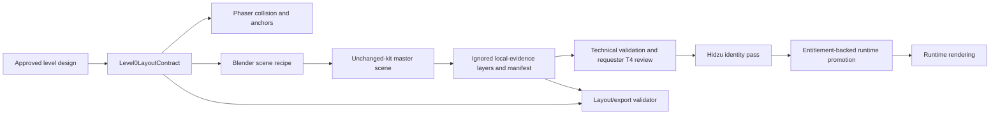

# Architecture

This document defines **how** the approved Tokyo escape specification is implemented. It is target architecture, not a claim that the current protected worktree already conforms.

Authority flows from current requester directives through [[01 MVP/12 Game Design Decision Register]] and the canonical system specifications into this document. Architecture may clarify ownership and data flow; it may not change player behavior. Any conflict returns to the specification and review queue before code changes continue.

## 1. Architectural principles

1. **Specification before runtime.** No gameplay recovery or reimplementation begins until the documentation gate in `AGENTS.md` is satisfied.
2. **One authority per state.** Redux owns persistent/domain state, Phaser owns frame-local presentation and simulation objects, React owns DOM presentation and player input for overlays, and content manifests own authored data.
3. **Gameplay topology outranks art.** `Level0LayoutContract` is authoritative for zones, walkability, footprints, entrances, and gameplay anchors. Blender consumes it; exported art never silently redefines it.
4. **Truthful perception.** Surveillance rendering and detection consume the same resolved geometry and occlusion data.
5. **Explicit effects.** Dialogue, interactions, terminals, and mission transitions commit typed effects; no component mutates unrelated domains opportunistically.
6. **Deterministic recovery.** Autosave and Retry are distinct persisted records. Retry restores one complete departure snapshot rather than reversing later events.
7. **Knowledge is state.** Facts and discovery control what the dossier, minimap, George, dialogue, and objectives may reveal.
8. **Pause is ownership, not a boolean.** Every pause surface acquires a reason; simulation resumes only when all reasons release.
9. **Human evidence outranks technical proxies.** Validators and tests protect contracts. Live human-control behavior and inspected frames prove the game.
10. **Retired code has no design authority.** Existing Ghost/Wire/Force, A*, combat, AutoBattle, storylet, reputation, and inventory code may be archived, removed, or selectively salvaged only after recovery; its presence cannot justify behavior.
11. **Provisional means reversible.** An unresolved `OPEN-*` recommendation may be encoded only through an authored constant, content record, manifest, or isolated presentation seam that is named in progress evidence and can be replaced without rewriting unrelated systems.

## 2. Runtime boundaries

### React application shell

React owns:

- main menu and New Game entry;
- character creation;
- four-lane HUD DOM;
- dialogue, Character screen, dossier, feed, terminal, debrief, failure, Retry, and completion overlays;
- localization rendering;
- accessible focus, keyboard routing, and modal ownership;
- creation/destruction of the Phaser canvas boundary.

React does not calculate camera detection, move actors, choose routes, or directly mutate Phaser objects.

### Redux domain store

Redux owns serializable run state:

- identity and build;
- Health and Paranoia;
- world clock and pause reasons;
- mission/objective/fact/outcome ledgers;
- discovered map knowledge;
- surveillance network state and last-known position;
- contact/dialogue state;
- safehouse, autosave metadata, and Retry snapshot;
- settings and localization.

Reducers accept typed domain events and remain deterministic. Selectors produce read models for React, Phaser synchronization, save serialization, George prompts, and diagnostics.

### Phaser runtime

Phaser owns frame-local world behavior:

- projected environment and dynamic actor rendering;
- direct movement intent and collision sliding;
- camera follow, pan, zoom, and observation framing;
- interaction hit testing against layout semantics;
- camera sweep, shared visibility geometry, drone movement, and authored NPC schedules;
- depth/occlusion presentation;
- runtime audio positioning and live visual feedback.

Phaser reports domain events to Redux. It does not persist authoritative mission outcomes in display objects.

### Authored content layer

Typed content modules/manifests own:

- Level 0 layout contract;
- mission/objective definitions;
- facts and checks;
- dialogue graphs and localized content;
- schedules;
- hiding/blending contexts;
- terminals and surveillance devices;
- George prompts;
- audio cue registry;
- art and actor manifests;
- acceptance fixtures and deterministic diagnostics.

### Production tooling

Tooling owns:

- Neo Tokyo source inventory and license metadata;
- Blender master-scene recipe and deterministic export;
- semantic mask/anchor extraction;
- art, actor, layout, localization, and content validation;
- fixed-viewport capture;
- AI playtest regression evidence.

Tool output never marks a player-experience gate accepted automatically.

### Active Level 0 runtime seam

The shipping application entry mounts the canonical Level 0 runtime island through `src/App.tsx` and `src/components/level0/Level0RuntimeShell.tsx`. The island deliberately does not mount the retired `GameController`, `BootScene`, `MainScene`, A* input modules, tactical-combat managers, or whole-root prototype hydration. Those modules remain recoverable source until their owning tickets salvage or remove them, but they are not part of ordinary New Game.

Current ownership is explicit:

- `src/content/levels/level0/layoutContract.ts` is the authored runtime topology;
- `src/game/level0/layout/` owns validation and the reversible 64×32 projection adapter;
- `src/game/level0/movement/directMovement.ts` owns direct intent, local collision sampling, and axis sliding;
- `src/game/level0/interaction/interactionResolver.ts` owns knowledge, independently derived world-ownership, range, occlusion, and authoritative availability results; automatic discovery filters unknown or wrong-domain anchors instead of revealing their existence through an error;
- `src/game/level0/art/` owns the T4 source/recipe/runtime-manifest contracts and validators only; generated derivatives remain ignored local evidence and `Level0Scene` still renders the greybox fallback;
- `src/game/level0/runtime/` owns authored-ID map knowledge, the clock, safehouse effects, exact schema and spatial validation, transient-pause normalization, autosave, and immutable departure Retry;
- `src/store/level0RuntimeSlice.ts` is the isolated serializable domain lane;
- `src/game/level0/scene/Level0Scene.ts` owns frame-local greybox rendering, actor transform, camera, and input;
- `src/game/level0/playtest/level0AgentBridge.ts` derives diagnostics from the same store/layout and may dispatch only normal runtime events;
- `art/iso-assets/contracts/level0-layout-contract.json` is the deterministic Blender-facing export of the same contract.

The retired `the-getaway-state` schema remains disabled. The new Level 0 autosave and Retry use independent keys and exact nested envelopes, so the legacy subscriber cannot hydrate or overwrite the canonical run. Validation rejects non-walkable player/last-known positions, non-unit facing, mismatched generation/seed/layout identity, inconsistent clock boundaries, and failure copy that does not exactly match incomplete requirements. Retry additionally requires the authored departure anchor. Transient overlay pause owners are never serialized; hydration derives only durable failure/completion ownership. Departure persists Retry before the departed autosave, rejects stale-session or divergent-state conflicts, and recreates Phaser at the committed departure transform. Player transforms are checkpointed only after change at a bounded cadence rather than stored every render frame. Exact layout dimensions, start zoom, movement speed, and safehouse policy remain provisional while their `OPEN-*` decisions are unresolved.

## 3. Application lifecycle

The target lifecycle is:

```text
BOOT
  → MAIN_MENU
  → L0_CHARACTER_CREATION
  → L0_SAFEHOUSE_INTRO
  → L0_LIRA_BRIEFING
  → L0_PREPARATION
  → L0_OPERATION_DEPARTED
  → L0_INFILTRATION
  → L0_MEDKITS_SECURED
  → L0_ESCAPE
  → L0_LIRA_RETURN
  → L0_TRANSIT_VALIDATION
  → L0_DEBRIEF
  → L0_COMPLETE
  → CONTINUE_EXPLORING | END_DEMO
```

Scene loading is an application side effect between valid character confirmation and `L0_SAFEHOUSE_INTRO`, not a second mission state. Any authored run failure enters `L0_FAILED` with one exact `failure.*` cause and exposes Retry. `failure.save_incompatible` prevents Level 0 hydration and offers New Game. Miami is continuation data only; no Level 1 scene is loaded.

Starting or restarting a run must:

1. stop and dispose the previous Phaser scene/runtime;
2. clear frame-local event handlers, timers, audio, and pause ownership;
3. initialize or hydrate only the current save schema;
4. load the correct layout/art/schedule state;
5. create the protagonist from `PlayerIdentity` and `PlayerBuild`;
6. center the camera and broadcast current viewport knowledge before input;
7. expose the correct React surface with no stale overlay or focus owner.

## 4. State ownership map

| Domain | Authority | Runtime mirror | Persisted | Notes |
|---|---|---|---|---|
| Identity/build/progression | Redux | Actor/portrait selection | Yes | No fixed Operative/package state. |
| Health/Paranoia | Redux | HUD and transient feedback | Yes | Changes only through authored effects. |
| Mission/objectives/facts/outcomes | Redux | Markers, prompts, debrief | Yes | Stable keys and provenance. |
| World time/schedules | Redux clock | Phaser schedule evaluation | Yes | Frame deltas emit clock progress only while unpaused. |
| Pause ownership | Redux | Phaser active/frozen gate | Yes for save-safe states | Additive reason set. |
| Surveillance state | Redux | Phaser detection/search presentation | Yes | Geometry remains content/runtime derived. |
| Actor transforms | Phaser during play | Redux snapshot checkpoints only | Snapshot | Avoid per-frame Redux position churn. |
| Discovery/minimap knowledge | Redux | Minimap/world emphasis | Yes | Unknown content cannot leak. |
| Dialogue state | Redux/content graph | React overlay | Yes | Effects commit atomically. |
| Safehouse/autosave/Retry | Persistence service + Redux metadata | React actions | Yes | Retry is separate record. |
| Camera/viewport | Phaser | React minimap scroller read model | No | Reinitialized deterministically. |
| Audio instances | Phaser/audio service | None | No | Derived from current domain events/state. |

## 5. Public typed contracts

The names below are required public concepts. Exact module locations may change during recovery, but the semantic fields and ownership must remain explicit and typed.

### Level0LayoutContract

```ts
type Level0SurfaceKind =
  | 'road'
  | 'sidewalk'
  | 'crossing'
  | 'alley'
  | 'plaza'
  | 'interior-boundary'
  | 'blocked';

type Level0AnchorKind =
  | 'safehouse'
  | 'contact'
  | 'entrance'
  | 'terminal'
  | 'camera'
  | 'drone-launch'
  | 'hiding'
  | 'blending'
  | 'objective'
  | 'interaction'
  | 'audio';

interface Level0LayoutContract {
  id: string;
  schemaVersion: number;
  projection: { tileWidth: 64; tileHeight: 32; orientation: 'isometric-2:1' };
  bounds: WorldPolygon;
  zones: Level0Zone[];
  traversalLoops: Level0TraversalLoop[];
  surfaces: Level0SurfaceRegion[];
  buildingFootprints: Level0BuildingFootprint[];
  entrances: Level0Entrance[];
  droneRegions: Level0DroneRegion[];
  anchors: Level0Anchor[];
  occluders: WorldPolygon[];
  semanticMaskIds: string[];
  artLayerIds: string[];
}
```

The contract is authored from approved rules plus explicitly recorded provisional layout data. Both Blender export and Phaser runtime consume it. Exact dimensions and anchors remain non-final while their review items are open and must stay replaceable through this contract.

### Player identity and build

```ts
interface PlayerIdentity {
  callsign: string;
  appearancePresetId: string;
}

type AttributeKey = 'physical' | 'mental' | 'social' | 'technical';
type SkillKey =
  | 'stealth'
  | 'evasion'
  | 'awareness'
  | 'composure'
  | 'insight'
  | 'influence'
  | 'systems'
  | 'opsec';

interface PlayerBuild {
  attributes: Record<AttributeKey, number>;
  skills: Record<SkillKey, number>;
  level: number;
  xp: number;
  unspentSkillPoints: number;
  unspentAttributePoints: number;
}
```

Creation budgets/caps and progression rules come from [[01 MVP/92 Character & Progression]]. Validation occurs both before confirmation and during save hydration.

### Deterministic checks

```ts
interface CheckRequirement {
  id: string;
  attribute: AttributeKey;
  skill: SkillKey;
  requiredTotal: number;
  factRules: CheckFactRule[];
  situationalModifiers: AuthoredModifier[];
  successEffectIds: string[];
  failForwardEffectIds: string[];
  localizedRequirementKey: string;
}

interface CheckResolution {
  checkId: string;
  attributeValue: number;
  skillValue: number;
  paranoiaPenalty: 0 | 1 | 2 | 3;
  appliedFacts: string[];
  appliedModifiers: AuthoredModifier[];
  finalTotal: number;
  requiredTotal: number;
  outcome: 'success' | 'fail-forward';
}
```

The resolver is pure and deterministic. UI consumes the same resolution details shown to diagnostics.

### Facts and discovery

```ts
interface FactAcquisition {
  acquisitionId: string;
  factId: string;
  sourceKind: 'opening' | 'dialogue' | 'observation' | 'interaction' | 'check';
  sourceId: string;
  acquiredAtWorldMinute: number;
  contextId?: string;
}

interface KnownFact {
  factId: string;
  acquisitions: FactAcquisition[];
  appliedEffectIds: string[];
}

interface FactLedger {
  known: Record<string, KnownFact>;
}

interface MapKnowledgeState {
  discoveredLocationIds: string[];
  discoveredCameraIds: string[];
  discoveredTerminalIds: string[];
  discoveredHidingContextIds: string[];
  discoveredBlendingContextIds: string[];
  objectivePrecision: Record<string, 'hidden' | 'district' | 'area' | 'entrance' | 'exact'>;
}
```

Facts are stable authored keys with declared effects. The first valid acquisition creates the `KnownFact` and atomically records the declared effect IDs after they apply. A later valid acquisition may append or refine provenance through a unique `acquisitionId`, but it cannot reapply an effect already present in `appliedEffectIds`. Discovery and facts are related but not interchangeable.

### Surveillance

```ts
type SurveillanceLevel = 'clear' | 'suspicious' | 'pursuit';

interface SurveillanceState {
  level: SurveillanceLevel;
  sourceDeviceId?: string;
  sourceActorId?: string;
  activeObserverIds: string[];
  lastTransitionReasonId?: string;
  lastKnownPosition?: WorldPoint;
  lastObservedAtWorldMinute?: number;
  suspiciousSinceWorldMinute?: number;
  pursuitSinceWorldMinute?: number;
  searchAreaId?: string;
  traceProvenance?: {
    terminalId: string;
    cameraGroupId: string;
    createdAtWorldMinute: number;
  };
  verificationProvenance?: {
    verifierId: string;
    verifiedAtWorldMinute: number;
  };
  droneAssignment?: {
    droneId: string;
    target: WorldPoint;
    phase: 'dispatching' | 'verifying' | 'searching' | 'returning';
  };
}
```

Runtime geometry emits observation evidence. A pure transition owner applies the approved thresholds and stores only legitimate last-known updates.

### World clock and pause

```ts
type PauseOwner =
  | 'menu'
  | 'settings'
  | 'character_creation'
  | 'character'
  | 'dossier'
  | 'social_feed'
  | 'dialogue'
  | 'observation'
  | 'terminal'
  | 'safehouse_action'
  | 'george_consultation'
  | 'interception'
  | 'retry_confirmation'
  | 'level_up'
  | 'debrief'
  | 'mission_recap'
  | 'failure'
  | 'completion';

interface WorldClockState {
  currentMinute: number;
  phase: 'dusk' | 'blue-hour' | 'curfew';
  curfewActive: boolean;
  deadlineReached: boolean;
  lastProcessedScheduleBoundaryId?: string;
  pauseOwners: PauseOwner[];
  scheduleStates: Record<string, string>;
}
```

Frame time advances the clock only when `pauseOwners` is empty and the run is in an active exploration state.

### Safehouse and Retry

```ts
interface SafehouseState {
  insideBoundary: boolean;
  departureSnapshotCreated: boolean;
  recoveryAvailable: boolean;
  transitCredentialState: 'not-issued' | 'issued' | 'validated';
  debriefAvailable: boolean;
  usedActionIds: string[];
}

interface SafehouseActionAvailability {
  actionId: string;
  available: boolean;
  blockedReasonId?: string;
  evaluatedAgainstSurveillanceLevel: SurveillanceLevel;
  directlyObserved: boolean;
}

interface RuntimeGenerationState {
  generationVersion: string;
  seed: string;
  authoredVariantIds: Record<string, string>;
}

type Level0MissionState =
  | 'L0_CHARACTER_CREATION'
  | 'L0_SAFEHOUSE_INTRO'
  | 'L0_LIRA_BRIEFING'
  | 'L0_PREPARATION'
  | 'L0_OPERATION_DEPARTED'
  | 'L0_INFILTRATION'
  | 'L0_MEDKITS_SECURED'
  | 'L0_ESCAPE'
  | 'L0_LIRA_RETURN'
  | 'L0_TRANSIT_VALIDATION'
  | 'L0_DEBRIEF'
  | 'L0_COMPLETE'
  | 'L0_FAILED';

type ObjectiveStatus =
  | 'hidden'
  | 'available'
  | 'active'
  | 'completed'
  | 'failed'
  | 'superseded';

interface ObjectiveState {
  objectiveId: string;
  status: ObjectiveStatus;
  completedAtWorldMinute?: number;
}

type ObjectiveStateRecord = Record<string, ObjectiveState>;

interface ContactState {
  consulted: boolean;
  lastDialogueNodeId?: string;
  acquiredFactIds: string[];
}

type ContactStateRecord = Record<'lira' | 'naila' | 'brant', ContactState>;

interface RetrySnapshot {
  schemaVersion: number;
  contentVersions: Record<string, string>;
  sessionId: string;
  createdAtWorldMinute: number;
  identity: PlayerIdentity;
  build: PlayerBuild;
  health: number;
  paranoia: number;
  worldClock: WorldClockState;
  mission: Level0MissionState;
  objectives: ObjectiveStateRecord;
  facts: FactLedger;
  mapKnowledge: MapKnowledgeState;
  contacts: ContactStateRecord;
  safehouse: SafehouseState;
  surveillance: Level0SurveillanceRuntimeState;
  player: Level0PlayerRuntimeCheckpoint;
  runtimeGeneration: RuntimeGenerationState;
  completion: Level0RunState['completion'];
}
```

The snapshot is written once when the player explicitly leaves the safehouse for the operation. Retry hydrates it as a whole and clears all post-departure runtime state.

### George prompts

```ts
interface GeorgePrompt {
  id: string;
  allowedContexts: Array<'hud' | 'observation' | 'safehouse' | 'dossier'>;
  requiredFactIds: string[];
  requiredMissionStates: string[];
  excludedSurveillanceStates?: SurveillanceLevel[];
  localizedQuestionKey: string;
  localizedResponseKey: string;
  effect: 'none';
}
```

George prompts are authored, contextual, informational, and effect-free. He never accepts unrestricted free text in Level 0.

### Outcome ledger

```ts
interface Level0OutcomeLedger {
  acceptedAt: number;
  departedAt: number;
  completedAt: number | null;
  primaryTiming: 'dusk_public' | 'curfew_service' | 'mixed';
  contactsConsulted: Array<'lira' | 'naila' | 'brant'>;
  factsAcquired: Array<{
    factId: string;
    acquisitionIds: string[];
  }>;
  cameraLoop: 'not_used' | 'clean' | 'traced';
  networkPeak: 'clear' | 'suspicious' | 'pursuit';
  droneVerified: boolean;
  hidingContextsUsed: string[];
  blendingContextsUsed: string[];
  interceptionOutcome: string | null;
  healthLost: number;
  paranoiaPeak: number;
  medkitsRecovered: boolean;
  medkitsReturned: boolean;
  manifestInspected: boolean;
  manifestRecognizedBy:
    | 'naila_fact'
    | 'awareness'
    | 'missed'
    | 'not_inspected';
  transitValidated: boolean;
  failureCause:
    | 'failure.health'
    | 'failure.paranoia'
    | 'failure.capture'
    | 'failure.deadline'
    | null;
}
```

Content may add stable detail fields only through a specification update. Debrief reads this ledger; it does not reconstruct outcomes from display logs.

### Art and actors

```ts
interface Level0ArtManifest {
  schemaVersion: 1;
  id: string;
  usage: 'local-evidence' | 'runtime';
  recipeId: string;
  layoutContractId: string;
  projection: { tileWidth: 64; tileHeight: 32; orientation: 'isometric-2:1' };
  worldOrigin: WorldPoint;
  canvas: {
    width: number;
    height: number;
    pixelOrigin: WorldPoint;
    tileSize: number;
    columns: number;
    rows: number;
  };
  budget: { maxTotalBytes: number; maxTileBytes: number; measuredTotalBytes: number };
  layers: Array<{
    id: string;
    kind: 'ground' | 'architecture-back' | 'architecture-front' | 'lighting-foundation' | 'semantic-mask';
    state?: 'dusk' | 'blue-hour' | 'curfew';
    maskId?: string;
    tiles: Array<{
      id: string;
      imagePath: string;
      sha256: string;
      byteSize: number;
      column: number;
      row: number;
      x: number;
      y: number;
      width: number;
      height: number;
    }>;
    fallbackLayerId: string;
  }>;
  anchorMetadata: { path: string; sha256: string; count: number };
  fallbackProfile: 'level0-greybox';
}

type CharacterState = 'idle' | 'move' | 'interact';
type CharacterDirection = 'n' | 'ne' | 'e' | 'se' | 's' | 'sw' | 'w' | 'nw';

interface CharacterSpriteManifest {
  actorId: string;
  ownership: 'player' | 'contact' | 'security' | 'civilian';
  spriteSetId: string;
  frame: { width: 64; height: 96; framesPerAnimation: 4 };
  origin: { x: number; y: number };
  scale: number;
  sheets: Record<CharacterState, Partial<Record<CharacterDirection, string>>>;
  portraitKey: string;
  fallbackRigKey: string;
}
```

Required actors must pass complete-matrix validation before production acceptance. Fallback is resilience, not acceptance evidence.

## 6. Layout and Blender data flow


```mermaid
flowchart LR
  A["Approved level design"] --> B["Level0LayoutContract"]
  B --> C["Phaser collision and anchors"]
  B --> D["Blender scene recipe"]
  D --> E["Unchanged-kit master scene"]
  E --> F["Ignored local-evidence layers and manifest"]
  F --> G["Technical validation and requester T4 review"]
  G --> H["Hidzu identity pass"]
  H --> I["Entitlement-backed runtime promotion"]
  F --> J["Layout/export validator"]
  B --> J
  I --> K["Runtime rendering"]
```

### Contract discipline

- Layout coordinates, zone names, entrances, devices, contacts, terminals, hiding/blending contexts, and objectives originate in one versioned contract.
- Blender may refine visual mass and public realm inside the contract but cannot move required gameplay anchors without a reviewed layout change.
- T4 export validation proves projection and canvas containment, tile-grid registration, file hashes/bytes/budgets, layer semantics/fallbacks, and complete anchor values against the layout contract. Decoded raster-edge agreement remains a visual/runtime acceptance responsibility rather than a claim made by metadata validation alone.
- If a parallelogram footprint cannot match a visual base within one tile, author a custom polygon or multi-region footprint rather than trim-chasing.
- One full master scene prevents per-building angle, scale, and light drift.
- Raw licensed files remain outside Git. Source manifests, recipes, and validators are versioned; flattened derivatives remain ignored until acquisition-specific entitlement and runtime promotion are explicitly approved.

## 7. Movement, interaction, camera, and observation

### Direct movement

Click-to-move stores a world-space intent point. WASD stores a directional intent. A new input replaces the old intent immediately. The movement integrator advances directly toward the intent and uses local collision sliding; it does not request a path.

Invalid clicks resolve against the layout’s walkable geometry and return a typed reason plus optional nearest reachable marker. They do not silently route around buildings.

### Interaction

The interaction resolver evaluates:

1. target exists and is currently available;
2. pointer/keyboard action belongs to the world, not a DOM overlay;
3. protagonist is within forgiving target range;
4. required visibility and occlusion rules pass;
5. the target’s owning domain authorizes the requested interaction.

It returns a typed available/blocked result consumed by both prompt UI and activation. Proximity alone never commits an interaction.

Player knowledge and world ownership are separate inputs. Knowledge controls whether a target may be surfaced; world ownership proves that the target's backing domain state exists. An explicitly addressed invalid target may return a truthful diagnostic, while automatic interaction discovery silently excludes unknown or wrong-domain anchors so it cannot leak hidden content.

### Camera

- Normal Level 0 zoom cannot go below `0.60`.
- Camera follow binds to the current protagonist after every load/restart.
- Observation mode may pan independently while paused, then restores follow without a sacrificial click.
- Minimap viewport derives from current camera transform, not stale render bounds.
- Exact start zoom, movement speed, and camera easing remain open tuning values.

### Observation

Observation acquires the `observation` pause reason. It permits camera pan and read-only inspection of known cameras, drone, last-known state, contacts, entrances, hiding/blending contexts, current objective, facts, and one authored George prompt. It cannot issue movement, activate terminals, alter surveillance, or commit world state.

## 8. Surveillance architecture

### Shared geometry

Each surveillance device owns one current orientation/sweep definition. The visibility resolver combines it with range, field of view, layout occluders, and active schedule. Both the world rendering layer and detection sampler consume that same result.

### Network transition owner

A pure network reducer receives typed evidence:

- observation started/continued/broken;
- authored suspicious action;
- trace-producing terminal outcome;
- drone verification;
- recovery-context entered/maintained/invalidated;
- interception result.

It updates `SurveillanceState` according to the approved matrix. It cannot query the hidden protagonist transform when no valid observer has supplied it.

The safehouse boundary never dispatches a network-clear event by itself. A pure safehouse-availability resolver consumes `SafehouseState`, `SurveillanceState`, and current valid observation evidence and returns `SafehouseActionAvailability` records for Wait, Rest, save, level-up, George planning, and terminals. Until `OPEN-SAFE-001` is accepted, the resolver uses that queue entry's documented recommendation as explicit replaceable content data; UI and world interactions consume the same typed result and cannot invent a separate safe-zone policy. The provisional value cannot be treated as final acceptance evidence.

### Drone

Exactly one Level 0 drone receives dispatch targets from the network. Its runtime controller moves toward the stored last-known position, verifies visible/hiding areas according to authored rules, searches, and returns. It has no weapon, HP, combat turn, or defeat state.

### Hiding and blending

Contexts are layout/content records, not tile tags inferred at runtime. Each declares bounds, entry point, schedule, direct-observation restriction, allowed network states, recovery behavior, and player-facing fiction.

### Camera loop

Only the connected camera terminal can request a camera loop. The check/effect resolver uses Systems and OpSec, applies exactly the target declared by the terminal, schedules restoration, and records clean/trace outcome. There is no global hack bus.

## 9. Dialogue, facts, objectives, and George

### Dialogue graph

Dialogue content is an authored graph with stable nodes and localized exact lines. The dialogue domain evaluates availability/checks, commits typed effects atomically, advances the node, and records history. React renders the read model; no UI component dispatches unrelated low-level state mutations.

### Effect registry

Allowed Level 0 effects include:

- add fact;
- update objective or mission state;
- refine map knowledge;
- add an outcome-ledger field;
- apply authored time, Health, or Paranoia consequence;
- update contact state;
- issue/validate mission object;
- award milestone XP;
- enter a declared failure.

Every effect is idempotent or protected by a stable event ID.

### Objectives and facts

Mission state and objective state are separate. The mission state machine controls legal sequence; objectives provide player-facing instructions. Facts determine knowledge and modifiers. No log text is parsed to infer any of these domains.

### George

George consumes a read-only context assembled from mission state, facts, known devices/locations, time, Health/Paranoia, and allowed prompt definitions. His response resolver selects authored content only. `effect: 'none'` is enforced at the contract boundary.

## 10. Health, Paranoia, and progression

Health and Paranoia changes are authored effects with source IDs, before/after values, and feedback keys. No frame loop applies passive damage or Paranoia decay/gain.

The pure check resolver obtains the Paranoia penalty from current value:

- `0–39`: 0;
- `40–69`: −1;
- `70–89`: −2;
- `90–99`: −3;
- `100`: fatal collapse before further check resolution.

Milestone XP uses stable award IDs to prevent duplication. Level thresholds remain replaceable content data whether provisional or approved. Level-up allocation is rejected outside an allowed safehouse/debrief context.

## 11. Time, schedules, and pause

The clock service receives frame deltas only during active exploration with no pause owners. It advances at 30×, emits boundary events exactly once, and derives phase/curfew/deadline state.

Schedules are authored state tables keyed by world phase/boundary, not free-running NPC scripts. Schedule transitions can change availability, position/path definitions, public/blending context, and ambience. They cannot move a currently interacting actor or mutate geometry silently.

Safehouse Wait and Rest dispatch explicit clock jumps after confirmation. All boundary events between old and new time are processed deterministically.

## 12. Safehouse, persistence, and compatibility

### Persistence records

Use distinct storage keys and schema envelopes for:

- current-run autosave;
- operation-departure Retry snapshot;
- settings/localization.

Each envelope contains schema version, content/layout version, timestamp, and a deeply validated payload. Spatial checkpoints must be finite, walkable, and compatible with the active layout; facing is a nonzero unit vector; deterministic generation identifiers must match the active runtime; deadline failure requirements must equal the completion fields that remain false.

### Autosave

Autosave records current run at declared safe transitions. It is for continuing the run, not for deterministic mission Retry.

### Retry

The departure snapshot is created when the player explicitly crosses the operation-departure boundary after preparation. Retry discards post-departure state and hydrates the snapshot. Runtime-only controllers are rebuilt from restored domain state; they are not serialized as opaque objects.

### Compatibility

The new design requires a new schema version. Rewrite-era saves containing fixed Operative/package/combat/reputation/storylet/inventory assumptions are rejected. The UI explains incompatibility and offers New Game. No best-effort partial migration is permitted.

## 13. HUD and overlay architecture

The bottom dock is a fixed four-lane semantic layout:

1. knowledge minimap;
2. protagonist;
3. George;
4. current quest beat.

Selectors provide one read model per lane. CSS ownership remains component-local and uses semantic tokens. Level 0 styling is scoped through a visual-style data attribute. No component branches on raw theme IDs for painter logic.

Persistent height must remain within 16–18% at supported desktop viewports. Overlays acquire pause/focus ownership and fit at `1280×720`. Overlay close returns focus to the correct world/control owner without issuing gameplay input.

## 14. Audio architecture

A typed audio registry maps domain events to cue IDs, priority, cooldown, ducking group, spatial anchor behavior, and fallback. Required categories include city ambience, footsteps, entrances, terminals, camera sweep/focus, drone approach/verification, Suspicious, Pursuit, curfew, safehouse, Health/Paranoia effects, objectives, failure, completion, and restrained UI confirmation.

Audio is feedback, not authority. Missing audio cannot block state transitions, and repeated selector renders cannot replay one-shot cues.

## 15. Localization architecture

English and Ukrainian share stable content IDs and typed effect definitions. Only player-facing strings differ. Validation fails when a required node, choice, locked reason, objective, fact, prompt, failure cause, terminal state, or debrief line is missing in either language.

State transitions are tested once against shared content effects and with parity assertions across both localized presentations.

## 16. Failure and recovery architecture

There are four Level 0 terminal failure causes:

- Health reaches 0;
- Paranoia reaches 100;
- authored interception resolves to capture;
- midnight occurs while either Lira return or transit validation remains incomplete.

Failure is a domain event that records the exact cause, freezes simulation, captures a final outcome ledger, and opens the failure overlay. Retry is available only when a valid departure snapshot exists; otherwise New Game is offered with an honest explanation.

## 17. Validation and diagnostics

### Static/content validation

- unique stable IDs and valid references;
- complete 16-section canonical specifications;
- decision → document → Linear traceability;
- mission/objective transition legality;
- fact/check/effect validity;
- English/Ukrainian parity;
- layout zones, loops, anchors, footprints, and reachability without pathfinding;
- Blender mask/anchor/projection registration;
- art manifest completeness and source/license metadata;
- actor matrix, frame, direction, origin, scale, and portrait completeness;
- save-schema and Retry-snapshot validation.

### Runtime diagnostics

Development diagnostics may expose current mission state, objective/facts, pause owners, clock, surveillance state, last-known position, device geometry, interaction result, layout/mask alignment, and outcome ledger. Diagnostics are never required to play or complete the game and are excluded from production acceptance captures.

### Test layers

1. Pure unit tests for reducers, checks, facts, schedules, state transitions, save validation, and geometry.
2. Component tests for creation, dialogue, HUD, overlays, locked reasons, and localization.
3. Phaser/module tests for movement, collision, camera, interaction, surveillance, drone, depth, and art-layer registration.
4. Integrated deterministic scenarios for every acceptance row.
5. Human-control fixed-viewport playtests for playability and visual truth.
6. Guided AI playtest as regression evidence only.

Required closeout commands remain those in `AGENTS.md` and [[01 MVP/95 MVP Readiness Checklist]].

## 18. Recovery and implementation sequence

1. Preserve and verify the external dirty-tree archive.
2. Complete, review, approve, and separately commit the canonical specification.
3. Restore the pre-rewrite foundation while recording every salvage/rejection.
4. Establish target schema, pause, persistence, and `Level0LayoutContract` foundations.
5. Implement direct movement, interaction, camera, observation, and shared layout runtime.
6. Build and accept the unchanged-kit Blender city.
7. Add and accept Hidzu identity/world art.
8. Replace actors and portraits.
9. Restore identity, build, checks, Health, Paranoia, progression, and Character screen.
10. Implement surveillance, hiding/blending, drone, camera loop, and interception.
11. Implement dialogue/facts/George/dossier/minimap/HUD infrastructure.
12. Author/integrate mission content, audio, onboarding, bilingual presentation, and end-to-end acceptance.

Large tickets use internal milestones and proof gates; they do not blur ownership across steps.

## 19. Retired and deferred architecture

The following may exist in recovery archives or Git history but are not active target architecture:

- fixed Operative/Trace initialization;
- backgrounds and Ghost/Wire/Force packages;
- A* or threat-aware player routing;
- fixed 54×38/four-block or nine-parcel topology;
- tactical/AP combat, AutoBattle, enemy turns, cover, weapon/loadout, attack sheets;
- EMP, lure, breach, magic hacking, or universal movement-noise systems;
- broad inventory/equipment/economy/crafting/weapon modifications;
- storylets, procedural dialogue, runtime LLM orchestration, witness/gossip, reputation simulation;
- three-lane HUD and generic free-text George chat;
- synthetic building collage as the production city.

Post-MVP research is limited to the explicitly approved postponed areas in [[02 Post-MVP/00 Index]]. No archived module is promoted merely because it compiles or has tests.
