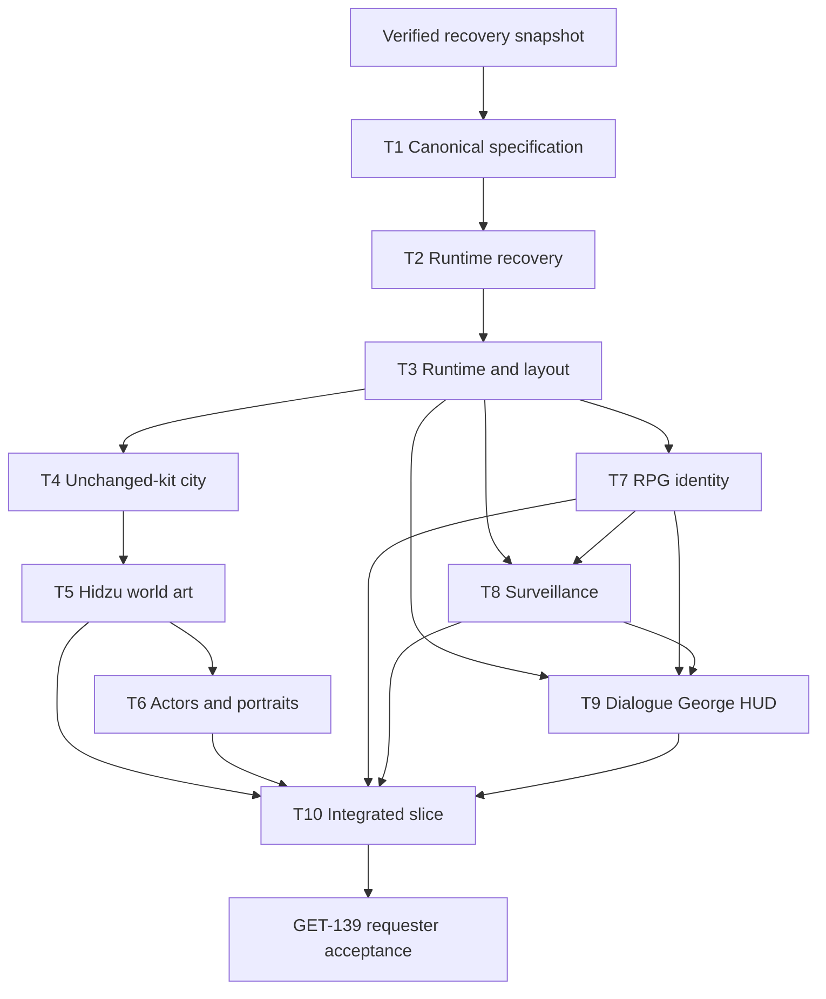

# Roadmap

This document defines current implementation order and gates. It is not a game-design source of truth and it is not a detailed progress log.

- Product behavior: [[01 MVP/Game Design]], [[01 MVP/11 Level 0 Vertical Slice Contract]], and per-system specifications.
- Decision status: [[01 MVP/12 Game Design Decision Register]].
- Open design questions: [[01 MVP/14 Specification Review Queue]].
- Engineering ownership: [[Architecture]].
- Current evidence and ask history: `progress/<Linear-key>.md`.
- Live execution state: Linear.

## Current program — GET-139 Tokyo escape vertical slice

Build a 15–20 minute outdoor Tokyo surveillance-escape RPG prologue that proves character creation, dialogue/facts, Paranoia, George, direct movement, observation, surveillance recovery, hiding/blending, optional evidence, safehouse/Retry, progression, and factual debrief without tactical combat.

GET-139 stays `In Progress` until the requester verifies the committed final build. Child tickets may move to `In Review` after their own evidence gate; `Done` still requires the repository completion policy and requester verification.

After the separate GET-201 documentation commit, execute one child at a time. A validated committed deliverable unlocks its successor even when the predecessor remains `In Review`. `OPEN-*` items are acceptance/freeze gates: recorded recommendations may be implemented as reversible provisional trials under `GDR-GOV-007`, but unresolved material behavior cannot move beyond `In Review` or be called final.

## Gate 0 — protected-work recovery preflight

Before documentation or runtime cleanup:

1. record current HEAD and complete dirty-tree manifest;
2. preserve tracked/indexed changes as applicable patches;
3. preserve untracked files in an external checksumed archive;
4. reproduce the worktree in a temporary verification copy;
5. record archive path, checksums, counts, and verification result in `progress/GET-139.md`.

This is a safety gate, not a gameplay ticket. No reset, deletion, restore, or selective salvage occurs before it passes.

## Gate 1 — canonical specification

### T1 — Canonical game-design bible and decision register

**Label:** Improvement
**State during specification work:** In Progress
**Blocks:** every implementation ticket and GET-139

Deliver:

- canonical Game Design hub and MVP Spine;
- full Level 0 contract;
- atomic Decision Register;
- common-template per-system specifications;
- mission, objective, fact, check, surveillance, dialogue, outcome, save/Retry, world, and acceptance matrices;
- explicit unresolved-decision queue with recommended baselines and blocked work;
- Plot Bible, Art Direction, Architecture, Roadmap, MVP Readiness, index, AGENTS, and progress alignment;
- self-contained Linear descriptions derived from the canonical package;
- contradiction, provenance, and bidirectional traceability review.

Exit gate:

1. Every current rule has a stable decision ID, canonical owner, and implementation ticket.
2. Removed ideas appear only in the Decision Register or clearly historical records.
3. Every system specification has all sixteen required sections.
4. Every required but unresolved value is an explicit `OPEN-*` item with a blocker.
5. Requester reviews the package and authorizes execution; unresolved choices remain explicit per-ticket acceptance gates.
6. Documentation is committed separately after explicit authorization.

Only T1 may be `In Progress` until this gate opens. Afterward, keep one implementation child active at a time in dependency order.

## Gate 2 — recover the canonical foundation

### T2 — Recover the canonical pre-rewrite foundation

**Label:** Improvement
**Depends on:** T1 reviewed, validated, and committed
**Blocks:** T3 and all runtime implementation

Milestones:

1. Re-verify the external archive against the recorded baseline.
2. Restore the shared workspace to the approved pre-rewrite foundation.
3. Selectively salvage only approved concepts/code:
   - direct responsive movement research;
   - factual-ledger concepts;
   - validated visual references;
   - Neo Tokyo compiler/recipe work;
   - reusable live-playtest diagnostics.
4. Reject the compact compound, fixed Operative, packages, tactical combat, fantasy actors, synthetic city, and deleted RPG identity.
5. Boot a clean baseline with honest incompatible-save handling.
6. Record restored, salvaged, archived, rejected, and unresolved items.

Exit gate: the workspace is reproducible, bootable, and contains no unreviewed rewrite deletion treated as canonical.

## Gate 3 — runtime and layout foundation

### T3 — Level 0 runtime and shared outdoor-layout contract

**Label:** Feature
**Depends on:** T2
**Blocks:** T4, T7, T8, T9, T10

Ownership:

- `Level0LayoutContract` and all runtime semantic anchors;
- new save schema, autosave infrastructure, Retry storage, and pause ownership;
- world clock and authored schedule infrastructure;
- direct click/WASD movement, collision sliding, input override, focus recovery;
- explicit interaction resolver;
- camera follow/pan/zoom and full-pause observation;
- safehouse runtime actions and incompatible-save flow.

Internal gates:

1. **Layout draft:** three loops and all mandatory anchors exist in one contract.
2. **Movement proof:** all mandatory locations are reachable without pathfinding; corners/alleys work under click and WASD.
3. **Pause/focus proof:** every overlay and observation freezes simulation and returns clean input ownership.
4. **Persistence proof:** autosave and operation-departure Retry remain distinct and deterministic.
5. **Projection proof:** runtime and Blender consume the same coordinates/masks/anchors.

Exit gate: dusk and curfew routes are topologically viable and debug geometry agrees with collision, markers, and entrances.

## Gate 4 — Tokyo city foundation

### T4 — Tokyo city foundation: hero intersection to dense live district

**Label:** Improvement
**Depends on:** the committed T3 runtime/projection/movement foundation; T3's exact rejected city geometry is not a constraint
**Blocks:** T5

Ownership:

- one mission-sized four-block rebuild, with an actual Blender proof gate before any live runtime replacement;
- one master scene using named assets from the requester-owned Neo Tokyo 2 kit plus necessary project-owned public-realm gap fills;
- street-first normal framing, human-scale actors, continuous street walls, three functional identities, three loops, one restrained landmark maximum, and a composed four-block overview;
- blue-hour primary materials/light with coherent daylight and curfew variants;
- accepted geometry back-propagated into shared collision, occlusion, masks, entrances, and anchors;
- versioned flattened derivatives, recipe/manifests, and validators without raw vendor geometry or textures;
- clean-world, current-HUD, and full-overview live evidence for the complete candidate.

Internal sequence:

1. Compose exactly four dense mission blocks from named Neo Tokyo 2 assets, using the approved KitBash + Reference 2 concept for relationships but never as production geometry.
2. Complete public realm, camera/actor scale, materials, practical lighting, and a few non-baked scale figures in that one source-bound Blender scene.
3. Internally reject and revise weak close or overview renders; present the best actual Blender pair for requester approval.
4. Only after that approval, export candidate collision, occlusion, masks, entrances, and anchors from the accepted master and integrate a reversible live candidate.
5. Present clean-world, current-HUD, and four-block overview live evidence. Only separate explicit live approval unlocks closeout and an authorized commit.

An AI-generated concept, validator, internal rating, or technical checkpoint cannot unlock T5. The actual Blender render is a mandatory source-geometry gate but not final delivery. Exit gate: the requester accepts the committed same-master live build as a coherent four-block city with readable people/routes, named KitBash provenance, no fallback leak, no void, no angle mismatch, and no zoom corruption.

## Gate 5 — Hidzu identity and surveillance-noir art

### T5 — Hidzu identity and graphic-surveillance-noir world art

**Label:** Improvement
**Depends on:** requester-accepted and committed GET-204 four-block same-master live rebuild
**Blocks:** T6 and T10 visual integration

Ownership:

- identity scanning, public screens, propaganda, corporate wayfinding, camera grammar, and checkpoint technology;
- cold institutional material, sodium practical lighting, and aligned curfew atmosphere;
- technology cyan and danger crimson semantics;
- gameplay-serving entrances, terminals, hiding/blending structures, contact spaces, and hazards;
- overview atmospheric depth without generic neon clutter.

Successor gate: a technically validated, committed T5 treatment with complete fixed captures may unlock T6 while the treatment remains provisional. Final acceptance gate: the requester agrees the city reads specifically as Hidzu-controlled Tokyo while retaining route/objective/actor hierarchy at normal and minimum zoom.

## Gate 6 — actor and portrait replacement

### T6 — Grounded actors, portraits, and entry-flow presentation

**Label:** Improvement
**Depends on:** T5 visual language
**Blocks:** T10 final presentation

Ownership:

- four protagonist presets;
- Lira, Naila, Brant;
- two Hidzu security archetypes;
- three civilian archetypes;
- twelve matching portraits;
- Takahiro broadcast portrait and George AR art;
- validated `64×96`, eight-direction, four-frame `idle/move/interact` sets;
- character-creation/world/dialogue identity continuity.

Exit gate: all matrices and anchors validate; actors are human-scale, readable without labels, grounded in the world, and visibly non-fantasy.

## Gate 7 — RPG identity, Health, Paranoia, progression

### T7 — Protagonist RPG identity, progression, Health, and Paranoia

**Label:** Feature
**Depends on:** T3
**Blocks:** T8, T9, T10

Ownership:

- callsign, four appearances, four attributes, eight skills, budgets, and caps;
- deterministic checks and visible result explanations;
- Character screen;
- authored XP, pending level-up, safehouse/debrief allocation;
- Health and Paranoia state/rules/effects;
- build/identity persistence in autosave and Retry;
- rejection of old package/background saves.

T3 owns persistence infrastructure; T7 owns RPG payload, validation, and player-facing behavior.

Exit gate: at least two different builds are created through normal New Game controls, persist exactly, and produce different results in the reusable visible check-breakdown component for the same canonical requirement. Focused domain proof covers facts, resources, progression, failure, and Retry without inventing unfinished mission transitions. T9/T10 re-prove those differences through normal practical dialogue, recognition, systems, and escape options while both can complete Level 0; those later integration scenarios are not a blocker to delivering the T7 foundation.

## Gate 8 — surveillance and noncombat escape

### T8 — Surveillance, security, civilians, hiding, drone, and noncombat escape

**Label:** Feature
**Depends on:** T3 and T7
**Blocks:** T9 contextual integration and T10 scenarios

Ownership:

- Clear/Suspicious/Pursuit network;
- shared render/detection geometry;
- last-known position;
- known-coverage presentation;
- authored security/civilian schedules that support surveillance and blending;
- discrete hiding and blending;
- connected camera terminal loop with Systems/OpSec trace behavior;
- exactly one verifier drone;
- authored noise events;
- real-time pursuit recovery;
- deterministic noncombat interception and capture.

T8 owns mechanics. T10 authors and proves mission scenarios using them.

Exit gate: dusk blending, curfew hiding, Suspicious recovery, Pursuit recovery, drone verification, camera looping, and capture all work through normal controls without tactical combat.

## Gate 9 — dialogue, George, facts, dossier, and HUD

### T9 — Dialogue, George, facts, dossier, social feed, and four-lane HUD

**Label:** Feature
**Depends on:** T3 and T7; consumes T8 context
**Blocks:** T10 content integration

Ownership:

- authored dialogue graph/check/effect infrastructure;
- Fact Ledger and knowledge-map selectors;
- operation dossier and knowledge minimap;
- George fourth lane, private AR avatar, and authored prompts;
- fixed four-lane 16–18% dock;
- Character-screen entry point and all major overlays;
- read-only Hidzu social feed;
- English/Ukrainian content parity validation.

T9 owns system infrastructure and presentation. T10 owns final Level 0 dialogue/debrief content and complete scenario integration.

Exit gate: facts change routes/checks/objectives/George/debrief truthfully, unknown information does not leak, and all UI fits target viewports with no free-text or inactive systems.

## Gate 10 — authored mission and end-to-end acceptance

### T10 — Tokyo escape content, audio, onboarding, and end-to-end acceptance

**Label:** Feature
**Depends on:** T5, T6, T7, T8, T9
**Blocks:** GET-139 acceptance

Ownership:

- final Lira/Naila/Brant dialogue and outcomes;
- mission-object placements/interactions and optional manifest content;
- authored schedules, hiding/blending contexts, camera/drone/security/civilian scenario content;
- contextual onboarding;
- complete audio content;
- factual debrief and Miami continuation data;
- all failure/retry paths;
- bilingual end-to-end content;
- fixed-viewport and human-control acceptance suite.

T10 integrates approved systems; it does not reimplement or redefine them.

Exit gate: the complete 15–20 minute route matrix in [[01 MVP/13 Level 0 Content and State Matrix]] and [[01 MVP/95 MVP Readiness Checklist]] passes with normal player controls, no debug bridge, and requester visual/play acceptance.

## Dependency graph

## Per-ticket delivery loop

1. Move only the active eligible child to `In Progress`.
2. Re-open canonical specs, Decision Register, ticket, AGENTS, and progress note.
3. For every affected `OPEN-*` item, either use an approved rule or record the queue recommendation as a reversible provisional trial with its implementation seam, live proof, and rollback path before encoding it.
4. Record live proof targets and internal milestones.
5. Implement the smallest coherent milestone.
6. Run focused tests and inspect live behavior/frames.
7. Review the diff; fix safe in-scope findings; rerun proof.
8. Run required validators, lint, build, tests, coverage, and guided AI regression at the ticket’s closeout gate.
9. Update specifications only when an approved decision changed; update Architecture for ownership/data flow; update readiness with evidence state.
10. Commit only after explicit requester authorization using the required ticket-scoped message.
11. Post a Linear evidence summary and move no issue to `Done` before requester verification.

## Active Post-MVP boundary

Only the following areas are explicitly postponed:

- small inventory/consumables research;
- manual confrontation UI research;
- faction contracts/reputation;
- complex interiors;
- advanced drone/security behavior;
- meaningful social-media mechanics;
- full witness/gossip systems;
- additional identity/build research;
- Miami Level 1 production.

Everything listed as `Removed` in the Decision Register is not a future promise.

## Historical boundary

Roadmap content written before 2026-08-02 described earlier versions of the game and is superseded. Detailed history remains recoverable in Git, the verified GET-139 archive, `progress/`, and Linear. Historic completion does not count as current readiness unless replayed against the Tokyo escape specification.
