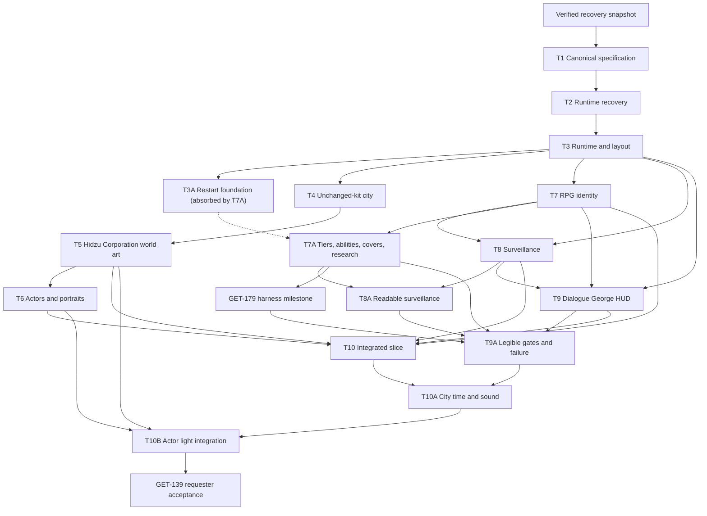

# Roadmap

This document defines current implementation order and gates. It is not a game-design source of truth and it is not a detailed progress log.

- Product behavior: [[01 MVP/Game Design]], [[01 MVP/11 Level 0 Vertical Slice Contract]], and per-system specifications.
- Decision status: [[01 MVP/12 Game Design Decision Register]].
- Open design questions: [[01 MVP/14 Specification Review Queue]].
- Engineering ownership: [[Architecture]].
- Current evidence and ask history: `progress/<Linear-key>.md`.
- Live execution state: Linear.

## Current program — GET-139 Tokyo escape vertical slice

Build a 15–20 minute outdoor Tokyo surveillance-escape RPG prologue that proves character creation, dialogue/facts, Paranoia, George, direct movement, observation, surveillance recovery, hiding/blending, optional evidence, safehouse/Restart Attempt, progression, and factual debrief without tactical combat.

GET-139 stays `In Progress` until the requester verifies the committed final build. Child tickets may move to `In Review` after their own evidence gate; `Done` still requires the repository completion policy and requester verification.

The original separate GET-201 documentation commit opened the existing delivery chain. This validated Fable-alignment package adds a new gate: do not start GET-211–GET-215 or GET-179 modernization until the requester explicitly authorizes its separate documentation commit. After that gate, execute one child at a time. A validated committed deliverable unlocks its successor even when the predecessor remains `In Review`. `OPEN-*` items are acceptance/freeze gates: recorded recommendations may be implemented as reversible provisional trials under `GDR-GOV-007`, but unresolved material behavior cannot move beyond `In Review` or be called final.

## Gate 0 — protected-work recovery preflight

Before documentation or runtime cleanup:

1. record current HEAD and complete dirty-tree manifest;
2. preserve tracked/indexed changes as applicable patches;
3. preserve untracked files in an external checksumed archive;
4. reproduce the worktree in a temporary verification copy;
5. record archive path, checksums, counts, and verification result in `progress/GET-139.md`.

This is a safety gate, not a gameplay ticket. No reset, deletion, restore, or selective salvage occurs before it passes.

## Gate 1 — canonical specification

### T1 — Canonical game-design bible and decision register

**Label:** Improvement
**State:** Todo in Linear; audit-backed Bible/Fable alignment expansion uncommitted
**Blocks:** every implementation ticket and GET-139

Deliver:

- canonical Game Design hub and MVP Spine;
- forensic coverage of all 214 original structured design rounds plus later requester corrections;
- full Level 0 contract;
- atomic Decision Register;
- common-template per-system specifications;
- mission, objective, fact, check, surveillance, dialogue, outcome, save/Restart Attempt, world, and acceptance matrices;
- explicit unresolved-decision queue with recommended baselines and blocked work;
- Plot Bible, Art Direction, Architecture, Roadmap, MVP Readiness, index, AGENTS, and progress alignment;
- self-contained Linear descriptions derived from the canonical package;
- contradiction, provenance, and bidirectional traceability review.

Exit gate:

1. Every current rule has a stable decision ID, canonical owner, and implementation ticket.
2. Removed ideas appear only in the Decision Register or clearly historical records.
3. Every system specification has all sixteen required sections.
4. Every required but unresolved value is an explicit `OPEN-*` item with a blocker.
5. Requester reviews the package and authorizes execution; unresolved choices remain explicit per-ticket acceptance gates.
6. Documentation is committed separately after explicit authorization.

The original entry gate opened with the separately committed package at `b50a4cd5290490cc8ab8c3521a2c22acaa1afdce`. GET-201 remains nonterminal while this audit-backed Bible expansion awaits requester review and separate commit authorization; that uncommitted polish does not revoke already delivered predecessor gates. Keep one implementation child active at a time in dependency order.

## Gate 2 — recover the canonical foundation

### T2 — Recover the canonical pre-rewrite foundation

**Label:** Improvement
**Depends on:** T1 reviewed, validated, and committed
**Blocks:** T3 and all runtime implementation

Milestones:

1. Re-verify the external archive against the recorded baseline.
2. Restore the shared workspace to the approved pre-rewrite foundation.
3. Selectively salvage only approved concepts/code:
   - direct responsive movement research;
   - factual-ledger concepts;
   - validated visual references;
   - Neo Tokyo compiler/recipe work;
   - reusable live-playtest diagnostics.
4. Reject the compact compound, fixed Operative, packages, tactical combat, fantasy actors, synthetic city, and deleted RPG identity.
5. Boot a clean baseline with honest incompatible-save handling.
6. Record restored, salvaged, archived, rejected, and unresolved items.

Exit gate: the workspace is reproducible, bootable, and contains no unreviewed rewrite deletion treated as canonical.

## Gate 3 — runtime and layout foundation

### T3 — Level 0 runtime and shared outdoor-layout contract

**Label:** Feature
**Depends on:** T2
**Blocks:** T3A, T4, T7, T8, T9, T10

Ownership:

- `Level0LayoutContract` and all runtime semantic anchors;
- save schema, autosave infrastructure, attempt-baseline storage seam, and pause ownership;
- world clock and authored schedule infrastructure;
- direct click/WASD movement, collision sliding, input override, focus recovery;
- explicit interaction resolver;
- camera follow/pan/zoom and full-pause observation;
- safehouse runtime actions and incompatible-save flow.

Internal gates:

1. **Layout draft:** three loops and all mandatory anchors exist in one contract.
2. **Movement proof:** all mandatory locations are reachable without pathfinding; corners/alleys work under click and WASD.
3. **Pause/focus proof:** every overlay and observation freezes simulation and returns clean input ownership.
4. **Persistence proof:** autosave and the operation-departure baseline remain distinct and deterministic.
5. **Projection proof:** runtime and Blender consume the same coordinates/masks/anchors.

Exit gate: dusk and curfew routes are topologically viable and debug geometry agrees with collision, markers, and entrances.

### T3A / GET-211 — Rename the operation baseline and Restart Attempt contract

> **Canceled — absorbed by T7A (GET-216) on 2026-08-07.** The rename scope and its blocks edges (T8A, GET-179 modernization) transferred to T7A; the contract below is historical.

**Linear:** GET-211
**Label:** Improvement
**Parent:** GET-203
**Depends on:** delivered T3 persistence/runtime seam and the separately committed specification update
**Blocks:** T8A and GET-179 modernization

Ownership:

- replace public/shared `retry*` symbols and persisted fields with `OperationAttemptBaseline` and `restartAttempt`;
- bump the Level 0 schema, validators, storage keys/envelopes, actions, and reducers;
- reject stale development saves explicitly rather than partially migrating them;
- assign confirmation ownership to `restart_attempt_confirmation`;
- present player-facing **Restart Attempt** copy;
- have George read the actual departure time, consulted contacts, the Paranoia tier, held abilities, and restoration meaning before confirmation.

Exit gate: autosave and `OperationAttemptBaseline` remain separate; departure writes the complete baseline before the departed autosave; every baseline field restores exactly through `restartAttempt`; stale saves fail honestly; and no current public/shared or persisted `retry*` name remains.

## Gate 4 — Tokyo city foundation

### T4 — Tokyo city foundation: hero intersection to dense live district

**Label:** Improvement
**Depends on:** the committed T3 runtime/projection/movement foundation; T3's exact rejected city geometry is not a constraint
**Blocks:** T5

Ownership:

- one mission-sized four-block rebuild, with an actual Blender proof gate before any live runtime replacement;
- one master scene using named assets from the requester-owned Neo Tokyo 2 kit plus necessary project-owned public-realm gap fills;
- street-first normal framing and the locked KitBash-blend human/door/sidewalk/street/building proportions, continuous street walls, three functional identities, three loops, one restrained landmark maximum, and a composed four-block overview;
- blue-hour primary materials/light with coherent daylight and curfew variants;
- accepted geometry back-propagated into shared collision, occlusion, masks, entrances, and anchors;
- versioned flattened derivatives, recipe/manifests, and validators without raw vendor geometry or textures;
- clean-world, current-HUD, and full-overview live evidence for the complete candidate.

Internal sequence:

1. Compose exactly four dense mission blocks from named Neo Tokyo 2 assets, using the approved KitBash + Reference 2 concept for relationships but never as production geometry.
2. Complete public realm, camera/actor scale, materials, practical lighting, and a few non-baked scale figures in that one source-bound Blender scene.
3. Internally reject and revise weak close or overview renders; present the best actual Blender pair for requester approval.
4. Only after that approval, export candidate collision, occlusion, masks, entrances, and anchors from the accepted master and integrate a reversible live candidate.
5. Present clean-world, current-HUD, and four-block overview live evidence. Only separate explicit live approval unlocks closeout and an authorized commit.

An AI-generated concept, validator, internal rating, or technical checkpoint cannot unlock T5. The actual Blender render is a mandatory source-geometry gate but not final delivery. Exit gate: the requester accepts the committed same-master live build as a coherent four-block city with readable people/routes, named KitBash provenance, no fallback leak, no void, no angle mismatch, and no zoom corruption.

## Gate 5 — Hidzu Corporation identity and surveillance-noir art

### T5 — Hidzu Corporation identity and graphic-surveillance-noir world art

**Label:** Improvement
**Depends on:** requester-accepted and committed GET-204 four-block same-master live rebuild
**Blocks:** T6 and T10 visual integration

Ownership:

- versioned dense four-block massing under an executable preserved-route/anchor/probe contract, with requester approval of a mission-staged material-free greybox before facade work;
- identity scanning, three stable public-screen roles, propaganda, corporate wayfinding, truthful camera grammar, and a pedestrian verification lane with queue rails, floor arrows, and an eye-height instruction panel;
- cold institutional material, sodium practical lighting, and aligned curfew atmosphere;
- technology cyan and danger crimson semantics;
- warm-white/amber neutral Needle lighting and crimson-only verification/Pursuit lighting;
- transit-shelter geometry with declared seated/standing capacity and people-free environment plates;
- 12–16 per-building identity cutouts/depth anchors, one dominant Hidzu landmark, and unreachable outside-bounds backdrop mass;
- removal of random ambient allocation; fixed nonblocking mission-stage groups of two seated plus one standing transit passenger and two seated café patrons; truthful public-queue occupancy, unavailable delivery activity, one public restricted-area guard plus Needle, and no static service-route guard; GET-208 retains broader behavior/delivery/security ownership;
- gameplay-serving entrances, terminals, hiding/blending structures, contact spaces, and hazards;
- overview atmospheric depth without generic neon clutter.

Sequence: separately committed documentation entry gate → exact route/anchor contract plus the recovered 24-probe fixture (14 Class A outcomes immutable; 10 Class B points freshly observed and frozen only with greybox approval) → requester-approved mission-staged greybox with the five-question legibility read, mid-band building fraction, at least ten meaningful hero identities, and no identity above 15% → requester-approved blue-hour hero → three-state/cutout/profile/manifest regeneration → fixed-camera live A/B, overview, and mobile acceptance. Successor gate: a technically validated, committed T5 treatment with complete fixed captures may unlock T6 while the treatment remains provisional. Final acceptance requires the requester to agree that the city reads specifically as a playable Hidzu Corporation-controlled mission scene while retaining every declared route/anchor and actor/objective hierarchy at normal and minimum zoom. T5 live evidence proves people-free source plates, no random ambient allocation, exact transit/café mission groups, truthful public-queue and delivery-context availability, one public restricted-area guard plus Needle, stable display roles, pedestrian restricted-area framing, camera-state cue alignment, wet blue-black material response, and sparse semantic color. GET-208/T10 retains broader delivery, reaction, and schedule-behavior acceptance.

## Gate 6 — actor and portrait replacement

### T6 — Grounded actors, portraits, and entry-flow presentation

**Label:** Improvement
**Depends on:** T5 visual language
**Blocks:** T10 final presentation

Ownership:

- four protagonist presets;
- Lira, Naila, Brant;
- two Hidzu Corporation security archetypes;
- three civilian archetypes;
- twelve matching portraits;
- Takahiro broadcast portrait and the recovered canonical George cyan-core orb art;
- validated `64×96`, eight-direction, four-frame `idle/move/interact` sets;
- cover-select/world/dialogue identity continuity.

Exit gate: all matrices and anchors validate; actors match `GDR-ART-014` at normal play (`68–80 px` visible protagonist alpha body at `1440×900` with the approved dock), share one world-locked base scale at every zoom, remain readable without labels, stay grounded in the world, and are visibly non-fantasy.

## Gate 7 — identity, abilities, Paranoia, research

### T7 — Protagonist RPG identity, progression, Health, and Paranoia

> **Superseded scope:** delivered In Review evidence of the numeric era; current condition/ability scope is T7A / GET-216 below.

**Label:** Feature
**Depends on:** T3
**Blocks:** T8, T9, T10

Ownership:

- callsign, four appearances, four attributes, eight skills, budgets, and caps;
- deterministic checks and visible result explanations;
- Character screen;
- authored XP, pending level-up, safehouse/debrief allocation;
- Health and Paranoia state/rules/effects;
- build/identity persistence in autosave and Restart Attempt;
- rejection of old package/background saves.

T3 owns persistence infrastructure; T7 owns RPG payload, validation, and player-facing behavior.

Exit gate: at least two different builds are created through normal New Game controls, persist exactly, and produce different results in the reusable visible check-breakdown component for the same canonical requirement. Focused domain proof covers facts, resources, progression, failure, and Restart Attempt without inventing unfinished mission transitions. T9/T10 re-prove those differences through normal practical dialogue, recognition, systems, and escape options while both can complete Level 0; those later integration scenarios are not a blocker to delivering the T7 foundation.

### T7A / GET-216 — Pivot to Paranoia tiers, binary abilities, cover-select, and research

**Linear:** GET-216
**Label:** Improvement
**Parent:** GET-207
**Depends on:** delivered T7 and the committed pivot documentation package; absorbs T3A (GET-211)
**Blocks:** T8A, GET-179 modernization, and T9A

Ownership:

- remove Health; single condition resource Paranoia presented as the Calm/Uneasy/Shaken/Breaking tiers with `fragile` ability locks;
- replace attributes/skills/XP/levels with the binary ability catalog and gate resolver (met/not-met with exact reasons);
- cover-select: one playable social-forward cover, three visibly disabled, zero numbers;
- safehouse research: declared fact plus world minutes converts to one ability, once per option;
- breakdown at 100 staged as surrender feeding `failure.breakdown`;
- the absorbed T3A rename scope: `OperationAttemptBaseline`, `restartAttempt`, `restart_attempt_confirmation`, one v2→v3 schema window, stale-save rejection;
- Bible character/condition chapter rewrite with per-chapter design-lineage notes; 43/92 file retitles with reference updates;
- agent-bridge four-band tiers plus the temporary legacy `health: 100` shim.

Exit gate: cover-select, gates, tier locks, research, breakdown, and Restart Attempt prove out under normal controls at target viewports in both languages, with no numeric surface anywhere and only the two parked GET-208 suites red.

## Gate 8 — surveillance and noncombat escape

### T8 — Surveillance, security, civilians, hiding, drone, and noncombat escape

**Label:** Feature
**Depends on:** T3 and T7
**Blocks:** T8A, T9 contextual integration, and T10 scenarios

Ownership:

- Clear/Suspicious/Pursuit network;
- shared render/detection geometry;
- last-known position;
- subtle normal-play camera light/reflection warnings and exact discovered coverage in Observation;
- authored security/civilian schedules that support surveillance and blending;
- discrete hiding and blending;
- connected camera terminal loop with Systems/OpSec trace behavior;
- exactly one verifier drone, player-facing **Needle**;
- authored noise events;
- real-time pursuit recovery;
- deterministic noncombat interception and capture.

T8 owns mechanics. T10 authors and proves mission scenarios using them.

Exit gate: dusk blending, curfew hiding, Suspicious recovery, Pursuit recovery, drone verification, camera looping, and capture all work through normal controls without tactical combat.

### T8A / GET-212 — Make Hidzu Corporation surveillance readable, attributable, and limited

**Linear:** GET-212
**Label:** Improvement
**Parent:** GET-208
**Depends on:** T3A
**Blocks:** T9A

Ownership:

- retain raw `ObservationEvidence` as geometry truth and add `SurveillanceRuleBreakEvidence` for the five approved concern sources;
- keep ordinary public camera visibility harmless and derive blind spots only from normal geometry/occlusion;
- render status LED, IR glint, and restrained wet-pavement warnings from the same device/geometry state used for exact discovered Observation coverage;
- author one camera group usable once per attempt, with `unused | active | clean | traced` history that persists until Restart Attempt;
- author Needle's single patrol, hum, approach warning, verification warning, valid last-known behavior, amber/warm-white neutral lamp, and crimson-only verification/Pursuit lamp;
- implement the readable pedestrian verification-lane commitment and its exact pass/manual-review/incomplete-processing outcomes;
- enforce the transit-shelter blending context's visible seated/standing capacities and schedule eligibility;
- reset recognition on full return to `Clear`;
- keep civilian glances/movement presentation-only and based only on visible camera, Needle, or player behavior;
- gate surveillance-origin Paranoia behind paired valid visibility and rule-break evidence.

Exit gate: normal controls prove harmless public observation, all five concern causes, solid-geometry blind spots, one camera use, trace/history persistence, Clear recognition reset, truthful camera physical cues, pedestrian-lane pass/premature-exit behavior, Needle neutral-to-crimson state, honest shelter capacity/schedule eligibility, and civilians that neither know hidden state nor report the player.

### GET-179 modernization milestone — reachable Level 0 harness

**Depends on:** T3A
**Blocks:** T9A alongside T8A

GET-179 keeps start, waits, and Restart Attempt as typed non-verb controls. Its guided vocabulary becomes exactly `move`, `observe`, `interact`, `choose`, `useContext`, and `consultGeorge`. Canonical profiles reject legacy stealth-toggle, automatic-collection, forced-progress, forced-failure, combat shortcuts, and direct state mutation. Milestone probes cover creation, Lira acceptance, preparation, departure baseline, infiltration, medkits, all manifest states/copy, surveillance recovery, return, transit validation, debrief, capture, deadline, and Restart Attempt.

Exit gate: deterministic and guided profiles reach the specified milestones using only normal reachable controls; direct state mutation remains fixture evidence.

## Gate 9 — dialogue, George, facts, dossier, and HUD

### T9 — Dialogue, George, facts, dossier, social feed, and four-lane HUD

**Label:** Feature
**Depends on:** T3 and T7; consumes T8 context
**Blocks:** T9A and T10 content integration

Ownership:

- authored dialogue graph/check/effect infrastructure;
- Fact Ledger and knowledge-map selectors;
- operation dossier and knowledge minimap;
- George fourth lane, the same recovered private orb near the protagonist, and authored prompts;
- fixed four-lane 16–18% dock;
- Character-screen entry point and all major overlays;
- read-only Hidzu Corporation social feed;
- typed transit-departure/civic-clock, verification-procedure/verdict/manual-review, and two-line sector-advisory world-screen content contracts with stable roles and knowledge filtering;
- English/Ukrainian content parity validation.

T9 owns system infrastructure and presentation. T10 owns final Level 0 dialogue/debrief content and complete scenario integration.

Exit gate: facts change routes/checks/objectives/George/debrief truthfully, unknown information does not leak, the three recurring screen roles never exchange jobs or fabricate content, and all UI fits target viewports with no free-text or inactive systems.

### T9A / GET-213 — Make checks, evidence, George, departure, and failure fully legible

> Vocabulary note: the checks this creation-state title names are now deterministic gates (`GDR-RPG-009`).

**Linear:** GET-213
**Label:** Improvement
**Parent:** GET-209
**Depends on:** T8A and the GET-179 modernization milestone
**Blocks:** T10A

Ownership:

- mount exact gate verdicts (met/not-met with reasons) before every gated choice and results from the same deterministic inputs;
- validate a real declared worse path for every nonterminal failure, reserving terminal failure for the final failed capture escape;
- keep the general Fact Ledger binary while implementing the dedicated Cold Iron chain and explicit five-minute/no-gate copy action;
- make George explain every unavailable-information boundary, keep silence non-semantic, and add no personal deletion arc;
- render George's departure baseline readback and Restart Attempt presentation;
- derive capture reports/maps only from real surveillance-ledger evidence, while deadline and breakdown failures remain cause-specific.

Exit gate: preview/result math is identical, every nonterminal failure progresses at a declared cost, all four Cold Iron states are reachable, copying costs five minutes, George's limits are explicit, baseline restoration is legible, and no failure surface invents evidence.

## Gate 10 — authored mission and end-to-end acceptance

### T10 — Tokyo escape content, audio, onboarding, and end-to-end acceptance

**Label:** Feature
**Depends on:** T5, T6, T7, T8, T9
**Blocks:** T10A, T10B, and GET-139 acceptance

Ownership:

- final Lira/Naila/Brant dialogue and outcomes;
- mission-object placements/interactions and optional manifest content;
- authored schedules, hiding/blending contexts, camera/drone/security/civilian scenario content;
- integrated pedestrian verification lane, truthful camera cues, Needle lamp semantics, transit-shelter capacities, and stable civic-display roles;
- contextual onboarding;
- complete audio content;
- factual debrief and Miami continuation data;
- all failure/Restart Attempt paths;
- bilingual end-to-end content;
- fixed-viewport and human-control acceptance suite.

T10 integrates approved systems; it does not reimplement or redefine them.

Exit gate: the complete 15–20 minute route matrix in [[01 MVP/13 Level 0 Content and State Matrix]] and [[01 MVP/95 MVP Readiness Checklist]] passes with normal player controls, no debug bridge, and requester visual/play acceptance, including the same-camera 18:45/post-21:30 street contrast and all pedestrian-lane/camera/Needle/shelter/display-role proofs.

### T10A / GET-214 — Make curfew, routes, recovery, and street sound live in the city

**Linear:** GET-214
**Label:** Improvement
**Parent:** GET-210
**Depends on:** T9A plus the existing T10 city/content prerequisites
**Blocks:** T10B and final GET-139 acceptance

Ownership:

- fire idempotent street changes at 21:00, 21:30, 22:00, and 23:30;
- localize the existing stable loop IDs as Transit Road, Market Ring, and Outer Space;
- author the Transit Road vending-machine coffee and Market Ring/Outer Space shrine actions at ten minutes/−10 Paranoia, once each per attempt;
- preserve one qualifying difficult-surveillance-escape −5 relief and one George warning at each 40/70/90 threshold;
- author civilian schedule changes, threshold lines, and bilingual content;
- schedule runtime-owned transit-shelter occupants within exact seated/standing capacities: populated at 18:45, visibly winding down after 21:30, inactive at curfew;
- author schedule-aware transit departures/civic time, verification procedure/verdict/manual review, and eligible two-line sector advisories without screen-role swaps;
- spatialize ambience at the Transit Road restaurant, Market Ring workshop, and safehouse-side apartment.

Exit gate: all four clock boundaries fire once across pause/save restoration, named routes and grounding effects are exact in English/Ukrainian, the same shelter camera proves 18:45/post-21:30/curfew runtime population and honest capacity, all three display roles remain stable/readable, civilian changes are authored, and all three street-sound locations are audible from their thresholds.

### T10B / GET-215 — Blend actors into authored street lighting

**Linear:** GET-215
**Label:** Improvement
**Parent:** GET-210
**Depends on:** T10A
**Blocks:** final GET-139 visual acceptance

Ownership:

- add validated `ActorLightRegion` metadata to the visual manifest;
- sample regions at each actor's foot anchor and apply semantic amber/cyan tint only;
- keep the tint presentation-only and independent from detection, movement, collision, interaction, and schedules;
- use the reversible `OPEN-ART-005` baseline of strongest-region-only blending, 250 ms easing, and restrained intensity until requester visual tuning is accepted.

Exit gate: live English/Ukrainian frames at 1280×720, 1440×900, and 1920×1080 show subtle coherent transitions without changing gameplay outcomes or obscuring actor readability.

## Dependency graph

## Per-ticket delivery loop

1. Move only the active eligible child to `In Progress`.
2. Re-open canonical specs, Decision Register, ticket, AGENTS, and progress note.
3. For every affected `OPEN-*` item, either use an approved rule or record the queue recommendation as a reversible provisional trial with its implementation seam, live proof, and rollback path before encoding it.
4. Record live proof targets and internal milestones.
5. Implement the smallest coherent milestone.
6. Run focused tests and inspect live behavior/frames.
7. Review the diff; fix safe in-scope findings; rerun proof.
8. Run required validators, lint, build, tests, coverage, and guided AI regression at the ticket’s closeout gate.
9. Update specifications only when an approved decision changed; update Architecture for ownership/data flow; update readiness with evidence state.
10. Commit only after explicit requester authorization using the required ticket-scoped message.
11. Post a Linear evidence summary and move no issue to `Done` before requester verification.

## Active Post-MVP boundary

Only the following areas are explicitly postponed:

- small inventory/consumables research;
- manual confrontation UI research;
- faction contracts/reputation;
- complex interiors;
- advanced drone/security behavior;
- meaningful social-media mechanics;
- full witness/gossip systems;
- additional identity/build design exploration;
- Miami Level 1 production.

Everything listed as `Removed` in the Decision Register is not a future promise.

## Historical boundary

Roadmap content written before 2026-08-02 described earlier versions of the game and is superseded. Detailed history remains recoverable in Git, the verified GET-139 archive, `progress/`, and Linear. Historic completion does not count as current readiness unless replayed against the Tokyo escape specification.
